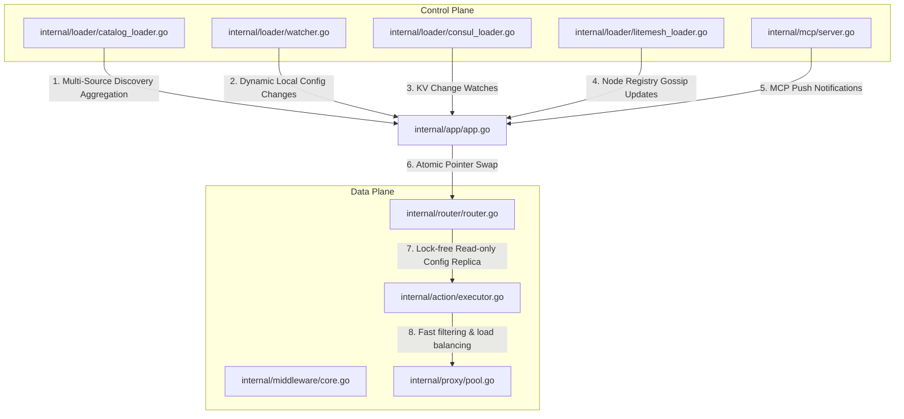
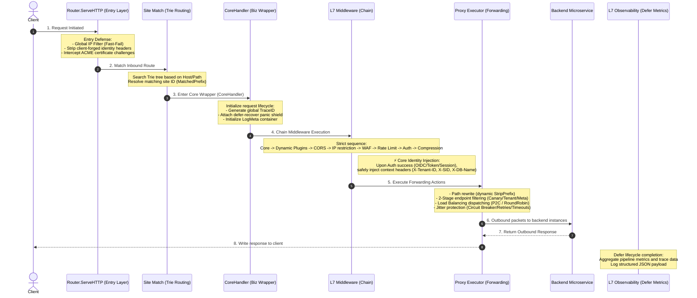
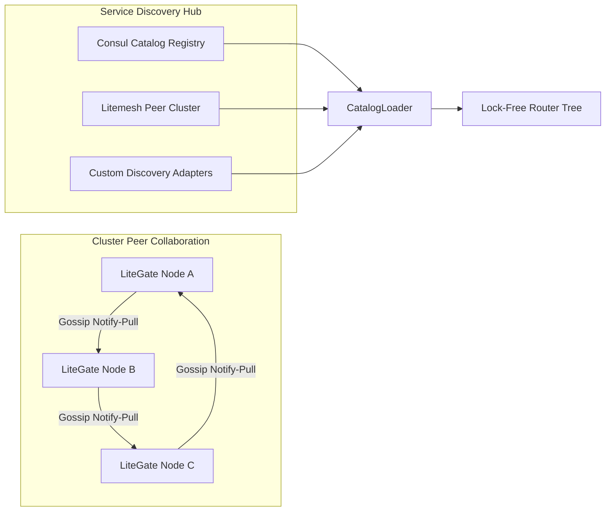
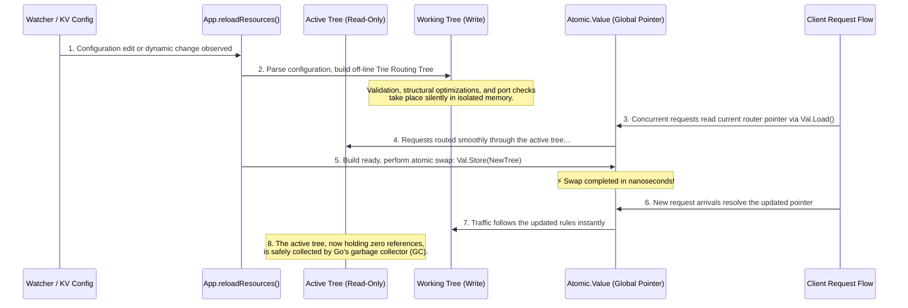

# LiteGate Core Architecture White Paper

## 1. Architectural Overview & Design Philosophy

LiteGate is a high-performance, full-stack, cloud-native gateway designed specifically for **private clouds and hybrid-cloud heterogeneous environments**. By design, LiteGate rejects tight coupling with heavy container orchestration frameworks (e.g., Kubernetes) and natively supports running standalone on bare metal, virtual machines, physical appliances, and Docker containers. 

Our core design philosophy boils down to:

*   **Decoupled Control & Data Planes**: Separating configuration processing from active traffic forwarding. This guarantees that the data plane runs in a highly optimized, "lock-free" and "zero-allocation" state, achieving massive throughput.
*   **Reversed Execution Pipeline**: Request execution does not rigidly stack from Layer 1 through Layer 7. Instead, we employ a reversed pipeline that moves network defense and rate-limiting upstream, keeps security and identity injection in the middle, and positions load balancing and circuit breaking downstream.
*   **Multi-Source Hub & Litemesh Consensus**: Out-of-the-box compatibility with industry-standard discovery protocols like Consul, combined with native integration of Litemesh—our lightweight, decentralized, and distributed gossip-based service mesh agreement.

---

## 2. Decoupled Plane Architecture (Control & Data Plane)

LiteGate is composed of two highly decoupled planes. This allows for instant, jitter-free, hot configuration reloads under high-concurrency request loads.



### 2.1 Control Plane
*   **Core Modules**: `internal/app/app.go` (Global Orchestrator) & `internal/loader/` (Multi-Source Discovery Pipelines).
*   **Responsibilities**:
    *   **Config Watching**: `watcher.go` leverages highly optimized `fsnotify` interfaces to listen for file system edits under the local `sites/` and `streams/` directories.
    *   **Remote Registries & Watching**: `consul_loader.go` and `litemesh_loader.go` maintain active subscriptions to remote key-value stores and clusters.
    *   **Multi-Source Aggregator (`CatalogLoader`)**: Standardizes endpoints from local disk configs, Consul catalogs, Litemesh nodes, and external APIs into internal `ActiveSite` and `ActiveStream` configurations.

### 2.2 Data Plane
*   **Core Modules**: `internal/router/router.go` (HTTP Router) & `internal/action/executor.go` (Action Handler Executor).
*   **Responsibilities**:
    *   **Zero-Overhead Forwarding**: The router holds a read-only pointer to the active routing tree (`*atomic.Value`). Rather than acquiring heavy global Mutex locks on every request, routing matches are performed concurrently on thread-safe read-only memory replicas.
    *   **Zero-Allocation Dispatching**: Upstream endpoints are compiled and cached inside the `PoolManager` (`internal/proxy/pool.go`). Active request flow bypasses Go reflection or memory reallocation, squeezing every bit of network card performance.

---

## 3. 7-Layer Execution Pipeline

In LiteGate's data plane, request processing behaves like a highly cohesive assembly pipeline. Physical execution logic has been optimized, positioning security and rate-limiting upstream to prevent downstream microservice cascades or database deadlocks.



### 3.1 Pipeline Stages Analysis

1.  **Entry Defense Layer (`internal/router/router.go`)**
    *   **IP Blacklisting**: Performs rapid IP lookups before evaluating routing configurations, cutting off suspicious clients instantly.
    *   **Identity Shielding**: Explicitly strips client-sent `X-Tenant-ID` or `X-SID` headers to guarantee the authenticity of injected identities downstream.
    *   **System Routing Capture**: Zero-cost intercept of ACME Challenge probes (for automated SSL certificates) and `/_litegate/` internal RPC handles (e.g., MCP agent requests) without burning application contexts.
2.  **Biz Wrapper Layer (`internal/middleware/core.go`)**
    *   **Trace ID Generation**: Appends a W3C-compliant `X-Trace-Id` header (if missing) to correlate distributed log nodes.
    *   **Panic Protection**: An active `recover()` handler intercepts nil-pointer dereferences or internal crashes within complex custom middlewares, returning an elegant `500 Internal Server Error` while maintaining gateway stability.
3.  **Security & Identity Injection Layer**
    *   **WAF & Rate Limiting Upstream**: Request rate limiting occurs prior to authenticating, shielding identity providers (OIDC / Redis / DB) from high-frequency credential DDoS exhaustion attacks.
    *   **IDS Identity Injection**: Decoded tenant properties (e.g., from validated OAuth2 tokens) are mapped directly into system context headers (`X-Tenant-ID`, `X-SID`, `X-DB-Name`), enabling zero-touch multi-tenancy.

---

## 4. Litemesh Gossip Consensus & Multi-Source Hub

In multi-node environments, LiteGate operates without heavy control plane backbones (like Kubernetes control planes or ZooKeeper clusters). It achieves eventual consistency via a decentralized gossip-based mechanism.



### 4.1 Litemesh Gossip Optimization
The Litemesh consensus engine is a customized Gossip implementation designed for private networks. It solves two classic gossip problems:
*   **"Notify-Pull" Broadcast Model**: Traditional Gossip algorithms flood the network with dense node metadata updates, triggering bandwidth spikes in larger clusters. Litemesh utilizes a **"Notify-Pull"** flow. When state shifts, a node broadcasts only a tiny digest containing the mutation ID. Peers check local databases and asynchronously pull detailed mappings via unicast from the source, saving up to **85%** in network bandwidth.
*   **Anti-Entropy Self-Healing**: To resolve packet losses or temporary network partition gaps, Litemesh triggers a background Anti-Entropy sweep every 5 minutes. It compares registry checksums with random peers, guaranteeing **eventual consistency** even after severe network disruptions.

### 4.2 Multi-Source Aggregator (`CatalogLoader`)
The `CatalogLoader` employs the Adapter Pattern. It merges endpoints from:
*   Static YAML local configurations.
*   Consul Registry APIs.
*   Litemesh cluster peers.
This allows LiteGate to balance traffic seamlessly across physical instances (Consul) and dynamic container workloads (Litemesh) under the same route.

---

## 5. Zero-Downtime Hot Reload

In enterprise environments, mutating routing rules (e.g., updating domains, editing rate limit margins, or adjusting canary weightings) must not disrupt active TCP connections. LiteGate employs **Atomic Pointer Swap** to solve this.



### 5.1 Physics Advantages of Atomic Reloading
*   **Zero TCP Jitter**: Bypasses the need to fork processes or drop listen sockets. Bind ports (`80/443`) are held open continuously, avoiding operating system I/O re-initializations.
*   **Fail-Safe Interceptions**: If compiling the `NewTree` fails due to syntax errors or certificate overlaps, the reload exits with an error. The pointer remains unchanged, and the gateway continues operating on the `OldTree` without a millisecond of downtime.

---

## 6. L4 Stream Server & High-Availability Resiliency

Beside Layer 7 Web routing, LiteGate embeds a highly optimized **Layer 4 Stream Server** to manage non-HTTP protocols, such as database pooling (MySQL/PostgreSQL), DNS routing, and IoT TCP/UDP streaming.

### 6.1 Resiliency Features
The gateway includes built-in microsecond-level fault recovery:
*   **Canary & Weight-Based Routing**:
    *   Requests are routed to the canary pool according to configured weights.
    *   If all canary endpoints fail health validation, LiteGate automatically falls back to the master pool, keeping endpoints accessible.
*   **Two-Stage Endpoint Filtering (`FilterEndpoints`)**:
    *   **Stage 1 (Strict Isolation)**: Searches for hard matches on `router.selector` and tenant tags. If this pool evaluates to empty, it throws a `502 Bad Gateway` instantly—preventing traffic leakage across tenants.
    *   **Stage 2 (Soft Match)**: Within the isolated subset, LiteGate filters based on metadata filters (`router.meta`). If no matches are found, it gracefully falls back to the isolated parent pool, maintaining architectural flexibility.
*   **Circuit Breaking & Retries**:
    *   If outbound connections fail, LiteGate transparently retries alternate upstreams based on configured retry back-offs.
    *   If an upstream endpoint throws errors beyond the error threshold, the gateway marks it "unhealthy" and drops it from the active upstream pool.

---

## 7. Ludicrous Speed Connection Pool Tuning

LiteGate's ability to process **~5.5w Requests Per Second (RPS)** on standard machines is a direct result of aggressive tuning within its connection pool manager (`PoolManager`).

### 7.1 "Ludicrous Speed" Configuration Defaults
The proxy engine sets performance properties defined in `internal/proxy/types.go` via `DefaultProxyConfig()`:

```go
func DefaultProxyConfig() *ProxyConfig {
    return &ProxyConfig{
        // Aggressive connection pool limits
        MaxIdleConns:        4096,            // Max idle connections globally
        MaxIdleConnsPerHost: 4096,            // Max idle connections per upstream Host
        MaxConnsPerHost:     8192,            // Max active connections per upstream Host
        IdleConnTimeout:     90 * time.Second,// Keep-alive lease for idle connections in the pool

        // Timeout settings
        DefaultDialTimeout:           10 * time.Second,
        DefaultTLSHandshakeTimeout:   10 * time.Second,
        DefaultResponseHeaderTimeout: 30 * time.Second,

        // Background garbage collection
        CleanupInterval:        5 * time.Minute,  // Sweeper frequency
        TransportIdleTimeout:   10 * time.Minute, // Transport idle timeout lease
        EnableTransportCleanup: true,
    }
}
```

### 7.2 Throughput Tuning Highlights

1.  **Massive Idle Connection Limits (`MaxIdleConnsPerHost: 4096`)**
    *   **The Default Gateway Trap**: Standard Go reverse proxies (and many standard configurations of Nginx/Caddy) limit idle connections per host to `2` or `100`. Under spike traffic, the idle pool is filled instantly. Subsequent requests are forced to initialize new physical TCP connections, complete TLS handshakes, and close them immediately after receiving the response payload. This wastes massive CPU cycles on TCP handshakes and rapidly exhausts the operating system's ephemeral ports, throwing `Address already in use` exceptions.
    *   **LiteGate's Solution**: LiteGate defaults the idle connection limit per host to **4096**. Under heavy load, incoming requests find pre-established keep-alive connections waiting in the pool, cutting TLS handshake costs to zero.
2.  **Self-Healing Sweeper**
    *   A background lightweight cleanup task managed by `CleanupInterval: 5m` continuously inspects active pools.
    *   If backend workloads scale down or traffic slopes, the sweeper shuts down idle connections and releases memory back to the OS. This maintains a small, permanent memory footprint of **~50MB** during idle periods, blending ultimate speed with strict resource efficiency.
