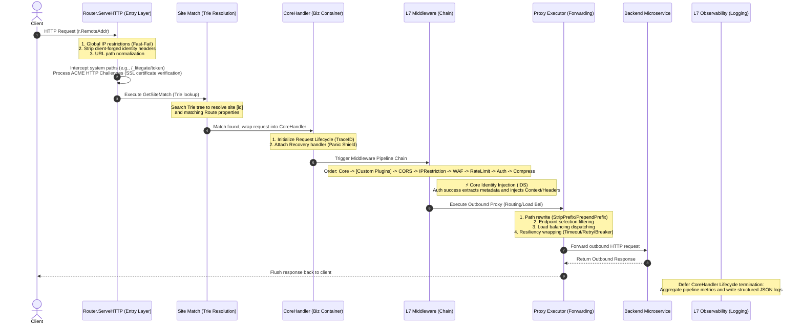

# LiteGate L7 Execution Flow: Physical Pipeline

In LiteGate's design, although the architecture logically follows a structured sequence from Layer 1 through Layer 7, the **physical execution sequence is highly optimized and reversed** in the gateway's core request processing logic.

---

## 1. Physical Execution Pipeline (Mermaid)

Below is the sequence diagram illustrating the actual physical execution flow of an inbound request, from when it enters the gateway until it reaches the backend microservice:

---

## 2. Pipeline Stages Breakdown

### 1. Entry Defense Layer (`internal/router/router.go`)
*   **Stage**: `Router.ServeHTTP` (Pre-processing)
*   **Behaviors**: 
    *   **Global Filters**: Resolves the client's actual IP and applies global IP blacklisting/whitelisting rules instantly.
    *   **Security Sanitizing**: Strips potentially client-forged identity headers, normalizes URLs, and handles ACME Challenges for automatic SSL certifications.
    *   **Reserved Path Interceptions**: Captures `/_litegate/` internal system URLs, processing and returning responses directly from this layer without invoking downstream contexts.

### 2. Trie Resolution Layer (`internal/router/router.go`)
*   **Stage**: `GetSiteMatch` (Trie Search)
*   **Behaviors**: Locates the active site `[id]` based on the inbound Host and Path. If no matches are found, the gateway throws a `404 Not Found` response directly from this stage.
    *   **Context Passing**: LiteGate injects the resolved matching route prefix (**`MatchedPrefix`**) into the request context for dynamic prefix-stripping in later execution layers.

### 3. Biz Container Layer (`internal/middleware/core.go`)
*   **Stage**: `CoreHandler` (Trace ID & Lifecycles)
*   **Behaviors**: Once a matching route is resolved, the request is wrapped inside the `CoreHandler`.
    *   **Trace ID Generation**: Automatically generates a W3C-compliant `X-Trace-Id` (if missing from the client) and injects it into both context and response headers.
    *   **Telemetry Initialization**: Instantiates the logging metadata repository (`logMeta`).

### 4. Middleware Chain Layer (`internal/router/router.go` ➡️ `BuildRouteHandler`)
*   **Stage**: L7 Pipeline Chain
*   **Sequence**: `Core` ➡️ `[Plugins]` ➡️ `CORS` ➡️ `IPRestriction` ➡️ `WAF` ➡️ `RateLimit` ➡️ `Auth` ➡️ `Compress`.
*   **Highlights**:
    *   **Resource Guarding**: 
        *   **IPRestriction & WAF**: Filters malicious network traffic at the outermost layer.
        *   **RateLimit (Global QPS Rate Limiting)**: Runs *before* the authentication layer. It evaluates total throughput margins to protect downstreams from cascading database failures and ensures authentication backends (OIDC/IDS Session) are not exhausted by flood requests.
    *   **Identity Mapping**: Upon successful credential validation, tenant details are automatically mapped to headers (`X-Tenant-ID`, `X-SID`, `X-DB-Name`) for transparent context passing.

### 5. Outbound Proxy Layer (`internal/action/proxy.go` ➡️ `prepareOutboundRequest`)
*   **Stage**: Proxy Executor
*   **Behaviors**:
    *   **Path Rewriting**: Modifies request paths (e.g., executing `StripPrefix` or `PrependPrefix`). If `StripPrefix` is set, it utilizes the **`MatchedPrefix`** held in the context to strip route prefixes dynamically.
    *   **Canary Weight Matcher**: Evaluates `litegate.[id].router.gray_weight` to determine whether this request routes to the canary pool. If selected, LiteGate filters upstreams matching the `upstream.gray` flag. If the canary pool is empty, it falls back to the master pool automatically.
    *   **Endpoint Filtering**: Executes `FilterEndpoints` in two stages:
        1.  **Stage 1 (Strict Isolation)**: Resolves upstreams against `router.selector` and tenant tags. If this pool is empty, it returns `502 Bad Gateway` instantly to prevent tenant cross-talk.
        2.  **Stage 2 (Soft Match)**: Filters Stage 1 outputs using metadata tags (`router.meta`).
        3.  **Fallback**: Returns Meta-matched instances if healthy; otherwise, falls back to all isolated Stage 1 upstreams to guarantee high availability.
    *   **Governance Dispatching**: Invokes the configured load balancing policy (Round Robin, IP Hash, Weighted, or Power of Two Choices) to select a physical target node, wrapping the outbound connection in timeouts, retries, and circuit breakers.

### 6. Observability Layer (`internal/middleware/core.go`)
*   **Stage**: Core Logger (Defer Phase)
*   **Behaviors**: Triggers upon request completion. The deferred core handler gathers pipeline properties (resolved Route ID, destination upstream IP, request elapsed duration, auth status) and outputs a standardized, structured JSON log.
