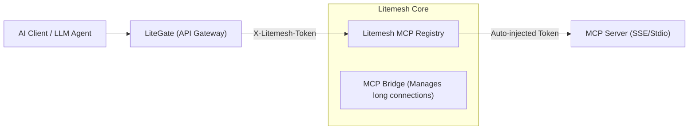

# LiteGate Litemesh MCP Integration Guide

This document describes how LiteGate integrates with Litemesh's Model Context Protocol (MCP) capabilities.

> [!IMPORTANT]
> **Architecture Refactoring Note**: The Litemesh MCP subsystem was fully refactored in 2026, officially separating from the generic "Service Discovery Registry". If your LiteGate previously discovered MCP instances using `tag=mcp-bridge`, you must adapt your codes based on the [Migration Guide](#migration-guide) below.

---

## 1. Architectural Preview



**Key Architectural Transitions**:

| Characteristic | Legacy Architecture | Modern Architecture |
| :--- | :--- | :--- |
| **Storage Engine** | Splat variables in generic KV | Dedicated `mcp.dat` state database |
| **Discovery APIs** | `/v1/discovery?tag=mcp-bridge` | `/v1/mcp/discovery` (Dedicated) |
| **Data Schemas** | `ServiceInstance` (Generic) | `MCPServerConfig` (Dedicated) |
| **State Tracking** | `passing` / `critical` | `connected` / `disconnected` |

---

## 2. MCP Server Registration & Deregistration

MCP servers are managed via dedicated Admin consoles or programmatic APIs. They do not rely on generic service auto-registrations.

### Registration Call (JSON API):
```bash
curl -X PUT http://litemesh:8080/v1/mcp/register \
  -H "X-Lito-Token: <your-token>" \
  -d '{
    "name": "weather-service",
    "type": "sse",
    "endpoint": "http://internal-mcp:8090/sse",
    "headers": { "Authorization": "Bearer key-xxx" }
  }'
```

---

## 3. LiteGate Integration Details

### 3.1 Dynamic Tool Discovery
Upon gateway initialization or when receiving change notifications, LiteGate queries the dedicated API to sync its active tool list.

- **URL**: `GET /v1/mcp/discovery`
- **Authentication**: Must carry the `X-Lito-Token` header, since the payload contains sensitive authorization properties for upstreams.

### 3.2 Bridge Invocation
We recommend routing MCP requests through the Litemesh Bridge.
- **Benefit**: LiteGate is insulated from backend-specific tokens. Litemesh automatically injects required authorization variables.
- **Endpoint**: `POST /v1/mcp/call/{server_name}`

---

## 4. Connection State Watching (SSE)

Because MCP relies on long-running persistent streams, LiteGate must monitor connection states:

1. **Subscribe**: Listen to Litemesh's concentrated event channel: `/v1/events`.
2. **Filter**: When receiving messages of the format `mcp-status:server-name`, it signifies a mutation in connectivity (e.g., connected or disconnected).
3. **Trigger**: LiteGate refreshes its local MCP cache, prompting attached LLM/AI clients to reload their active tool lists.

---

## 5. Go SDK Integration Example

```go
import litemesh "github.com/james/litemesh/sdk"

client := litemesh.NewClient("http://litemesh:8080", "token-xxx")

// 1. Fetch all active connected MCP servers
mcpServers, err := client.GetActiveMCPServers()

// 2. Invoke a specific tool of a backend server
res, err := client.MCPCall("weather-server", "get_current_weather", map[string]any{
    "city": "Shanghai",
})
```

---

## 6. Migration Guide

> [!WARNING]
> **Schema Field Mappings**:
> - `instance.Status.State == "passing"` ➡️ `config.Status == "connected"`
> - `instance.Meta["mcp_type"]` ➡️ `config.Type`
> - `SSE Event: mcp:name` ➡️ `SSE Event: mcp-status:name`

**Key Migration Steps**:
1. **API Migration**: Update all MCP queries pointing to `/v1/discovery` to point to `/v1/mcp/discovery`.
2. **Parser Updates**: Adapt JSON parsers to read `MCPServerConfig` instead of the generic `ServiceInstance` schema.
3. **Token Management**: Ensure discovery requests carry correct internal Litemesh tokens.
