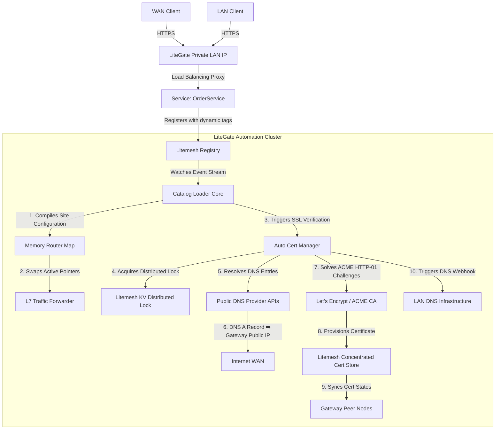

# Magic Ingress Architecture: Zero-Configuration Service Mesh Integration

**Magic Ingress** allows you to expose microservices to the internet without writing a single line of YAML configurations. You simply tag the service instance at boot time, and LiteGate's automated control plane handles the rest.

---

## 🚀 Core Philosophy: "Tag & Forget"

Under traditional routing models, provisioning an active service endpoint is a tedious, multi-step process:
1. Deploy the backend microservice.
2. Configure Nginx/Gateway routing path matches.
3. Register or buy a domain name.
4. Add DNS A/CNAME records on public registrars.
5. Provision SSL certificates and configure certificates.
6. Sync internal DNS servers to resolve internal requests.

Under the **Magic Ingress** architecture, developers only execute one step:
1. **Deploy a tagged service instance**: E.g., annotation `litegate.http.host=order.example.com`.

**LiteGate's automation engine performs all remaining steps in milliseconds.**

---

## 🏗️ Architectural Overview

When Litemesh (or Consul/Docker) detects a new microservice instance, the following automated pipeline is triggered:

---

## 🔧 Workflow Deep-Dive

### 1. Service Tag Annotations (The Only Manual Step)
When boot-registering a service using Litemesh SDK (or passing annotations via Sidecars), inject the following tags:

| Tag Key | Example | Description |
| :--- | :--- | :--- |
| `litegate.http.host` | `order.example.com` | Shortcut: forward this domain to the service. |
| `litegate.http.routers.<name>.match.*` / `.rule` | ``Host(`order.example.com`) && PathPrefix(`/api/v1`)`` | Host and path matching of a named Router. |
| `litegate.http.services.<name>.*` | `timeout=30s` | Timeout, retry, load balancing and other policy for this service. |

A Router attaches to `web` and `websecure` by default and forwards to the registering service.

> See the [Service Tag Reference](user/03-configuration/tag-reference.md) for every tag.

### 2. Magic Ingress Discovery
LiteGate's **Catalog Loader** monitors the service registry in real time. Upon detecting a tagged microservice, it:
- Parses EntryPoint / Router / Service resources, or the closed single-Router shortcut `litegate.http.host/path/path_prefix/strip_path`.
- Compiles a virtual `SiteConfig` profile in memory.
- Hot-swaps the active **Router** trees, permitting the gateway to route incoming requests immediately.

### 3. Automated Security and DNS Orchestration
Once the memory route is active, LiteGate's background controllers initialize the following routines:

* **Dynamic DNS (DDNS)**:
  - Detects the gateway's active public egress IP.
  - Queries your public DNS provider API (e.g., Cloudflare, Alibaba Cloud), registering the domain record to point to the **gateway public IP**.

* **SSL Certificate Provisioning (AutoCert)**:
  - Queries the concentrated Litemesh KV: "Do we hold a valid certificate for this domain?"
  - If missing: Acquires the Litemesh distributed cluster lock and launches the ACME HTTP-01 validation.
  - Upon ACME success, writes the cert to Litemesh KV, prompting **all active peer gateway nodes** to sync and mount the certificate in memory.

* **LAN Connectivity (Split-Horizon DNS)**:
  - `dns_update` writes the domain and the gateway's internal IP into LiteMesh KV.
  - LiteDNS watches KV and resolves the domain to the **gateway internal LAN IP**.
  - **Value**: LAN clients query the endpoint directly without outward loop overheads. The browser displays a green padlock since the certificates are valid globally.

---

## 🎉 Final Achievements

* **Zero-Config Maintenance**: Bypasses manual `nginx.conf` or `gateway.yaml` updates.
* **Autonomous Operations (Zero Ops)**: SSL provisioning, renewals, and DNS records are automated.
* **Unified Domain Spaces**: LAN and WAN clients share identical SNIs and SSL certificates, aligning development and production environments.

The Magic Ingress engine elevates LiteGate from a simple proxy into an **autonomous edge gateway cluster**.
