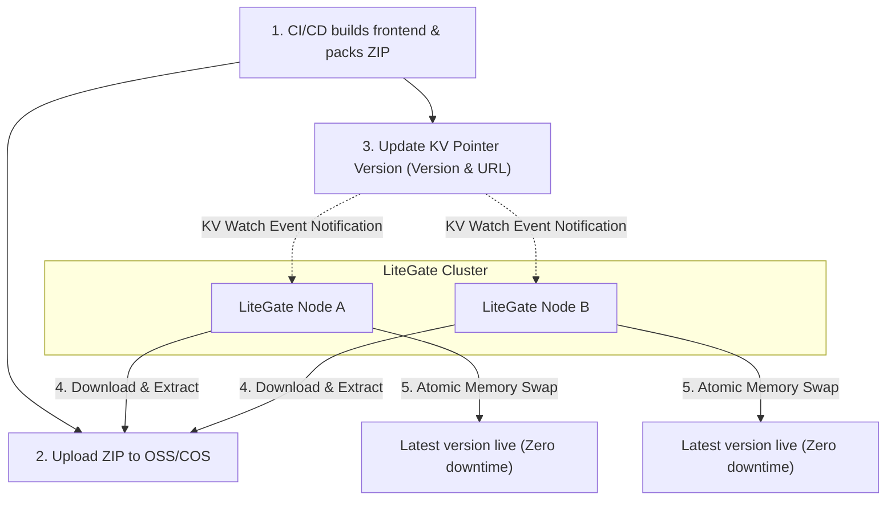

# LiteGate Frontend ZIP Hosting & Serve KV Automated Sync Mode

This document introduces LiteGate's **Serve KV** feature. It represents an elegant, ultra-simple approach to static frontend asset distribution and multi-node synchronization across server clusters.

---

## 1. Pain Points & Design Background

In traditional multi-node or VPS web deployments, updating static frontend assets usually involves tedious operations:
* Writing complex `rsync` scripts to distribute static asset directories to gateway nodes one by one.
* Heavy release and rollback procedures, which easily lead to version mismatches due to network failures or permission issues on individual nodes.
* Requiring dedicated shared network storage mounts or complex CI/CD pipeline integrations.

**Serve KV** changes all of this. It reduces frontend release actions to a simple, declarative pointer update:
1. **Build & Compress**: Once the frontend build completes, compress the output directory into a `.zip` package and upload it to OSS/COS or any object storage provider.
2. **Submit Version**: Write a JSON object containing the new version index, download URL, and SHA256 checksum into Litemesh KV, Consul KV, or any HTTP KV API.
3. **Nodes Fetch**: All active LiteGate nodes watch for KV changes. They automatically download the ZIP archive in the background, verify the SHA256 checksum, extract it to a local version directory, and **atomically** hot-swap the serving paths in memory without drops in traffic. Outdated historical version directories are cleaned up automatically according to your policy.



---

## 2. Site Configuration Guide

In your LiteGate YAML configurations, a standard `serve` action route enters **KV Automated Sync Mode** by adding the `kv_` prefix settings.

### 2.1 Full Configuration Example

Specify this in `sites/yourdomain.yaml`:

```yaml
domain: example.com
routes:
  - match:
      path_prefix: /
    action:
      type: serve
      root: /var/www/my-app           # Base local directory for storing extracted versions
      spa: true                        # Enables single-page application routing support
      
      # --- KV Mode Core Fields ---
      kv_mode: true                    # Enables KV synchronization mode
      kv_provider: litemesh            # Supports: litemesh, consul, http
      kv_key: litegate/config/front/main # Watched KV key path or HTTP URL
      keep_versions: 3                 # Max historical versions kept locally (default 3)
```

### 2.2 Field Descriptions

| Field | Type | Required | Default | Description |
| :--- | :--- | :--- | :--- | :--- |
| `kv_mode` | bool | Yes | `false` | Set to `true` to enable automated KV synchronization. |
| `kv_provider` | string | Yes | - | Specifies the driver: `litemesh` (recommended), `consul`, or `http`. |
| `kv_key` | string | Yes | - | The KV key path. If the provider is `http`, write the full GET API URL. |
| `keep_versions` | int | No | `3` | Number of historical versions kept locally. Excess directories are purged after a successful swap. |

---

## 3. KV Payload Specification & Release Steps

The payload observed by LiteGate in the KV store must be a valid **JSON object**.

### 3.1 JSON Schema

```json
{
  "version": "12",
  "url": "https://oss.example.com/front/main-12.zip",
  "sha256": "2cf24dba5fb0a30e26e83b2ac5b9e29e1b161e5c1fa7425e73043362938b9824"
}
```

* **`version`**: Must be a **numeric string that parses to a 64-bit integer** (e.g., `"12"`). LiteGate evaluates version updates based on value sizes to prevent version rollbacks (unless local folders are deleted), offering split-brain protection.
* **`url`**: The downloadable HTTP/HTTPS link of the ZIP package.
* **`sha256`**: (Optional) The SHA256 checksum of the ZIP file. If provided, LiteGate calculates and compares the SHA256 after downloading. Mismatched downloads are rejected to prevent corrupted deploys.

### 3.2 Deployment Steps

1. **Pack**: Archive your build folder: `zip -r main-12.zip dist/`, upload it, and get the download link: `https://oss.example.com/front/main-12.zip`.
2. **Calculate SHA256**: Run `sha256sum main-12.zip` to get the checksum, e.g., `2cf24dba5fb0a30e26e83b2ac5b9e29e1b161e5c1fa7425e73043362938b9824`.
3. **Write KV**:
   * **Litemesh KV Users**:
     ```bash
      curl -X PUT http://127.0.0.1:8787/v1/kv/litegate/config/front/main \
        -d '{"version": "12", "url": "https://oss.example.com/front/main-12.zip", "sha256": "2cf24dba5fb0a30e26e83b2ac5b9e29e1b161e5c1fa7425e73043362938b9824"}'
     ```
   * **Consul KV Users**:
     ```bash
     consul kv put litegate/config/front/main '{"version": "12", "url": "https://oss.example.com/front/main-12.zip", "sha256": "2cf24dba5fb0a30e26e83b2ac5b9e29e1b161e5c1fa7425e73043362938b9824"}'
     ```

---

## 4. Key Architectural & Security Mechanisms

### 4.1 Elegant 503 Warming-Up Prevention

When a new node joins the cluster, cold-starts, or a new site is configured, the local physical version directory is usually not ready (downloading or extracting in the background).
If external user traffic floods the gateway at this point, traditional gateways throw a wave of 404s or deadlock.

LiteGate implements a **Warming-Up Protection Mechanism**:
1. When a request arrives, if the local directory is not yet prepared, LiteGate holds the request in suspension and gracefully polls in the background (up to `200ms`).
2. If extraction completes within `200ms`, the request is seamlessly and smoothly processed using the latest frontend assets.
3. If the timeout expires before extraction finishes, LiteGate routes the client to an elegant **503 Service Unavailable** response depending on the HTTP `Accept` header and file extension, avoiding coroutine pool exhaustion:
   * **Web Browser / HTML accesses**: Renders a premium, modern Glassmorphic **Warming Up Page** with loading animations.
   * **API / JSON accesses**: Returns a clean JSON response: `{"status": 503, "message": "Site warming up, please retry in 3 seconds"}`.
   * **JS / CSS static dependencies**: Returns a commented script: `/* LiteGate: Site warming up, please retry in 3 seconds */` to prevent HTML junk data from corrupting the frontend dependency tree.

### 4.2 ZIP Directory Traversal Defense (Zip Slip Prevention)

Since ZIP files are fetched from network addresses, they can carry risks of **Zip Slip directory traversal attacks** (where files in the archive specify malicious names like `../../etc/passwd`).
LiteGate's extractor validates the absolute path of every file before extracting:
```go
if !strings.HasPrefix(fpath, filepath.Clean(dest)+string(os.PathSeparator)) {
    return fmt.Errorf("illegal file path in zip: %s", f.Name)
}
```
Any extraction path that resolves outside the designated target folder is strictly rejected and logged, keeping the server secure.

### 4.3 Automated Disk Convergence & Cleanup

LiteGate stores version folders under a directory appended with `_versions` to your `root` parameter (e.g., if `root` is `/var/www/my-app`, the controller folder will be `/var/www/my-app_versions/`).

After each successful upgrade, LiteGate spawns a background cleanup routine:
* Converts all version folders in the directory to numeric values and sorts them in descending order.
* Keeps only the latest `keep_versions` folders (e.g., 3).
* **Safety Shield Protection**: Active physical folders currently referenced by the memory router are scanned and excluded from removal. Even if they are older versions (such as during rollbacks), they are never physically deleted, realizing jitter-free graceful traffic transitions.
