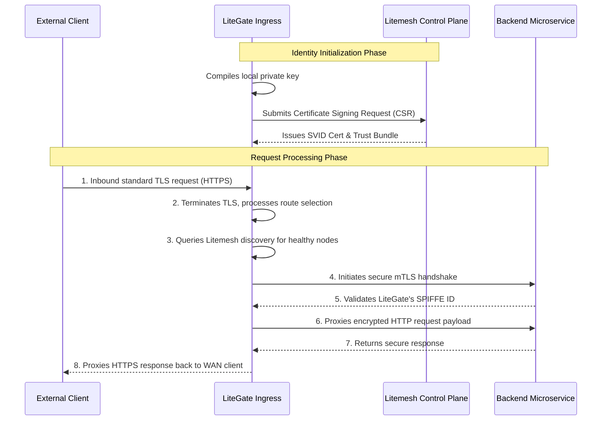

# LiteGate TLS & mTLS Security Architecture

This document describes how LiteGate manages secure communications along the entire request path, from external clients to internal backend microservices.

---

## Architectural Overview

LiteGate employs a two-layered security isolation model:
1. **External Layer (TLS)**: Standard HTTPS connects public internet clients to the LiteGate ingress.
2. **Internal Layer (mTLS)**: Mutual TLS (mTLS) secures communication between LiteGate and backend microservices using Litemesh.



---

## 1. External Layer: Client ➡️ LiteGate (Standard TLS Ingress)

As the edge termination proxy for north-south traffic, LiteGate manages public cryptographic handshakes.

- **Certificate Management**:
  - **Static Provisioning**: Binds `.pem` and `.key` files declared in site configurations.
  - **Dynamic Provisioning (AutoCert)**: Leverages built-in ACME automation to dynamically request and renew certificates from Let's Encrypt.
- **Protocol Configuration**: Enforces TLS 1.2 / 1.3 and supports HTTP Strict Transport Security (HSTS) headers.
- **Performance Optimization**: Configured with optimized connection pools to accelerate high-concurrency SSL handshakes.

---

## 2. Internal Layer: LiteGate ➡️ Backend (Litemesh mTLS)

This is the core of LiteGate's "Zero-Trust" security model. When active, LiteGate operates as a verified peer inside Litemesh.

### Operational Mechanics

1. **Dynamic Cryptographic Identity (SVID)**: Instead of static files, LiteGate uses short-lived SPIFFE ID certificates requested from Litemesh.
2. **Mutual Verification**:
  - LiteGate verifies that the backend node belongs to a trusted logical network.
  - Backend nodes verify LiteGate's SPIFFE ID against ACL rules to authorize request ingress.
3. **Automated Cert Rotation**: Certificates are rotated in memory before they expire, ensuring that long-lived HTTP/2 or gRPC streams are not interrupted.

### SPIFFE Identity Format
LiteGate's cryptographic identity is formatted as:
`spiffe://litemesh.local/ns/system/sa/litegate`

---

## 3. Configuration Example

Enable global mTLS integration inside `litegate.yaml`:

```yaml
# Edge TLS parameters
tls:
  certs_dir: "./certs"

# Litemesh Service Mesh Integration
litemesh:
  enabled: true
  address: "http://litemesh-agent:8787"
  mtls: true # 🔥 Enforces mutual TLS for east-west traffic
  spiffe_id: "spiffe://litemesh.local/ns/gateway/sa/litegate"
```

---

## 📌 Core Architecture Advantages

1. **Strict Cryptographic Isolation**: Prevents unauthorized traffic from communicating with backend services, even if network boundaries are breached.
2. **Zero Manual Key Management**: Automates certificate issuance, distribution, and rotation.
3. **Granular Access Control**: Downstream microservices can check client SPIFFE IDs to ensure requests originate strictly from the LiteGate ingress cluster.
