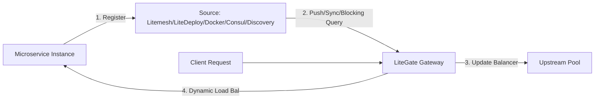

# Service Discovery Integration Principles

One of LiteGate's core strengths is its powerful **Dynamic Service Discovery** capability. It allows the gateway to perceive backend instance scaling and rollouts in real-time, eliminating the need to manually update upstream lists in static configuration files.

---

## 1. Why Service Discovery?

In cloud-native or microservice environments, the IP addresses of backend instances (e.g., Docker containers, K8s Pods) change dynamically.
- **High Dynamism**: Scaling up/down and rolling updates cause backend IP addresses to shift frequently.
- **Health Awareness**: Service instances can go down at any moment.
- **Zero Administration**: Developers should only need to spin up their services and register them. The gateway should automatically discover new targets and start routing traffic to them.

---

## 2. Supported Integration Sources

LiteGate currently supports 5 backend discovery sources: `litemesh`, `litedeploy`, `docker`, `consul`, and `discovery`. All of them are normalized into the same service instance model, then processed by the same `litegate.*` tag system.

| Source | Mechanism | Notes |
| :--- | :--- | :--- |
| `litemesh` | SSE push | Litemesh mesh, mTLS, and Magic Ingress |
| `litedeploy` | SSE push | Services and instance metadata managed by LiteDeploy |
| `docker` | Docker event stream | Docker / Swarm with container labels |
| `consul` | Catalog sync | Existing Consul Catalog and health checks |
| `discovery` | Blocking query | External aggregation layer such as `camodns_discovery` |

`discovery` is written as `provider: discovery` in global config and consumed by the external discovery client at runtime. Common endpoints are `/v1/catalog/services` and `/v1/health/service/:service_name`.

---

## 3. Workflow: From Registration to Live Routing



### Detailed Steps
1.  **Service Registration**: When a backend service boots up, it registers its IP, port, service name, and metadata (Meta) to the registry via an SDK or a Sidecar.
2.  **Watch for Changes**: LiteGate’s discovery agent monitors the registry center for updates in real-time.
3.  **Compute Candidates**: Once a service instance is marked `Passing` (healthy), the agent recalculates the valid Upstream list.
4.  **Zero-Downtime Updates**: The routing table in memory is atomically hot-replaced. In-flight requests are entirely unaffected.

---

## 4. Binding Routing with Service Discovery

LiteGate supports two ways of binding routes with discovery: **Static Declarative Binding** and **Dynamic Autonomic Merging (Magic Ingress)**.

### Method A: Static Declarative Binding
If you maintain static site YAML configurations, you can bind a route directly to service discovery by specifying the `service_name`:

```yaml
action:
  type: proxy
  upstream_type: consul  # litemesh / litedeploy / docker / consul / external
  service_name: order-api # Registered service name
```

---

### Method B: Dynamic Autonomic Merging (Magic Ingress) 🌟
**This is the most recommended production practice.** Developers do not need to manually create or modify any static YAML configurations in LiteGate.

When a backend instance registers, it can declare named resources in Metadata / Tags:

```properties
litegate.http.routers.orders.match.hosts=site.example.com
litegate.http.routers.orders.match.path_prefix=/order/api
litegate.http.services.orders.timeout=30s
```

A Router attaches to `web` and `websecure` by default and forwards to the registering service. When a single domain is all you need, the shortcut `litegate.http.host=site.example.com` is enough; the two forms cannot be mixed. See the [Service Tags Guide](../03-configuration/tag-dsl.md).

**Truly achieving: Service launch is registration, registration is instant routing. The entire lifecycle requires absolutely zero manual modifications to the gateway's YAML configurations.**

---

## Further Reading
- [Configuring Consul Discovery](../07-discovery/consul.md)
- [Litemesh Integration Guide](../07-discovery/litemesh.md)
- [Discovery Sources Overview](../07-discovery/overview.md)
- [Metadata-based Canary Releases](./sites-and-routes.md)
