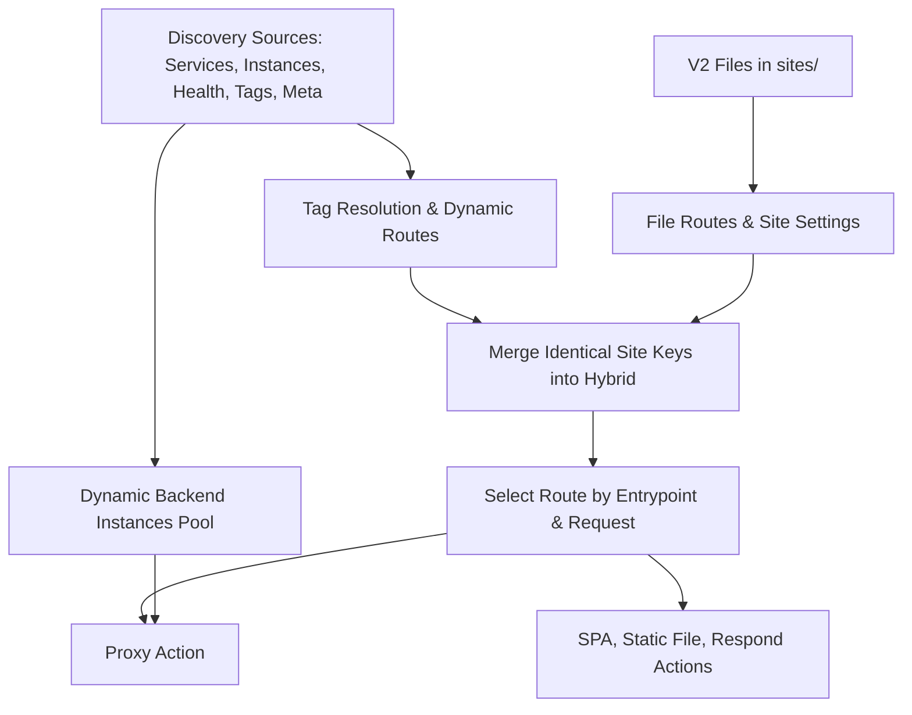

# Site YAML V2: Structure and Core Concepts

Starting from a minimal configuration, this document explains V2 file organization, site addresses, route matching, actions, configuration reuse, and validation. Understanding what each layer is responsible for makes it much easier to write correct configurations.

Create new sites using `sites/*.yaml` with a top-level `site:`. Here is a complete site configuration:

```yaml
site: :9090
~/goapi: 127.0.0.1:8080
spa: ./www
```

It accepts any Host on port 9090; forwards the `/goapi` path segment and its subpaths to the backend (matching case-insensitively for ASCII); and serves the rest of the paths via the single-page application in `./www`. The proxy preserves the request path by default.

## Reading Navigation

1. [File Organization and Overall Structure](#1-file-organization-and-overall-structure)
2. [YAML Syntax, Indentation, and Quotation](#2-yaml-syntax-indentation-and-quotation)
3. [Global Configuration vs. Site Configuration](#3-global-configuration-vs-site-configuration)
4. [Site Address, HTTPS, and ECH](#4-site-address-https-and-ech) (including 4.3 Top-Level Site Properties, 4.4 Encrypted ClientHello ECH)
5. [Path Routing and Matchers](#5-path-routing-and-matchers) (including 5.4 Complete Route Match Attributes)
6. [Actions and Shorthands](#6-actions-and-shorthands) (including proxy / serve / php action attribute lists)
7. [Routing Selection and Execution Order](#7-routing-selection-and-execution-order)
8. [Configuration Scope and Inheritance](#8-configuration-scope-and-inheritance) (including 8.3 CORS / Auth / Rate Limit / Cache Route Governance Properties)
9. [Placeholders and Dynamic Values](#9-placeholders-and-dynamic-values)
10. [Snippets and Shared Definitions](#10-snippets-and-shared-definitions) (including 10.3 Snippet Allowed Governance Attributes)
11. [Middlewares, Services, and Transports](#11-middlewares-services-and-transports) (including full resource attribute definitions)
12. [Comments, Environment Variables, and Paths](#12-comments-environment-variables-and-paths)
13. [Validation, Hot Reloading, and Common Pitfalls](#13-validation-hot-reloading-and-common-pitfalls)
14. [Integrating Discovery Sources, Tags, and V2](#14-integrating-discovery-sources-tags-and-v2)

## 1. File Organization and Overall Structure

### 1.1 One Document Describes One Site

The default directory layout is structured as follows (the actual paths follow the global configuration):

```text
config.yaml                Global configuration
sites/
  app.yaml                 Application site
  api.yaml                 API site
  _shared.yaml             Shared matchers and snippets
www/
  index.html               Frontend build artifacts
```

V2 identifies the format via `site:`; `version: 2` can be omitted. File names are used for file organization; the site address is determined by the `site` field in the file.

### 1.2 Where Each Layer Sits

```yaml
site: app.example.com
https: false

# Site-wide response headers
response_headers:
  X-Frame-Options: DENY

# Named resources: defined only, do not automatically create routes
services:
  orders:
    to: localhost:8080
    timeout: 5s

# Path routes: match condition written in the key
/api:
  service: orders
  strip_prefix: true

# Explicit routes: used for exact paths, methods, and complex conditions
routes:
  - name: health
    match: {path: /health}
    respond: ok

# Site-level action: serves as the fallback route
spa: ./www
```

| Position | Responsibility | Example |
|---|---|---|
| `site`, `https`, `ech`, `port`, `entrypoints` | Site address and entrypoint settings | `site: :9090` |
| `/api`, `~/api` | Define routes by path prefix | `/api: localhost:8080` |
| `match` in `routes` | Describe complex match conditions | `match: {path: /health}` |
| Actions in routes | Generate responses or proxy requests | `proxy`, `respond`, `serve` |
| Governance fields in routes | Process requests hitting the route | `cors`, `strip_prefix` |
| `services`, `transports`, `middlewares` | Define reusable resources | `service: orders` |
| `matchers`, `snippets` | Reuse match conditions and policies | `match: '@api'`, `import: common` |

### 1.3 Multi-Site Configurations

Multiple sites can be placed in separate files or separated using `---` as multiple YAML documents within the same file:

```yaml
site: app.example.com
spa: ./www
---
site: api.example.com
proxy: localhost:8080
```

When multiple addresses share identical configurations, separate them with commas in `site`:

```yaml
site: example.com, www.example.com
respond: hello
```

This expands one site configuration for each address. Multiple documents in the same file must use the same format; do not mix V2 with legacy formats. Different sites do not automatically inherit each other's configurations.

## 2. YAML Syntax, Indentation, and Quotation

### 2.1 Indentation Determines Hierarchy

Use spaces for indentation; two spaces per level is recommended:

```yaml
site: example.com
/api:
  proxy: localhost:8080
  strip_prefix: true
spa: ./www
```

`proxy` and `strip_prefix` belong to `/api`; `spa` is at the same level as `/api` and serves as the site's fallback action. Indenting `spa` under `/api` would declare two actions on the same route, which validation will reject.

### 2.2 Strings, Objects, and Lists

The same proxy action can expand progressively from shorthand to full mapping:

```yaml
site: example.com
/api: localhost:8080
```

```yaml
site: example.com
/api:
  proxy: localhost:8080
```

```yaml
site: example.com
/api:
  proxy:
    to: [localhost:8080, localhost:8081]
    timeout: 5s
    retry: 2
```

The first two are equivalent; the third adds multiple backends, timeouts, and retries. Objects can also be written inline, e.g. `proxy: {to: localhost:8080, timeout: 5s}`. Expanding complex configurations onto multiple lines is recommended for readability and comments.

### 2.3 Which Values Require Quotes

| Value | Recommended syntax | Reason |
|---|---|---|
| Addresses starting with `*` | `site: '*.example.com'` | `*` is an alias indicator in YAML |
| References starting with `@` | `match: '@api'` | Avoid YAML special character parsing |
| Standalone placeholders | `X-Path: '{path}'` | Avoid being parsed as mapping/object |
| Windows paths | `spa: 'D:\web\dist'` | Single quotes preserve backslashes |
| String boolean words | `respond: 'true'` | Unquoted `true` is a boolean |
| Text containing colons with spaces | `respond: 'result: ok'` | Avoid being parsed as key-value structure |

`site: :9090` and `proxy: localhost:8080` do not require quotes because there is no space after the colon.

### 2.4 Multiline Text

```yaml
site: example.com
respond:
  content_type: text/plain
  body: |
    Welcome to LiteGate.
    This is a multi-line response.
```

`|` preserves newlines, while `>` folds newlines into spaces. Duplicate keys, YAML anchors/aliases, merge keys, and `null` are not supported in V2; simply omit unused fields.

## 3. Global Configuration vs. Site Configuration

The global configuration `config.yaml` describes gateway runtime behavior, such as entrypoint listeners, site directories, logging, service discovery, and certificate management. Site files describe how a specific site processes incoming HTTP requests.

Fields at the root of a site file are not necessarily "global settings". For example, `spa: ./www` is the fallback action for that specific site and does not affect other sites.

| Requirement | Configuration location |
|---|---|
| Configure gateway entrypoints and service discovery sources | `config.yaml` |
| Bind a domain or an independent port | `site` in site file |
| API proxying and frontend routing | Path keys or `routes` |
| Reuse backend connections, retries, and load balancing | `services` in site file |
| Reuse match conditions and governance across sites | `sites/_shared.yaml` |

For full details on global settings, see [Global Configuration](global-config.md).

## 4. Site Address, HTTPS, and ECH

### 4.1 Address Comparison

| `site` value | Meaning |
|---|---|
| `example.com` | Match by HTTP Host header using existing entrypoints |
| `example.com:9090` | Match this domain on the specified port |
| `:9090` | Accept any Host on the specified port |
| `'*:9090'` | Equivalent to `:9090` |
| `0.0.0.0:9090` | Equivalent to `:9090` |
| `'[::]:9090'` | Equivalent to `:9090` |
| `127.0.0.1:9090` | Match requests with Host set to this IP on the specified port |
| `'[::1]:9090'` | IPv6 Host with port; brackets required when specifying a port |
| `https://example.com` | Declares HTTPS site intent |

The Host in the address selects requests; it does not specify which local network interface to bind. Actual binding addresses are controlled by entrypoint settings. Specifying a domain in the configuration does not automatically create DNS records.

Port numbers range from 1–65535. When an address already includes a port, you cannot declare `port` or `entrypoints` simultaneously.

### 4.2 HTTPS Must Be Explicitly Configured

In V2, `https` defaults to `false`. Specifying a domain name, IP, or `:443` alone will not automatically enable HTTPS.

```yaml
site: example.com
https: true
proxy: localhost:8080
```

You can also write `site: https://example.com`, in which case you cannot declare `https: false`. The `http://` prefix is not a supported V2 address format; HTTP sites use standard addresses with `https: false`.

For HTTPS to work properly, valid entrypoints and certificates are required. For certificate issuance and storage details, see [Certificate Configuration Guide](../06-certificates/auto-cert.md).

### 4.3 Top-Level Site Properties

In addition to `site` and `https`, the root level of a site configuration supports entrypoint bindings, network restrictions, global inheritance, TLS, and ECH:

| Top-Level Property | Type | Default | Description |
|---|---|---|---|
| `site` | string | required | Site listening and matching address. Supports domain (`example.com`), port shorthand (`:9090`), domain with port (`example.com:9090`), IPv6 (`'[::1]:9090'`), HTTPS intent (`https://example.com`), or comma-separated addresses. |
| `https` | boolean | `false` | Whether to enable automatic HTTP-to-HTTPS redirect. Even when binding to port 443, V2 does not enable HTTPS by default; declare `https: true` explicitly. |
| `ech` | boolean / string | `false` | Site-level ECH (Encrypted ClientHello) client handshake encryption. Can be set to `true` when only one ECH group is defined globally; must specify the public hostname (e.g. `ech: ech.example.com`) in multi-group environments; `false` explicitly disables ECH (default). Requires HTTPS (port 443 with TLS 1.3), automatically publishes HTTPS (Type 65) DNS records via the associated DNS provider. Cannot be used with wildcard, pure IP, or L4 passthrough sites. |
| `port` | integer (1–65535) | follows global | Explicitly specifies an independent port. Prohibited if `site` already contains a port. |
| `entrypoints` | string list | global entrypoints | Associates listener names defined in global `config.yaml` (e.g. `[web, websecure]`). Mutually exclusive with addresses containing ports. |
| `max_request_body_size` | integer (bytes) | `0` (unlimited) | Client request body size limit in bytes. Requests exceeding this limit return 413 Payload Too Large immediately. E.g. `10485760` (10MB). |
| `disable_trace_id` | boolean | `false` | Disables request tracing ID across the site. When enabled, the gateway will not generate `X-Trace-Id` headers or span logs. |
| `ip_restriction` | object | none | Site-level client IP access rules, containing `allow_ips` and `deny_ips` lists (supporting single IPs and CIDR ranges). |
| `request_headers` | key-value map | none | Site-level inherited request headers. Automatically attached to all proxy (`proxy`) actions; prefix `-` (e.g. `-Authorization`) removes the header. Supports placeholders. |
| `response_headers` | key-value map | none | Site-level inherited response headers. Automatically attached to all routes and actions; prefix `-` removes the header. |
| `upstream_client` | string | follows global | Site-level upstream HTTP client policy: `fast` (high-performance synchronous HTTP/1.1 client) or `standard` (standard Go HTTP client). |
| `use` | string / list | none | Site-level middleware bindings. Prepend to the middleware pipeline of every route in the site at compile time. |
| `error_pages` | object list | none | Custom HTTP error page mappings, formatted as `[{status: [404], template: /var/www/404.html}]`. |
| `tls` | object | none | Site-specific TLS certificate and policy override (`cert_file`, `key_file`, `client_auth`, etc.). |
| `forward` | object | none | Layer 4 passthrough forwarding configuration (mutually exclusive with HTTP routes). |

**Complete Site Root Configuration Example:**

```yaml
site: api.example.com
https: true
ech: ech.example.com                # Bind to ECH public group to encrypt SNI
max_request_body_size: 20971520      # Limit request body to 20MB
upstream_client: fast               # Use high-performance upstream client

# Site-level IP restrictions (applies to all routes in this site)
ip_restriction:
  allow_ips:
    - 192.168.0.0/16
    - 10.0.0.0/8
  deny_ips:
    - 192.168.1.100

# Site-level headers (inherited by proxy actions and responses)
request_headers:
  X-Gateway-Site: api.example.com
response_headers:
  X-Frame-Options: DENY
  X-Content-Type-Options: nosniff

# Custom error pages
error_pages:
  - status: [404]
    template: /var/www/errors/404.html
  - status: [500, 502, 503, 504]
    template: /var/www/errors/50x.html

# Site TLS certificate override (optional; defaults to ACME auto-cert or global cert)
tls:
  enabled: true
  cert_file: /etc/ssl/certs/api.crt
  key_file: /etc/ssl/certs/api.key
  min_version: "1.2"
  client_auth: "none"                # Set to require_and_verify for mTLS

/api: localhost:8080
```

### 4.4 Client Handshake Encryption with ECH (`ech`)

ECH (Encrypted ClientHello) encrypts the TLS ClientHello handshake extension between client browsers and LiteGate, concealing the actual target domain (SNI). Eavesdroppers on the public network only see the outer public domain name (e.g. `ech.example.com`). LiteGate decrypts the inner ClientHello at the edge and selects certificates and routes based on the real inner hostname (e.g. `api.example.com`):

```yaml
site: api.example.com
https: true
ech: ech.example.com
proxy: localhost:8080
```

- **Configuration Syntax**:
  - `ech: ech.example.com`: Specifies the public group hostname this site belongs to (required in multi-group deployments). The gateway automatically registers the site domain under that group's DNS provider for publishing HTTPS (Type 65) DNS records.
  - `ech: true`: Permitted only when exactly one ECH group is configured globally in `config.yaml`. If multiple groups exist, validation requires an explicit public name.
  - `ech: false`: Explicitly disables ECH for this site (default).
- **Prerequisites and Constraints**:
  - Global `config.yaml` must enable `ech.enabled: true` and define `groups` with corresponding DNS provider credentials.
  - The site must have HTTPS enabled (`https: true` or `site: https://...`), listen on port 443, and allow TLS 1.3 (enabled by default).
  - The site domain must be covered by the chosen DNS provider's `domains` pattern.
  - **Unsupported Scenarios**: Wildcard sites (e.g. `*.example.com`), pure IP addresses (e.g. `127.0.0.1:9090`, `:9090`), and Layer 4 passthrough sites (`forward:`).
- **Hot Reloading and Group Switching**:
  - Enabling, disabling, or switching ECH groups reloads live without restarting the gateway process.
  - When switching groups or disabling ECH, old HTTPS records published at the previous DNS provider are safely withdrawn before new records are published.
  - For full details on DNS publication, DoH client setup, and multi-node KV secret synchronization, see [ECH Configuration Guide](../06-certificates/ech.md).

## 5. Path Routing and Matchers

### 5.1 Path Keys Are Prefix Matches

```yaml
site: example.com
/api: localhost:8080
~/goapi: localhost:8081
spa: ./www
```

| Request Path | Matched Route |
|---|---|
| `/api`, `/api/orders` | `/api` |
| `/API/orders` | SPA fallback |
| `/goapi`, `/GoApi/Orders` | `~/goapi` |
| `/apix`, `/goapix`, `/other/goapi` | SPA fallback |

Path keys match along path segment boundaries. `~/` enables case-insensitive matching for ASCII paths and is not a regular expression. Do not define both `/goapi` and `~/goapi` at the same time.

Path keys cannot contain nested `match` blocks; when additional match conditions are required, use `routes`.

### 5.2 Exact Paths and Composite Conditions

```yaml
site: example.com
routes:
  - name: health
    match: {path: /health, method: GET}
    respond: ok
  - name: api-write
    match: {prefix: /api, method: [POST, PUT, DELETE]}
    proxy: localhost:8081
/api: localhost:8080
```

`path` performs exact matching, and `prefix` aliases `path_prefix`. `method` accepts a single string or a list. Multiple conditions combine with logical AND: in the example above, write operations go to 8081, while other `/api` requests go to 8080.

Exact paths do not provide a strippable matched prefix and cannot be paired with `strip_prefix: true`. In that scenario, specify the prefix string explicitly or switch to prefix matching.

### 5.3 Named Matchers

```yaml
site: example.com
matchers:
  writes:
    prefix: /api
    method: [POST, PUT, DELETE]
routes:
  - match: '@writes'
    proxy: localhost:8081
/api: localhost:8080
```

`matchers` defines conditions, and `match: '@writes'` applies them. Defining a matcher does not create a route or alter priority. Names must start with a letter or underscore and may contain digits, underscores, and hyphens.

A list composes conditions that must all hold, so one matcher can serve several routes, each adding its own condition. Definitions can compose too:

```yaml
site: example.com
matchers:
  api: {prefix: /api}
  api-write: ['@api', {method: [POST, PUT, DELETE]}]
routes:
  - match: '@api-write'
    proxy: localhost:8081
  - match: ['@api', {header: {X-Canary: "1"}}]
    proxy: localhost:8082
/api: localhost:8080
```

`rule` expressions are joined with AND and `header`/`query` maps merge; any other field may come from one item only, and a conflicting value is an error rather than a silent override.

Regular expressions and complex expressions are configured using `match.rule`. For path lists, wildcard paths, and detailed match rules, see [Site Configuration Reference](site-config.md). Do not use `/api/*` as shorthand for `/api`.

### 5.4 Route and Match Attributes Reference

In `routes:`, each route entry contains metadata and match criteria:

| Route Metadata | Type | Default | Description |
|---|---|---|---|
| `name` | string | none (auto-numbered) | Unique route identifier for logging, metrics, and debugging. Must be unique within the site. |
| `priority` | integer | `0` | Explicit route match priority. Higher values are evaluated first. Among routes of equal specificity, higher priority routes take precedence. |
| `match` | string / object / list | required | Match criteria. A scalar string represents a path prefix or `@name`; an object supports the composite conditions below; a list combines items that must all hold. |

Properties of the `match` object:

| `match` Attribute | Type | Example | Description |
|---|---|---|---|
| `prefix` / `path_prefix` | string | `prefix: /api` | Path prefix match. Must start with `/` and matches along segment boundaries (`/api` matches `/api` and `/api/users`, but not `/apix`). |
| `path` | string / list | `path: /health`<br>`path: ["/v1/*", "/v2/*"]` | Exact path match (starting with `/`), or path list with wildcard `*` (compiled automatically to efficient `PathRegexp` expressions). |
| `method` | string / list | `method: GET`<br>`method: [POST, PUT, DELETE]` | HTTP request method match (case-insensitive). Supports a single method or a list. |
| `header` | key-value map | `header: {X-Role: admin}`<br>`header: {Accept: [application/json, text/plain]}` | HTTP request header match. Exact value match, or list of acceptable candidates. |
| `query` | key-value map | `query: {version: v2, debug: "true"}` | URL Query parameter match. Request must contain the specified parameter matching the value. |
| `rule` | string | `rule: "Method('GET') && PathPrefix('/api')"` | Advanced rule DSL expression (Traefik-compatible syntax). Can be used alone or combined with other conditions via logical `&&`. |

**Route Matching Comprehensive Example:**

```yaml
site: example.com
matchers:
  admin_only:
    prefix: /admin
    header: {X-Role: admin}
routes:
  # Exact path + HTTP method + custom priority
  - name: health_check
    priority: 100
    match:
      path: /healthz
      method: [GET, HEAD]
    respond: "healthy\n"

  # Wildcard path list + write method filtering
  - name: api_v1_writes
    priority: 10
    match:
      path: ["/api/v1/*", "/api/v2/*"]
      method: [POST, PUT, DELETE]
    proxy: localhost:8081

  # Reference named matcher
  - name: admin_console
    match: '@admin_only'
    proxy: localhost:8082

/api: localhost:8080
spa: ./dist
```

## 6. Actions and Shorthands

Each route must define exactly one terminal action. Governance fields can complement actions, but configuring two terminal actions (such as `proxy` and `spa`) on the same route is prohibited.

| Action Type | Shorthand | Expanded Form | Description |
|---|---|---|---|
| `proxy` | `proxy: localhost:8080` | `proxy: {to: [...], timeout: 5s, lb: least_conn}` | Reverse proxy to upstream addresses or discovery services |
| `service` | `service: orders` | `proxy: {service: orders}` | Conveniently references a named backend defined under `services:` |
| `serve` | `serve: ./public` | `serve: {root: ./public, index: index.html}` | Serves local static files (`file_server` is a synonym) |
| `spa` | `spa: ./dist` | `serve: {root: ./dist, spa: true}` | Single-Page Application, falls back to `index.html` on missing files |
| `php` | - | `php: {root: /var/www, upstream: unix:///run/php-fpm.sock}` | PHP-FPM site with built-in index directory routing |
| `respond` | `respond: ok` | `respond: {status: 200, body: ok, content_type: text/plain}` | Returns fixed status code and response body directly |
| `redirect` | `redirect: /new` | `redirect: {location: /new, status: 301}` | URL redirect (shorthand defaults to 302) |
| `webdav` | `webdav: ./share` | `webdav: {root: ./share, read_only: false}` | Provides WebDAV network storage and file management |
| `template` | - | `template: {template: index.html, fetch_json: [...]}` | Dynamic template engine with data prefetching and HTMX |

A string value on a path key always represents a proxy address. For example, `/api: orders` will proxy to a host named `orders`, not reference `service: orders`; `/static: ./public` will not serve static files.

### 6.1 Reverse Proxy Attributes (`proxy`)

The `proxy` object forwards traffic to a static address pool, discovery service, or named Service:

| Attribute | Type | Shorthand | Default | Description |
|---|---|---|---|---|
| `to` / `servers` | string / list | `to: localhost:8080` | none | Static upstream backend physical addresses (`host:port`). Multiple addresses form a load-balancing pool. `to` and `servers` are aliases (do not configure both). |
| `service` | string | `service: orders` | none | References a named backend defined under `services:`. When referencing a Service, route-level connection attributes cannot be overridden. |
| `discovery` | string / object | `discovery: orders` | none | Dynamic service discovery backend. A scalar string is the registered service name; object form supports `name` and label selectors `selector: {match: {...}, meta: {...}}`. Mutually exclusive with static addresses. |
| `timeout` | string / integer | `timeout: 5s` | global (30s) | Backend response timeout. Supports unit strings (`5s`, `500ms`, `2m`) or integer seconds. |
| `retry` | integer / object | `retry: 2` or `retry: {attempts: 2}` | `0` (no retry) | Maximum retry attempts to other available instances on failure. |
| `lb` / `loadbalancer` | string / object | `lb: least_conn` | `round_robin` | Load-balancing strategy: `round_robin`, `least_conn`, `ip_hash`, `p2c_least_conn`. Object form supports `{strategy, server: {port, scheme}, serverstransport}`. |
| `health` / `healthcheck` | string / object | `health: /health` | none | Active backend health probe. Scalar string is probe path; object form supports `path: /health` and probe `interval: 10s`. |
| `circuitbreaker` | object | `circuitbreaker: {...}` | none | Upstream circuit breaker protection: `enabled` (bool), `timeout` (seconds open), `maxrequests` (half-open test requests), `tripthreshold` (consecutive failures). |
| `resolver` | string | `resolver: internal-dns` | global DNS | References an upstream DNS resolver view defined in global `config.yaml`. |

**Inline Proxy Configuration Example:**

```yaml
site: example.com
/api:
  proxy:
    to:
      - 10.0.1.10:8080
      - 10.0.1.11:8080
    timeout: 3s
    retry: 2
    lb: least_conn
    health:
      path: /healthz
      interval: 5s
    circuitbreaker:
      enabled: true
      timeout: 30
      tripthreshold: 5
  strip_prefix: true
```

### 6.2 Static Files and Single-Page Applications (`serve` / `file_server` / `spa`)

`serve` (`file_server` is an alias) serves local static files, and `spa` provides fallback routing for single-page applications:

| Attribute | Type | Shorthand | Default | Description |
|---|---|---|---|---|
| `root` | string | `serve: ./public`<br>`spa: ./dist` | required | Physical root directory for static files. Absolute path or relative path from gateway working directory. |
| `index` | string | - | `index.html` | Default index file when accessing directories. |
| `file` | string | - | none | Serves a single specific file directly (e.g. for downloads or favicon). |
| `spa` | boolean | `spa: ./dist` auto-true | `false` | Enables SPA fallback. Unmatched files fallback to `index.html` to support HTML5 History routing. |
| `browse` / `allow_browse` | boolean | - | `false` | Enables directory listing (useful for file shares or mirrors). |
| `show_hidden` | boolean | - | `false` | Allows accessing files starting with `.`. Denied by default. |
| `cache_control` | string | - | none | Injects static `Cache-Control` header (e.g. `public, max-age=31536000, immutable`). |
| `try_files` | string list | - | none | Custom file lookup candidate order (e.g. `["{path}", "{path}.html", "/index.html"]`). |
| `not_found_file` | string | - | none | Custom 404 HTML file path relative to root when files are missing. |
| `render_markdown` | boolean | - | `false` | Renders `.md` Markdown files in the directory as HTML on the fly. |

**Static Files and SPA Example:**

```yaml
site: example.com
# Static assets directory with cache control
/static:
  serve:
    root: /var/www/assets
    cache_control: "public, max-age=604800"

# Site fallback SPA application
spa:
  root: /var/www/dist
  not_found_file: 404.html
```

### 6.3 PHP Websites (`php`)

`php` coordinates FastCGI execution, static asset lookup, and front-controller routing automatically:

| Attribute | Type | Default | Description |
|---|---|---|---|
| `root` | string | required | Physical document root of the PHP application (e.g. `/var/www/wordpress`). |
| `upstream` | string / list | required | PHP-FPM socket or network address: Unix socket (`unix:///run/php/php8.3-fpm.sock`) or TCP (`127.0.0.1:9000` / `fastcgi://127.0.0.1:9000`). |
| `deny_scripts` | string list | none | Subdirectories prohibited from executing PHP scripts (e.g. `[/wp-content/uploads]`), returning 403 to prevent uploaded script attacks. |
| `index` | string | `index.php` | Default PHP index file, must end with `.php`. |
| `try_files` | string list | see note | File fallback candidate order. Defaults to `["{path}", "{path}/index.php", "{path}/index.html", "/index.php"]`. |
| `timeout` | integer (s) | `30` | FastCGI processing timeout in seconds. |
| `keep_conn` | boolean | `false` | Enables persistent FastCGI connections. Recommended for high-concurrency production. |
| `max_idle_conns` | integer | `16` | Maximum idle FastCGI connections. |
| `idle_timeout` | integer (s) | `60` | Idle connection keep-alive timeout in seconds. |
| `params` | key-value map | none | Custom FastCGI environment variables passed to PHP-FPM (e.g. `{APP_ENV: production}`). |

**WordPress / Laravel Production Example:**

```yaml
site: example.com
https: true
compress: true
php:
  root: /var/www/wordpress
  upstream: unix:///run/php/php8.3-fpm.sock
  deny_scripts: [/wp-content/uploads]
  keep_conn: true
  max_idle_conns: 16
  idle_timeout: 60
```

### 6.4 Direct Responses and Redirects (`respond` / `redirect`)

- **`respond` Attributes**:
  | Attribute | Type | Shorthand | Default | Description |
  |---|---|---|---|---|
  | `status` | integer | - | `200` | HTTP response status code (e.g. 200, 403, 503). |
  | `body` | string | `respond: "OK"` | none | Response body text. Supports multiline text with YAML `\|`. |
  | `content_type` | string | - | `text/plain` | Content-Type header (e.g. `application/json`, `text/html; charset=utf-8`). |

- **`redirect` Attributes**:
  | Attribute | Type | Shorthand | Default | Description |
  |---|---|---|---|---|
  | `location` | string | `redirect: /new-path` | required | Target URL or path. Supports placeholders like `{uri}` and `{path}`. |
  | `status` | integer | - | `302` | HTTP redirect status code: 301 (permanent), 302 (temporary), 307 (temporary preserving method), 308 (permanent preserving method). |

```yaml
site: example.com
# Maintenance page or health check response
/health:
  respond:
    status: 200
    body: '{"status":"UP"}'
    content_type: application/json

# Permanent redirect
/old-docs:
  redirect:
    location: https://docs.example.com{path}
    status: 301
```

### 6.5 WebDAV and Dynamic Templates (`webdav` / `template`)

- **`webdav` attributes**: `root` (storage directory, required), `read_only` (boolean, default false), `direct_download` (direct download link generation), `allow_browse` (enables file index listing).
- **`template` attributes**: `template` (template file path), `template_root` (template directory root), `template_fragment` (HTMX partial fragment name), `template_csp` (Content-Security-Policy headers), `template_debug` (debug mode), `fetch_json` (list of JSON prefetch sources with `key`, `url`, `ttl`, `timeout`, `forward_headers`).

### 6.6 Path Matching Does Not Automatically Rewrite Proxy Paths

```yaml
site: :9090
~/goapi:
  proxy: localhost:8080
  strip_prefix: true
spa: ./www
```

A request to `/GoApi/Orders` is proxied as `/Orders`, preserving the casing of the remainder. Without `strip_prefix: true`, the upstream receives `/GoApi/Orders`.

Static file actions have their own mount mapping: `file_server: ./public` mounted on `/static` strips the `/static` mount prefix by default, mapping `/static/app.js` to `./public/app.js`. Do not assume this behavior applies to proxies or PHP.

### 6.7 Advanced Action Escape Hatch

When advanced features or custom plugin actions are required, use the generic `action:` block:

```yaml
site: example.com
/api:
  action:
    type: proxy
    upstream: [localhost:8080]
    host: backend.internal
```

A generic `action` must declare `type` explicitly and cannot sit alongside `proxy` or other action keys. Standard V2 shorthand is preferred whenever possible.

## 7. Routing Selection and Execution Order

The gateway first selects the matching site, then selects the matching route within that site, and finally executes that route's governance pipeline and terminal action.

```yaml
site: example.com
/orders: localhost:8080
/orders/export: localhost:8081
respond: unknown route
```

A request for `/orders/export/report` matches the more specific `/orders/export`. More specific routes do not need to appear earlier in the file. Actions at the site root act as fallbacks.

Complex matching considers explicit `priority` and route specificity. Do not rely on placing broad routes first to influence routing. Routes of identical specificity depend on declaration order, but identical routes may be rejected during validation. For full priority rules, see [Routing Priority](../02-concepts/routing-priority.md).

**Route matching and action execution are separate phases.** Once an API proxy route is selected, an upstream 404 response will not cause the request to fall back to the SPA action. `strip_prefix` alters the path sent upstream; it does not trigger re-routing.

Governance fields execute in pipeline stages by priority, not by their appearance order in YAML. See [Middleware Pipeline](../../../zh-cn/user/05-middleware/pipeline.md) (Chinese).

## 8. Configuration Scope and Inheritance

### 8.1 Site-Level Inheritance

```yaml
site: example.com
request_headers:
  X-Gateway: LiteGate
response_headers:
  X-Frame-Options: DENY
/api:
  proxy: localhost:8080
  response_headers:
    X-Service: api
spa: ./www
```

Site `request_headers` apply to proxy requests; site `response_headers` apply to all actions. Route-level headers override site-level headers. Site `use` binds shared middleware to all routes in the site.

### 8.2 Root Route Governance Differs from Site Inheritance

When a site has only one root action, governance fields can be attached directly to it:

```yaml
site: example.com
compress: true
spa: ./www
```

When child routes exist, governance for the root fallback action must be placed under an explicit `/` route:

```yaml
site: example.com
/api: localhost:8080
/:
  compress: true
  spa: ./www
```

Here, compression is bound only to the `/` route. To apply middleware to all routes, use site-level `use:`; do not expect root-level `auth`, `cors`, or `rate_limit` to automatically inherit to child routes.

### 8.3 Route Governance Policies Reference

In V2, any route (including path keys like `/api:` and items in `routes:`) can declare inline traffic governance policies. These policies are executed efficiently by the unified middleware pipeline.

#### 8.3.1 Cross-Origin Resource Sharing (`cors`)

| Attribute | Type | Default | Description |
|---|---|---|---|
| `allowed_origins` | string list | required | Allowed Origin list: `["*"]` or `["https://app.example.com", "https://admin.example.com"]`. |
| `allowed_methods` | string list | required | Allowed HTTP methods: `[GET, POST, PUT, DELETE, OPTIONS]`. |
| `allowed_headers` | string list | required | Allowed request headers: `["*"]` or `[Authorization, Content-Type, X-Requested-With]`. |
| `exposed_headers` | string list | none | Headers exposed to client JavaScript: `[X-Total-Count, X-Trace-Id]`. |
| `allow_credentials` | boolean | `false` | Allows credentials (Cookies/Authorization). When `true`, `allowed_origins` cannot be `*`. |
| `max_age` | integer (s) | `0` | OPTIONS preflight request cache duration in seconds. E.g. `86400` (24h). |
| `enabled` | boolean | `true` | Enables or disables CORS. Can be omitted when declaring `cors:`. |

```yaml
cors:
  allowed_origins: ["https://web.example.com"]
  allowed_methods: [GET, POST, PUT, DELETE, OPTIONS]
  allowed_headers: ["Authorization", "Content-Type", "X-Trace-Id"]
  exposed_headers: ["X-Total-Count"]
  allow_credentials: true
  max_age: 7200
```

#### 8.3.2 Authentication (`auth`)

Supports Basic Auth, JWT token validation, and SSO session logins:

| Attribute | Type | Applicable | Default | Description |
|---|---|---|---|---|
| `type` | string | all | required | Authentication mechanism: `basic`, `jwt`, `sso`. |
| `realm` | string | basic | `"Restricted"` | HTTP Basic authentication realm prompt. |
| `users` | key-value map | basic | none | Username to SHA-256 password hash mapping: `{username: sha256_hash}`. |
| `permissions` | key-value map | basic | none | User permissions: `{username: "rw"}` or `{username: "ro"}`. |
| `jwks_url` | string | jwt | none | Remote JWKS public key endpoint URL for signature verification. |
| `issuer` | string | jwt | none | Expected JWT `iss` claim. |
| `audience` | string list | jwt | none | Expected JWT `aud` audience list. |
| `secret` | string | sso | none | SSO session cookie signing and encryption key. |
| `template` | string | sso | none | HTML login template file path for SSO. |
| `session_ttl` | integer (s) | sso | `86400` | SSO session cookie lifetime in seconds. |
| `cookie_samesite` | string | sso | `lax` | SSO Cookie SameSite setting: `lax`, `strict`, `none`. |
| `cookie_secure` | boolean | sso | `true` | Restricts cookie transmission to HTTPS. |

```yaml
# Basic Auth example
auth:
  type: basic
  realm: "Admin Area"
  users:
    admin: "8c6976e5b5410415bde908bd4dee15dfb167a9c873fc4bb8a81f6f2ab448a918"  # sha256("admin")
  permissions:
    admin: rw

# JWT example
auth:
  type: jwt
  jwks_url: "https://auth.example.com/.well-known/jwks.json"
  issuer: "https://auth.example.com"
  audience: ["api.example.com"]
```

#### 8.3.3 Rate Limiting and Concurrency Limits (`rate_limit` / `limit_conn`)

Protects backends against sudden traffic bursts:

| Attribute | Type | Default | Description |
|---|---|---|---|
| `rate_limit` | float / int / obj | none | Maximum allowed QPS. Shorthand accepts a number (`rate_limit: 100`); object form supports `{rate: 100, key: '{client_ip}'}`. |
| `rate_limit_policy` | string | `static` | Limiter algorithm: `static` (token bucket) or `adaptive` (dynamically adjusted based on backend health). |
| `rate_limit_key` | string | `{client_ip}` | Rate limit key dimension. Defaults to client IP, or header values like `{header.X-API-Key}`. |
| `limit_conn` | integer | none | Maximum concurrent connections (e.g. `limit_conn: 20`). Exceeding requests return 429. |
| `limit_conn_key` | string | `{client_ip}` | Concurrency limit key dimension. |

```yaml
# Up to 50 req/s, partitioned by X-API-Key header
rate_limit:
  rate: 50
  key: "{header.X-API-Key}"
rate_limit_policy: static

# Up to 10 concurrent connections per client IP
limit_conn: 10
limit_conn_key: "{client_ip}"
```

#### 8.3.4 Response Caching (`cache`)

High-performance gateway response cache (applies to `proxy` actions only):

| Attribute | Type | Default | Description |
|---|---|---|---|
| `cache` | boolean / object | none | Cache toggle. `cache: true` uses default 60s; object form configures custom policy. |
| `enabled` | boolean | `true` | Explicit cache toggle. |
| `ttl` | string / integer | required | Cache retention time. Unit string (`30s`, `10m`, `1h`) or positive integer seconds. |
| `key` | string | default key | Custom cache key expression, e.g. `"{method}:{host}:{uri}"`. |

```yaml
/api/products:
  proxy: localhost:8080
  cache:
    enabled: true
    ttl: 5m
    key: "{host}:{uri}"
```

#### 8.3.5 Path Trimming and Prefixing (`strip_prefix` / `prepend_prefix`)

Controls URL path transformations when forwarding requests upstream:

| Attribute | Type | Context | Description |
|---|---|---|---|
| `strip_prefix` | boolean / string | Prefix routes | `true` strips the matched prefix segment (requires prefix match); string specifies the exact prefix string to remove (`/api`). Exact matches cannot use `true`. |
| `prepend_prefix` | string | Proxy actions | Prepends the specified prefix to the path before forwarding upstream (e.g. `/users` -> `/api/v1/users`). |

```yaml
# Request /goapi/orders -> proxied as /orders
/goapi:
  proxy: localhost:8080
  strip_prefix: true

# Request /search -> proxied as /internal/v2/search
/search:
  proxy: localhost:8080
  prepend_prefix: /internal/v2
```

#### 8.3.6 URL Path and Query Rewriting (`rewrite`)

Rewrites request paths and query parameters:

| Attribute | Type | Description |
|---|---|---|
| `path` | object | Regex path rewrite: `pattern: "^/old/(.*)$"` and `target: "/new/$1"`. |
| `query` | object | Query parameter operations:<br>• `set: {key: val}`: sets or overwrites parameter<br>• `add: {key: val}`: appends if parameter does not exist<br>• `rename: {old: new}`: renames an existing parameter<br>• `remove: [p1, p2]`: removes specified parameters |

```yaml
rewrite:
  path:
    pattern: "^/v1/user/(.*)$"
    target: "/v2/profile/$1"
  query:
    set:
      client: "litegate"
    rename:
      old_token: "token"
    remove:
      - "internal_debug"
```

#### 8.3.7 Response Compression (`compress`)

`compress: true`: Dynamically compresses responses based on the client `Accept-Encoding` header (supporting gzip, brotli, zstd).

#### 8.3.8 Route-Level IP Restrictions (`ip_restriction`)

Overrides site-level IP restrictions for specific sensitive routes:

```yaml
/admin:
  proxy: localhost:8080
  ip_restriction:
    allow_ips:
      - 10.0.0.0/8
      - 192.168.1.50
    deny_ips:
      - 10.0.1.99
```

#### 8.3.9 Web Application Firewall (`waf`)

| Attribute | Type | Default | Description |
|---|---|---|---|
| `enabled` | boolean | `true` | Enables WAF rule engine. |
| `block_mode` | boolean | `true` | `true` blocks malicious requests returning 403; `false` alerts and records metrics without blocking. |
| `sensitivity` | string | `medium` | Rule sensitivity: `low`, `medium`, `high`. |

#### 8.3.10 IDS Provider and OIDC Authentication (`ids` / `remote_auth`)

`ids` delegates request inspection and decisions to an IDS Provider plugin after route matching and before action execution.

| Setting | Role | What `provider` References |
|---|---|---|
| `ids` | Invokes plugin to decide allow, direct respond, inject trusted headers, rate limit by subject, or filter discovery instances | Plugin registered via `RegisterIDSProvider` |
| `remote_auth` | OIDC / OAuth2 login, callbacks, and claims injection | Name configured in global `auth_providers` |

These are independent configurations. Business logic such as MD5 signatures, token queries, or Redis sessions are implemented by IDS plugins. IDS can filter instances of the route's selected Service, but cannot replace the Service.

For example, to route `open.example.com/api` through the built-in MD5 plugin:

```yaml
site: open.example.com
https: true
/api:
  proxy: 127.0.0.1:8080
  ids:
    provider: openapi-md5
    fail_policy: deny
    options:
      secret_env_prefix: OPENAPI_SECRET_
      max_clock_skew: 5m
      max_body_size: 1MiB
```

`ids` supports `provider`, `fail_policy`, `selector_merge_policy`, `runtime`, `options`, and `header_projection`. Explicit plugin rejections are not overridden by `fail_policy: allow`. See [IDS Provider Plugin Guide](../..//ids_development_guide.md).

`remote_auth` supports `enabled`, `provider`, `callback_path`, `enforce`, `inject_claims`, `default_redirect_back`, and `fail_policy`.

#### 8.3.11 Traffic Mirroring (`mirror`)

Asynchronously copies received requests to a shadow backend for testing or auditing without affecting client responses:

```yaml
mirror:
  service_name: payment-shadow       # Target service name
  service_port: 8080                 # Target port
  namespace: default
  percent: 20                        # Sampling percentage (1-100)
```

#### 8.3.12 Observability and Lifecycle Hooks

| Attribute | Type | Description |
|---|---|---|
| `upstream_client` | string | Route-level client override: `fast` or `standard`. |
| `log_level` | string | Route log level: `debug`, `info`, `warn`, `error`. |
| `tracing` | boolean | Enables OpenTelemetry distributed tracing for this route. |
| `flush_interval` | integer (s) | Streaming response flush interval in seconds. `-1` flushes immediately with no buffering (ideal for SSE, chunked streams). |
| `on_success` | object | Cleanup hooks on 2xx responses: `invalidate_cache: [tag1]`, `htmx_trigger: [refreshEvent]`, `discard_body: bool`. |
| `on_error` | object | Fallback response on backend failure: `status: 503`, `body: "Service Degradation"`, `content_type: text/plain`. |

#### 8.3.13 Header Governance and Resource Bindings

| Attribute | Type | Description |
|---|---|---|
| `request_headers` | key-value map | Headers sent upstream (proxy only). Prefix `-` removes header. Supports placeholders. |
| `response_headers` | key-value map | Headers returned to client (all actions). Prefix `-` removes header. |
| `use` | string / list | References middlewares defined in `middlewares:` (e.g. `use: [cors-policy, zip]`). |
| `import` | string / list | References snippets defined in `snippets:` (e.g. `import: [api-governance]`). |

`@` marks a named reference. It is required only where the field also accepts literal values (`match: '@name'` versus `match: /api`); for `import` and `use`, which accept names only, `import: base` and `import: '@base'` are equivalent.

**Comprehensive Route Governance Example:**

```yaml
site: api.example.com
/v1/orders:
  proxy: localhost:8080
  # Path trimming and query rewriting
  strip_prefix: true
  rewrite:
    query:
      remove: [debug, mock]

  # CORS policy
  cors:
    allowed_origins: ["https://app.example.com"]
    allowed_methods: [GET, POST, OPTIONS]
    allowed_headers: ["*"]
    allow_credentials: true

  # Rate and connection limits
  rate_limit:
    rate: 100
    key: "{header.X-User-Id}"
  limit_conn: 15

  # Response caching
  cache:
    enabled: true
    ttl: 30s
    key: "{path}:{query.page}"

  # Header governance
  request_headers:
    X-Gateway: LiteGate
    -X-Internal-Token: ""            # Strip private token upstream
  response_headers:
    X-Content-Type-Options: nosniff

  # Error fallback
  on_error:
    status: 503
    body: '{"error":"Orders service temporarily unavailable"}'
    content_type: application/json
```

## 9. Placeholders and Dynamic Values

Certain fields support dynamic placeholder replacement at request time:

```yaml
site: www.example.com
redirect:
  location: https://example.com{uri}
  status: 301
```

| Placeholder | Meaning | Example Use |
|---|---|---|
| `{uri}` | Path and query parameters | Preserving full request URI on redirects |
| `{path}` | Request path | Path-based dynamic values |
| `{host}` | Request host | Host-dependent values |
| `{header.X-Tenant}` | Specified request header value | Forwarding tenant context |

Placeholders are evaluated at runtime by features that explicitly support them; they are not arbitrary YAML file interpolation. Do not assume `site`, file directories, or all backend fields accept placeholders.

Templates use `{{ ... }}` syntax, as documented in [Template](../04-actions/template.md).

## 10. Snippets and Shared Definitions

### 10.1 `snippets` and `import`

```yaml
site: example.com
snippets:
  api-common:
    response_headers:
      X-API-Version: v1
    strip_prefix: true
/users:
  import: api-common
  proxy: localhost:8080
/orders:
  import: api-common
  proxy: localhost:8081
```

Snippets expand during configuration compilation to reuse governance fields. `import` accepts a single name or a list of names. Snippets may import other snippets, but circular and undefined references cause errors.

Snippets cannot define site addresses, match conditions, routes, terminal actions, or resources like `services`. They take no arguments and do not import arbitrary files.

Merging rules: duplicate governance fields cause errors (no deep merging); headers merge by header name (local values take precedence); conflicting header values between imported snippets cause errors; `use` merges in import order and deduplicates.

**Snippet or named middleware?** A snippet is copied into each route at compile time, so every route gets its own instance and its own runtime state. `use: name` references one named middleware definition. For `rate_limit` and `limit_conn` this matters: a field written in a snippet (or inline) counts per route, while a named middleware counts once for every route in the site that uses it.

| Need | Use |
|---|---|
| Same policy, separate budget per route (each API gets 100 req/s) | snippet with `rate_limit` |
| One shared budget across routes (the whole site gets 100 req/s) | named `rate_limit` middleware via `use` |
| Group headers, CORS, auth and other fields for reuse | snippet |

### 10.2 Cross-Site Sharing

Shared matchers and snippets can be defined in `sites/_shared.yaml`:

```yaml
matchers:
  api:
    prefix: /api
snippets:
  security:
    response_headers:
      X-Frame-Options: DENY
```

Site files reference shared definitions by name:

```yaml
site: example.com
routes:
  - match: '@api'
    import: security
    proxy: localhost:8080
spa: ./www
```

Shared definition files declare reusable resources and are not accessible sites. Expanding shared snippets does not imply that different sites share runtime state (such as rate limiter counters).

### 10.3 Snippet Allowed Governance Attributes

Snippets are designed to **extract common route governance policies**, aligning exactly with route governance fields.

**Allowed in Snippets:**
- **Route-level governance fields**: `cors`, `auth`, `rate_limit`, `rate_limit_policy`, `rate_limit_key`, `limit_conn`, `limit_conn_key`, `cache`, `strip_prefix`, `prepend_prefix`, `rewrite`, `compress`, `ip_restriction`, `waf`, `remote_auth`, `ids`, `mirror`, `upstream_client`, `log_level`, `tracing`, `on_success`, `on_error`, `flush_interval`.
- **Headers**: `request_headers`, `response_headers`.
- **References**: `use` (references named middlewares), `import` (nested snippet imports; circular references forbidden).

**Prohibited in Snippets:**
- **Site address and entrypoints**: `site`, `https`, `ech`, `port`, `entrypoints`.
- **Route topology and matching**: `routes` list, path keys (e.g. `/api:`), `match` conditions.
- **Terminal actions**: `proxy`, `serve`, `spa`, `respond`, `redirect`, `php` (actions must be decided by concrete routes).
- **Resource definitions**: `services`, `transports`, `middlewares`, `matchers` (named resources must be declared at the root of a site or shared file).

## 11. Middlewares, Services, and Transports

These resources solve distinct concerns:

| Concept | Concern | Reference Syntax |
|---|---|---|
| Matcher | Which requests match? | `match: '@name'` |
| Snippet | Which governance fields can be reused? | `import: name` |
| Middleware | How should requests or responses be transformed? | `use: name` or list |
| Service | How should backends be selected, connected, and governed? | `service: name` |
| Transport | What TLS/transport settings should upstream connections use? | `loadbalancer.serverstransport` |

### 11.1 Named Middlewares (`middlewares`)

Reusable middlewares defined under `middlewares:`. Definitions incur no runtime cost until mounted via `use:` on a site or route.

| Attribute | Type | Required | Description |
|---|---|---|---|
| `type` | string | yes | Middleware type: `compress`, `headers`, `ip_restriction`, `rate_limit`, `limit_conn`, `cors`, `waf`, `basic_auth`, `jwt`, `circuit_breaker`, `remote_auth`, `rewrite`, `trace`, etc. |
| `config` | key-value map | no | Middleware-specific configuration dictionary (e.g. `response.X-Custom: value` for headers). |

```yaml
site: example.com
middlewares:
  # Compression middleware
  zip:
    type: compress

  # Security response headers middleware
  secure-headers:
    type: headers
    config:
      response.X-Content-Type-Options: nosniff
      response.X-Frame-Options: SAMEORIGIN

use: [zip, secure-headers]
/api: localhost:8080
spa: ./www
```

### 11.2 Named Backends (`services`)

`services:` centralizes backend topology, discovery, timeouts, retries, load balancing, and health checks. Routes reference services via `service: name`, decoupling routing logic from backend infrastructure.

| Attribute | Type | Shorthand | Default | Description |
|---|---|---|---|---|
| `to` / `servers` | string list | - | none | Static backend upstream addresses (e.g. `["10.0.1.10:8080", "10.0.1.11:8080"]`). Mutually exclusive with `discovery`. `to` and `servers` are synonyms. |
| `discovery` | string / object | `discovery: orders` | none | Dynamic service discovery. Scalar string is service name; object form supports `name: orders` and `selector: {match: {...}, meta: {...}}`. |
| `timeout` | string | - | global (30s) | Upstream response timeout (`5s`, `500ms`, `2m`). |
| `retry` | integer / object | `retry: 2` | `0` | Retry attempts on failure. Object form: `retry: {attempts: 2}`. |
| `lb` / `loadbalancer` | string / object | `lb: least_conn` | `round_robin` | Load balancer strategy and transport binding: `round_robin`, `least_conn`, `ip_hash`, `p2c_least_conn`. Object form: `{strategy: least_conn, serverstransport: backend-tls}`. |
| `health` / `healthcheck` | string / object | `health: /health` | none | Active health check probe. Scalar string is check path; object form: `{path: /health, interval: 10s}`. |
| `circuitbreaker` | object | - | none | Circuit breaker: `enabled` (bool), `timeout` (s), `maxrequests`, `tripthreshold`. |
| `resolver` | string | - | global DNS | References an upstream DNS resolver view defined in global `config.yaml`. |

**Named Service Definition and Reference Example:**

```yaml
site: example.com
transports:
  backend-tls:
    tls:
      enabled: true

services:
  # Static cluster service with health check, least_conn, and circuit breaker
  user-backend:
    to:
      - 10.0.1.20:8080
      - 10.0.1.21:8080
    timeout: 3s
    retry: 2
    lb: least_conn
    health:
      path: /healthz
      interval: 10s
    circuitbreaker:
      enabled: true
      timeout: 60
      tripthreshold: 5

  # Dynamic discovery service with instance selector
  order-backend:
    discovery:
      name: orders
      selector:
        match: {env: production}
        meta: {version: v2}
    timeout: 5s
    loadbalancer:
      strategy: round_robin
      serverstransport: backend-tls

# Routes reference services by name
/api/users:
  service: user-backend
  strip_prefix: true

/api/orders:
  service: order-backend
  strip_prefix: true
```

### 11.3 Transports (`transports`)

`transports:` defines transport channel characteristics (such as upstream TLS or mutual TLS authentication) between the gateway and upstream backends. Backends reference transports via `loadbalancer.serverstransport`:

| Attribute | Type | Required | Description |
|---|---|---|---|
| `tls.enabled` | boolean | yes | Enables TLS encryption on upstream connections. |
| `tls.insecureskipverify` | boolean | no | Skips backend certificate and hostname validation (for development or self-signed backends). Defaults to `false`. |
| `tls.clientcertificate` | string | no | Client identity name for upstream mTLS. Currently supports `litemesh` (uses LiteMesh identity); file paths are not supported. Must not be used with `insecureskipverify: true`. |

```yaml
site: example.com
transports:
  # Secure TLS channel for internal microservices
  backend-tls:
    tls:
      enabled: true
      insecureskipverify: false
      clientcertificate: litemesh

services:
  secure-orders:
    to: https://internal.order-service.local:8443
    loadbalancer:
      strategy: least_conn
      serverstransport: backend-tls

/orders:
  service: secure-orders
```

The mTLS example above requires a valid LiteMesh identity configured on the gateway. For one-way TLS, omit `clientcertificate`.

## 12. Comments, Environment Variables, and Paths

### 12.1 Comments

`#` starts a YAML comment on its own line or after a value:

```yaml
site: :9090                 # Development listener
~/goapi: localhost:8080     # Backend preserves /goapi prefix
spa: ./www                 # Frontend build directory
```

If text contains ` #`, wrap it in quotes. Comments document deployment intent and do not participate in routing.

### 12.2 Environment Variables and Secret Resolution

`LITEGATE_CONFIG` specifies the global configuration file. Certain credential fields support secret resolver syntax like `env://NAME` or `${NAME}`; specific OIDC fields support `env:NAME`.

These are capabilities of specific fields, not a generic interpolation system across all V2 fields. When generating site addresses or backend addresses dynamically, generate the full YAML first and run validation. For secret resolution, see [CredKeeper](../../../zh-cn/user/06-certificates/credkeeper.md) (Chinese); for OIDC, see [OIDC](../05-middleware/oidc.md).

### 12.3 Relative Paths

Relative paths like `./www` are resolved relative to the gateway's working directory. Do not assume paths are relative to the file inside `sites/`. In production, fix the working directory or use explicit absolute paths; container paths must point to directories visible inside the container.

## 13. Validation, Hot Reloading, and Common Pitfalls

### 13.1 Pre-Save Validation

```shell
litegate -t -config config.yaml
```

This command validates configurations through the unified Loader, checking YAML syntax, field validity, reference integrity, and business constraints. YAML syntax validity alone does not guarantee a valid site configuration.

Changes in the sites directory support hot reloading. An invalid configuration will not replace an already loaded valid site; check logs after saving to confirm the reload succeeded.

### 13.2 Error Reference

| Phenomenon or Syntax | Cause and Fix |
|---|---|
| `site: *:9090` | Quote strings starting with `*`, or write `site: :9090` |
| Address includes port while setting `port` / `entrypoints` | Choose one entrypoint declaration style |
| Both `proxy` and `spa` under `/api` | Only one action per route; move SPA to site root fallback |
| `match` declared under `/api` | Use an entry in `routes` list instead |
| Both `/goapi` and `~/goapi` present | Keep one based on case-sensitivity requirements |
| Exact `path` combined with `strip_prefix: true` | Use prefix matching or specify the explicit prefix string to strip |
| `proxy: orders` treated as backend hostname | Define `services.orders` and use `service: orders` |
| Root `auth` / `cors` with child routes | Move root policy to explicit `/` route; use site `use` for site-wide policies |
| Duplicate governance fields after `import` | Remove conflicting fields; snippets do not perform deep object merging |
| Undefined middleware, snippet, or service | Define the resource first before referencing its name |
| Backend returns 404 without falling back to SPA | Route matched proxy action; failed proxies do not fall back to other actions |
| `ech: true` error: missing public domain | When multiple ECH groups are configured globally, specify public domain explicitly (`ech: ech.example.com`) |
| `ech` error on wildcard or IP site | ECH is supported on concrete single-domain HTTPS sites only (not wildcard, IP, or L4 passthrough) |
| `ech` site reports domain uncovered | Site domain is not covered by the associated DNS provider's `domains` pattern |

For more recipes, see [Cookbook](../../../zh-cn/user/cookbook/README.md) (Chinese); for detailed fields, see [Site Configuration Reference](site-config.md); for common errors, see [Pitfalls](../../../zh-cn/user/cookbook/04-pitfalls.md) (Chinese).

## 14. Integrating Discovery Sources, Tags, and V2

### 14.1 Distinguishing the Three Concepts

| Concept | What It Provides | Example |
|---|---|---|
| Discovery Source | Service names, instance addresses, health status, tags, and metadata | Litemesh, Docker, Consul |
| Service Tags | Publishes registered services as routes, declaring backends and policies | `litegate.http.routers.orders.*` |
| V2 Site File | Manually maintained routes, frontend assets, site settings, and resources | `sites/app.yaml` |

Discovering an instance does not imply it automatically creates public routes. Routes can be generated from tags or written manually in V2; instance addresses are updated dynamically by discovery sources. Tag Router names, local `services` names, and registry service names occupy separate namespaces.



### 14.2 Where Discovery Sources Are Configured

Discovery sources are configured in global `config.yaml`. Supported providers include:

| Catalog `provider` | Source | Common Tag Carrier |
|---|---|---|
| `litemesh` | Litemesh Agent | Service Tags / Metadata |
| `litedeploy` | LiteDeploy Agent | Service Tags & Metadata |
| `docker` | Docker Daemon / Swarm | Container or Service Labels |
| `consul` | Consul Catalog / Agent | Service Tags / Meta |
| `discovery` | External aggregation agent | Agent-returned tags & metadata |
| `k8s` | Kubernetes Services & Endpoints | See Kubernetes documentation |

For example, using an external aggregation agent:

```yaml
# In config.yaml
service_discovery:
  catalogs:
    - name: primary
      enabled: true
      provider: discovery
      url: http://127.0.0.1:55500
      namespace: default
```

Multiple catalogs can be declared under `catalogs`. After configuring sources, choose the integration approach below based on who manages routes. See [Discovery Overview](../07-discovery/overview.md).

### 14.3 Approach 1: Tags Govern Routing, V2 Governs Frontend

A common pattern when frontend and backend share the same domain. Suppose an `orders` service registers with the following tags:

```properties
litegate.http.routers.orders.match.hosts=app.example.com
litegate.http.routers.orders.match.path_prefix=/api
litegate.http.routers.orders.service=orders-backend
litegate.http.services.orders-backend.timeout=5s
litegate.http.services.orders-backend.retry.attempts=2
```

In `sites/app.yaml`, maintain only the frontend:

```yaml
site: app.example.com
spa: ./www
```

After merging, requests behave as follows:

| Request | Handler |
|---|---|
| `/api`, `/api/orders` | Tag-generated dynamic router, forwarded to `orders` instances |
| `/dashboard`, `/settings/profile` | File SPA fallback |
| `/apix` | SPA fallback, does not match `/api` path segment |

Tags default to `web` and `websecure` entrypoints when `entrypoints` is omitted. Ensure those entrypoints are available and configured for HTTPS. The example preserves `/api`; to strip it, bind a strip-prefix middleware in the tags.

### 14.4 Approach 2: V2 Governs Routing, Discovery Provides Backends

When API paths, authentication, and headers are managed centrally by the gateway, declare discovery backends directly in V2:

```yaml
site: app.example.com
services:
  orders-backend:
    discovery: orders
    timeout: 5s
    retry: 2
/api:
  service: orders-backend
  strip_prefix: true
spa: ./www
```

`services.orders-backend` is a local resource, and `discovery: orders` is the registry service name. When instances change, the gateway updates the backend pool dynamically without modifying site files. The service does not need to declare public routes via tags.

To specify underlying discovery providers and namespaces explicitly, use the generic action escape hatch:

```yaml
site: app.example.com
/api:
  action:
    type: proxy
    service_name: orders
    upstream_type: litemesh
    namespace: default
  strip_prefix: true
spa: ./www
```

### 14.5 Conditions for Hybrid Site Merging

Merging is performed by **runtime Site Key**, not file name or router name:

- Standard sites use domain name as the key; ports 80 and 443 are treated under the standard domain key.
- Custom non-standard ports use `domain:port` as the key.
- When both file configuration and catalog configuration share the same Site Key, they form a **Hybrid** site.
- File-only configurations are classified as **Static**; discovery-only configurations as **Mesh**.

For example, `site: app.example.com` merges with tag host `app.example.com`. `site: app.example.com:9090` does not merge with tags published to standard 80/443.

`site: :9090` is a `*:9090` wildcard site key and is not equivalent to `app.example.com:9090`. To merge frontend and API routes, ensure Host and port definitions align.

### 14.6 Route Sets Are Merged, Not Patched Field-by-Field

File routes and dynamic routes retain their respective matchers, actions, and policies, and combine into a single route set. Two sources declaring `/api` will not merge into "file auth + tag backend".

| Merged Item | Rule |
|---|---|
| Routes | Both sets join one collection and are re-sorted |
| Non-root routes of equal specificity | Compares `priority` first, then path specificity; file source wins ties |
| `/` prefix routes | Act as fallbacks; file root route wins ties |
| Middleware definitions | Name table merged; file definition wins conflicts and logs a conflict |
| Port, entrypoints, TLS, site IP restrictions | File settings are retained in Hybrid |
| `https` / Disable Trace ID | Logical OR of both sides |
| Body size limit, error pages | File settings take precedence if configured, else dynamic values |
| Tag-declared entrypoint resources | Retained in merged view for listener management |

**File priority only applies when sorting conditions are otherwise equal.** A more specific dynamic `/api/orders` route will precede a file `/api` route; a higher `priority` dynamic route also precedes an equal-specificity file route.

### 14.7 File Site Inheritance Does Not Extend to Dynamic Routes

Site `use`, `request_headers`, and `response_headers` bind to **routes in that file** at compile time. Dynamic routes participate in Hybrid merging afterwards, so they do not inherit these file-bound policies.

To apply governance to tag-generated routes, declare and bind middlewares directly on tag routers, or use Approach 2 to manage routes entirely within V2 files.

Site-level properties preserved on the merged site—such as site IP restrictions, TLS, and body size limits—apply to all requests hitting that site.

### 14.8 Preventing SPAs from Taking Over APIs When Services Disappear

When maintaining only an SPA file while APIs come from tags, an upstream catalog update that removes an API service might cause API requests to fall through to the SPA fallback. To preserve API boundaries, add a low-priority placeholder route:

```yaml
site: app.example.com
/api:
  priority: -1
  respond:
    status: 503
    body: API unavailable
spa: ./www
```

Paired with tag routes (which default to priority 0):

| State | `/api/orders` | `/dashboard` |
|---|---|---|
| Tag route active | Dynamic API backend | SPA |
| Tag route removed | File placeholder returns 503 | SPA |
| Tag route restored | Dynamic API backend | SPA |

### 14.9 Instance Tags vs. Route Tags Boundaries

Route and resource tags for a registered service should remain consistent across instances to avoid divergent policies. Instance identity (such as `sid`, `version`, region) can vary per instance.

V2 uses discovery selectors to filter instances:

```yaml
site: app.example.com
services:
  orders-v2:
    discovery:
      name: orders
      selector:
        match: {sid: tenant-a}
        meta: {version: v2}
/api:
  service: orders-v2
```

`selector.match` is a hard requirement; `selector.meta` is a soft preference, prioritizing matching instances and falling back to the hard match pool if none match.

### 14.10 Choosing Configuration Divisions

| Goal | Configuration Approach |
|---|---|
| Expose APIs automatically upon service deployment | Tags declare Router / Service |
| Ops manages frontend, APIs follow service releases | V2 SPA + tag APIs (Hybrid) |
| Explicit 503 when API is decommissioned | Add low-priority placeholder route in Hybrid |
| Gateway centrally governs paths, auth, and policies | V2 routes + `services.*.discovery` |
| Temporary manual override for a specific path | Compare match criteria and `priority`; avoid mixing fields across two routes |

After deployment, check discovery source connectivity, tag validation logs, runtime site classifications, and final routing. While `litegate -t` validates files, it cannot replace verifying dynamic tags reported by registries in the future.
