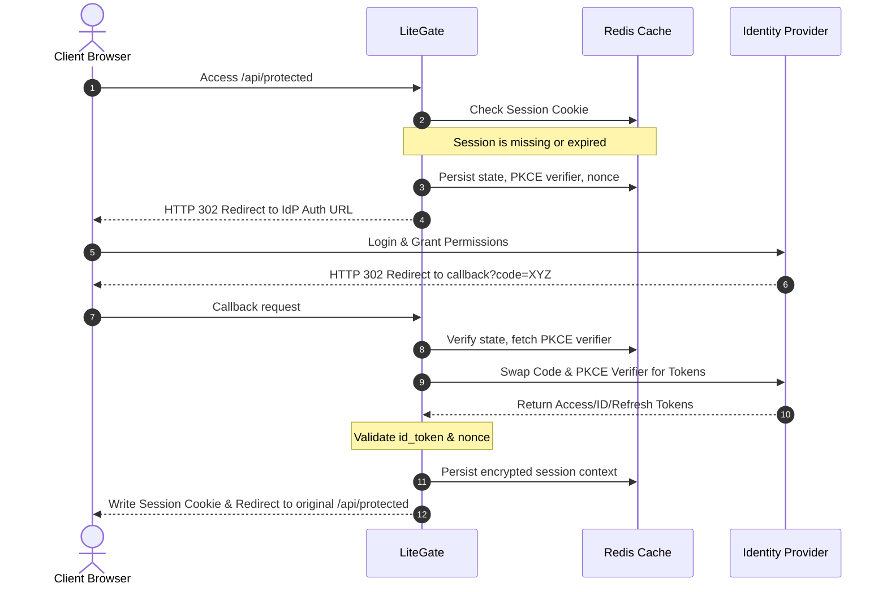

# OIDC / OAuth2 Authentication Guide

LiteGate features enterprise-grade federated identity integration powered by standard OIDC and OAuth2 authentication handlers, utilizing `remote_auth.provider` definitions backed by a distributed Redis session store.

---

## 1. Architectural Blueprint

LiteGate's identity verification follows a **Stateless Routing + Stateful Session** design:

- **Redis as a Hard Dependency**: Transient parameters (such as `state` validation salts, PKCE verifiers, and nonces) as well as post-login user session context are persisted directly in your Redis cluster.
- **Zero Local State on Edge Gateways**: Gateways remain stateless. Client browsers only carry an encrypted AES session cookie that maps to the physical session state kept in the central Redis cluster.
- **Flexible Callbacks**: Supports system-default callback paths (`/_litegate/oauth/callback`) as well as customized callback URIs declared at the provider or route level.

---

## 2. Global Configurations

### 2.1 Redis Store Activation
Redis is a mandatory prerequisite for OIDC/OAuth2 state tracking:

```yaml
redis:
  enabled: true
  address: "127.0.0.1:6379"
  password: ""
  db: 0
```

### 2.2 Declaring Auth Providers
Configure one or more central Identity Providers (IdP) in your `config.yaml`:

```yaml
auth_providers:
  google-oidc:
    enabled: true
    type: "oidc"
    issuer: "https://accounts.google.com"
    client_id: "YOUR_CLIENT_ID"
    client_secret: "YOUR_CLIENT_SECRET" # Supports env:XXX environment mappings
    scopes: ["openid", "profile", "email"]
    # Optional parameters:
    # callback_path: "/_auth/google/callback"
    # clock_skew: "5m"
    # allowed_signing_algs: ["RS256"]
    # notify_url: "http://your-app/auth-webhook"

  github-oauth:
    enabled: true
    type: "oauth2"
    auth_url: "https://github.com/login/oauth/authorize"
    token_url: "https://github.com/login/oauth/access_token"
    client_id: "YOUR_CLIENT_ID"
    client_secret: "YOUR_CLIENT_SECRET"
    scopes: ["user", "repo"]
    # callback_path: "/_auth/github/callback"
```

#### Under the Hood:
- **`type: oidc`**: Best suited for standard Identity Providers supporting OIDC Discovery metadata and cryptographic `id_token` validation.
- **`type: oauth2`**: Best suited for raw OAuth2 providers (such as GitHub) lacking OIDC Discovery specs.
- **Dynamic Secrets**: The `client_secret` parameter supports `env:ENVIRONMENT_VARIABLE_NAME` syntax to avoid hardcoding secrets.
- **Authorization parameters**: No `prompt` or `access_type` is sent by default. Google (issuer or auth_url on `accounts.google.com`) automatically gets `access_type=offline` and `prompt=consent`, which it needs to issue refresh tokens. Use `auth_params` (for example `auth_params: {prompt: login}`) to add or override parameters for other IdPs; an empty value removes a default. Parameters generated by the flow (`state`, `nonce`, `scope`, `redirect_uri`, ...) cannot be overridden.
- **Refresh tokens**: Keycloak issues them by default; Authentik, Dex and Azure AD usually require `offline_access` in `scopes`.

### 2.3 OIDC Security & Access Controls

```yaml
oidc_security:
  cookie_secret: "32_byte_secret_for_aes_encryption"
  cookie_same_site: "lax"   # lax / strict / none
  max_concurrent_sessions: 5

  # Restrictions for internal session exchange endpoints
  token_allowed_ips: ["127.0.0.1", "192.168.1.0/24"]
  me_allowed_ips: ["127.0.0.1"]

  # /_litegate/oauth/token is disabled by default
  # token_endpoint_enabled: true
  # Optional: delete a session after a direct session-ID lookup
  # token_one_shot: true
  # External hosts allowed as redirect_back targets
  # allowed_redirect_hosts: ["app.example.com"]
  # Failed login callbacks per IP within 15 minutes; default 20, negative disables
  # login_failure_limit: 20
```

#### Under the Hood:
- **`cookie_secret`**: Must be a cryptographically strong 32-byte secret. When set, session cookies are transparently encrypted via AES.
- **`max_concurrent_sessions`**: Restricts the maximum number of active concurrent sessions per user. Exceeding this limit evicts the oldest session record in Redis.
- **`token_allowed_ips`**: Restricts caller IP ranges permitted to access session exchange interfaces (`/_litegate/oauth/token`).
- **`me_allowed_ips`**: Restricts caller IP ranges permitted to query session metadata (`/_litegate/oauth/me`).
- **`login_failure_limit`**: After this many failed login callbacks from one IP (IdP errors, failed token exchanges) within 15 minutes, login initiation returns 403. Expired states and callbacks not started in the same browser are not counted. Raise it, or set a negative value to disable it, when many users share a NAT address.

---

## 3. Site and Route Configuration

Bind Identity Providers to specific routing pathways using the `remote_auth` configuration block:

```yaml
domain: "app.example.com"
routes:
  - name: "protected-api"
    match:
      path_prefix: "/api"
    action:
      type: "proxy"
      service_name: "my-backend"
      remote_auth:
        enabled: true
        provider: "google-oidc"
        enforce: true                 # Redirects unauthenticated traffic immediately to IdP
        callback_path: "/_auth/cb"    # Route-level callback override
        inject_claims:
          "X-User-Id": "sub"
          "X-User-Email": "email"
          "X-User-Name": "name"
```

#### Parameter Highlights:
- **`provider`**: References a declared provider key within `auth_providers`.
- **`enforce`**: When set to `true`, unauthenticated traffic is automatically redirected to the Identity Provider's login portal. When set to `false`, requests flow down to backend services without cookies, leaving it to backends to handle authentication.
- **`inject_claims`**: Dynamically extracts user properties from authenticated OIDC JWT tokens and injects them as custom HTTP request headers sent upstream.
- With `enforce: true`, browser requests (`Accept` containing `text/html`) are redirected to login and API requests receive `401`.
- If the provider is unavailable (not configured, or IdP discovery failed), enforced routes return `503` instead of passing traffic; only an explicit `fail_policy: allow` lets requests through anonymously. A provider initialized or reloaded later takes effect immediately.
- OIDC providers always request the `openid` scope; it may be omitted from `scopes`.
- The session cookie takes precedence. `Authorization: Bearer` is recognized only for gateway session IDs (UUIDs); a backend's own bearer tokens (such as JWTs) pass through untouched and do not affect the login state.
- The login callback requires the state cookie set in the browser that started the login, preventing login CSRF.
- Access tokens are refreshed when less than a quarter of their lifetime (at most 5 minutes) remains. If the IdP sends no `expires_in`, the session lasts as long as its session record (7 days).

---

## 4. Callback Path Steering

LiteGate supports two callback formats:
1. **Default callback endpoint**: `/_litegate/oauth/callback`.
2. **Custom callback paths**: Overridden at the provider or route level.

LiteGate's routing engine dynamically tracks active PKCE validation states in Redis. There is **no need** to manually create extra routes inside your YAML to handle callback URLs.

### Security Best Practices:
* Custom callback URLs must reside within the exact host domain scope of the site.
* Avoid routing conflicts with LiteGate reserved pathways:
  * `/.well-known/acme-challenge/*` (ACME challenges)
  * `/health` (Health endpoints)
  * `/_litegate/*` (Gateway internal endpoints)

---

## 5. Reserved Gateway API Endpoints

### 5.1 Query Session Context (`/_litegate/oauth/me`)
Accessing this endpoint returns JSON data for the current active user session:
```text
GET /_litegate/oauth/me
```
*Response Payload*:
```json
{
  "id": "session-uuid",
  "user_id": "user-unique-identifier",
  "provider": "google-oidc",
  "claims": {
    "sub": "user-sub",
    "email": "user@example.com"
  },
  "expiry": "2026-05-19T10:00:00Z"
}
```
* Security is restricted by `oidc_security.me_allowed_ips`.

### 5.2 Exchange Session Tokens (`/_litegate/oauth/token`)
Internal backend microservices can query active session contexts from the gateway by passing a session ID:
```text
GET /_litegate/oauth/token?id=<session-id>
```
Or by supplying it via header injection:
```text
Authorization: Bearer <session-id>
```
* Requires `oidc_security.token_endpoint_enabled: true`; callers are restricted by `oidc_security.token_allowed_ips`.
* `id` may be a session ID or a one-time ticket from `redirect_back` (below). A ticket is invalid after its first exchange, and its session stays valid for the browser. `token_one_shot: true` applies only to direct session-ID lookups and deletes that session after the query.

### 5.2.1 `redirect_back`: handing the login to another system
Start the login with `?redirect_back=<url>` (or set `default_redirect_back` on the route). After login the browser is sent there with `token=<ticket>` (and the passthrough `state`). External targets must be https and listed in `allowed_redirect_hosts`.

`token` is a one-time ticket valid for 2 minutes, not the session ID: URLs end up in browser history, access logs and Referer headers, so the 7-day session credential is never placed in one. The receiver exchanges the ticket server-side at `/_litegate/oauth/token?id=<ticket>`.

> Earlier versions passed the session ID here. Receivers that used `token` as `Authorization: Bearer` must exchange it first; the `id` field of the result is the session ID.

### 5.3 Manual Token Refresh (`/_litegate/oauth/refresh`)
```text
POST /_litegate/oauth/refresh?id=<session-id>
```
* Requires a valid session containing an active `refresh_token` and an IdP supporting refresh loops.

### 5.4 Evict Session State (`/_litegate/oauth/logout`)
```text
GET /_litegate/oauth/logout
```
* Deletes the Redis session and the local cookies. If the provider advertises an `end_session_endpoint`, the user is redirected there with `id_token_hint`, `client_id` and `post_logout_redirect_uri` (the site root `/`); otherwise to `/`.
* Register the `post_logout_redirect_uri` with the IdP client (Keycloak: Valid post logout redirect URIs), or the IdP will refuse to redirect back.

---

## 6. Execution Flow Lifecycle

A typical OIDC/OAuth2 authorization code flow with PKCE follows this sequence:



---

## 7. Troubleshooting & FAQ

### Callback throws `State mismatch` or `Session expired`?
- **Redis Availability**: Ensure the Redis server is responsive and writable.
- **Expiration Limits**: Transient state values might have expired before the user completed IdP authentication.
- **Redirect URI Mismatch**: Confirm that the redirect URI registered in your Identity Provider's console exactly matches the URL format used by LiteGate.

### How do backend applications read user details?
Configure `inject_claims` in your routing table. LiteGate extracts user details and injects them as standard request headers sent upstream.
```yaml
inject_claims:
  "X-User-Id": "sub"
  "X-User-Email": "email"
```
Backend microservices can read user details directly from `X-User-Id` headers.

The two configuration forms map in opposite directions: the route-level `inject_claims` map is `Header: claim`, while a named `type: remote_auth` middleware takes `config.inject_claims` as a comma-separated `claim:Header` string (for example `sub:X-User-Id,email:X-User-Email`).
