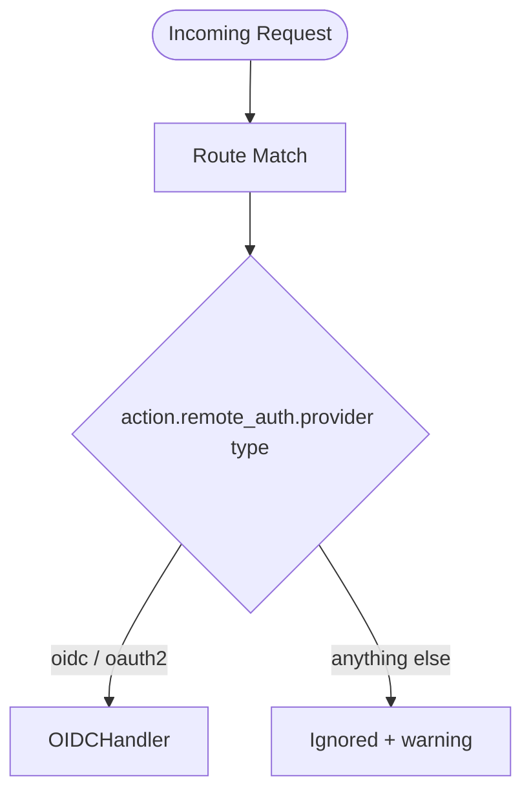

# Remote Auth (OIDC / OAuth2 SSO)

> **Scope change.** `remote_auth` used to be an umbrella engine that also covered dynamic
> open-platform credential verification and multi-tenant session steering. Those
> responsibilities have moved to **IDS (Identity Steering)**, which now runs as a
> pre-proxy governance seam configured under `action.ids` — see the
> [IDS development guide](../../ids_development_guide.md). Today `remote_auth` is the
> narrow, compatibility entry for **redirect-based OIDC / OAuth2 SSO federation only**.

---

## 1. What `remote_auth` does now

`remote_auth` mounts as a standard HTTP middleware (not the IDS pre-proxy seam) and drives
browser-facing **OIDC / OAuth2 login redirect loops**: unauthenticated requests are
redirected to the identity provider, the callback is validated, and verified claims are
injected downstream. It is dispatched only when the linked provider is of type `oidc` or
`oauth2`; other legacy sign methods are no longer handled here.



---

## 2. Configuration

Define an OIDC/OAuth2 provider in the global `config.yaml` under `auth_providers`:

```yaml
auth_providers:
  google:
    enabled: true
    type: oidc
    issuer: "https://accounts.google.com"
    client_id: "..."
    client_secret: "..."
    scopes: ["openid", "email", "profile"]
    callback_path: "/_auth/callback/google"
```

Then reference it from the site configuration via `remote_auth`:

```yaml
domain: "portal.example.com"
routes:
  - name: "portal"
    match: { path_prefix: "/" }
    action:
      type: "proxy"
      service_name: "portal-svc"
      remote_auth:
        enabled: true
        provider: "google"
        enforce: true            # redirect to login when the session is missing
```

Only OIDC/OAuth2 fields on `auth_providers` are consumed (`issuer`, `client_id`,
`client_secret`, `scopes`, `callback_path`, `auth_url`, `token_url`, `clock_skew`,
`allowed_signing_algs`, `introspection_url`, ...). For full OIDC details see
[oidc.md](./oidc.md) and [authentication.md](./authentication.md).

---

## 3. Moved to IDS — do not configure it here

The following are **no longer** part of `remote_auth`. Configure them under `action.ids`
(see the [IDS development guide](../../ids_development_guide.md)):

- Open-platform signature verification and SaaS session steering are implemented by an `ids.provider` selected per route.
- Route policy is passed through hot-reloadable `ids.options`; Providers own their DB/Redis/HTTP pools and resolve secrets from their own secure source.

> ⚠️ **Security note.** IDS no longer auto-injects readable tenant/DB/cluster headers
> (`X-Tenant-ID`, `X-DB-Name`, `X-SID`, ...). Such headers are **Fail-Closed blocked**
> unless explicitly whitelisted via `ids.allowed_headers`; prefer opaque references like
> `X-LiteGate-Identity-Ref`.

---

## 4. Operational notes

- **Provider type mismatch**: if a route's `remote_auth.provider` resolves to a type other
  than `oidc`/`oauth2`, the middleware is skipped and a warning is logged.
- **`fail_policy`**: `deny` (default) rejects on failure; `allow` (fail-open) must be set
  explicitly and is surfaced as a security warning in logs.
