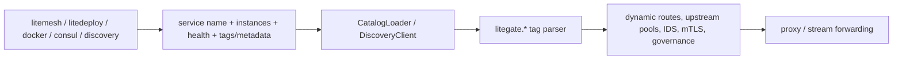

# Service Discovery Sources Overview

LiteGate backend discovery has 5 source types: `litemesh`, `litedeploy`, `docker`, `consul`, and `discovery`. After ingestion, all of them are normalized into the same `ServiceEndpoint` model, then the same `litegate.*` tags drive routing, upstream pools, authentication, IDS, mTLS, and observability.

The tag system is not owned by a single provider. Tags can come from Docker labels, Litemesh/LiteDeploy/Consul tags or metadata, or metadata returned by an external discovery agent. LiteGate only needs the normalized service name, instance address, health state, tags, and metadata.

## 1. Source Matrix

| Source | Config value | Connects to | Update mode | Best fit |
| :--- | :--- | :--- | :--- | :--- |
| Litemesh | `provider: litemesh` / `upstream_type: litemesh` | Litemesh Agent | SSE push | Litemesh environments, mTLS, frequent instance changes |
| LiteDeploy | `provider: litedeploy` / `upstream_type: litedeploy` | LiteDeploy Agent or cluster endpoints | SSE push | Services and metadata managed by LiteDeploy |
| Docker | `provider: docker` / `upstream_type: docker` | Docker Daemon socket | Docker event stream | Single-host Docker or Swarm using container labels |
| Consul | `provider: consul` / `upstream_type: consul` | Consul Agent / Catalog | Catalog sync | Existing Consul catalog and health checks |
| Discovery | `provider: discovery` / `upstream_type: external` | `camodns_discovery` or compatible agent | Blocking query | Aggregating heterogeneous registries such as Docker, K8s, Nacos, Etcd, and Litemesh |

> [!NOTE]
> `provider: discovery` maps to LiteGate's external discovery client at runtime. It is not a sixth business registry. It is the HTTP blocking-query adapter used to consume `camodns_discovery` or a compatible aggregation layer.

## 2. How Tags Flow



Common tag responsibilities:

| Tag scope | Purpose |
| :--- | :--- |
| `litegate.http.host/path/path_prefix/strip_path` | Shortcut: forward one domain to this service |
| `litegate.http.routers.<name>.*` | Declare Host/path rules and reference IDS, Middleware, and Service resources; attached to web and websecure by default |
| `litegate.entrypoints.<name>.*` | Open a new HTTP listener; the port must be in `service_discovery.tag_entrypoints.allowed_ports` |
| `litegate.http.services.<name>.*` | Declare discovery, selectors, balancing, health checks, retry, and circuit breaking |
| `litegate.http.middlewares.<name>.*` | Declare reusable request/response processing |
| `mtls`, `mtls_port`, `spiffe_id` | Declare Litemesh mTLS backend access |
| `sid`, `env`, `version`, etc. | Drive canary routing, tenant isolation, and IDS-selected physical steering |

## 3. Discovery and camodns_discovery

The `discovery` source connects to `camodns_discovery`. LiteGate treats it as an HTTP agent compatible with Consul Catalog semantics and consumes blocking-query style endpoints such as:

- `GET /v1/catalog/services`
- `GET /v1/health/service/:service_name`

The point of blocking query is to avoid tight polling loops. The agent can hold the request until its service index changes, then return the new index and instance list. This lets an external aggregation layer normalize Docker, K8s, Nacos, Etcd, Litemesh, and other registries into a service catalog LiteGate can consume.

```yaml
service_discovery:
  catalogs:
    - enabled: true
      provider: discovery
      url: "http://127.0.0.1:55500"
      namespace: "default"
```

If `camodns_discovery` itself is registered in Litemesh or Consul, LiteGate can resolve the discovery agent by service name first, then consume its blocking-query API:

```yaml
service_discovery:
  catalogs:
    - enabled: true
      provider: discovery
      service_name: "camodns-discovery"
      url: "http://127.0.0.1:8787"
      resolve_via: "litemesh"
      namespace: "default"
```

## 4. Choosing a Source

| Current environment | Recommended source |
| :--- | :--- |
| Backends already use Litemesh and need mTLS | `litemesh` |
| Releases are managed by LiteDeploy | `litedeploy` |
| Services mostly run on Docker / Swarm | `docker` |
| Consul Catalog and health checks already exist | `consul` |
| Multiple registries need to be aggregated before LiteGate consumes them | `discovery` + `camodns_discovery` |

## Further Reading

- [Site YAML V2: Integrating Discovery Sources, Tags, and V2](../03-configuration/site-yaml-v2-concepts.md#14-integrating-discovery-sources-tags-and-v2): routing responsibilities, Hybrid merging, conflicts, and decommissioning
- [Tag DSL](../03-configuration/tag-dsl.md)
- [Proxy Action](../04-actions/proxy.md)
- [Consul Discovery](./consul.md)
- [Litemesh Discovery](./litemesh.md)
- [Litemesh mTLS](./litemesh-mtls.md)
- [Docker Provider Deployment Guide](../../litegate_docker_provider_deployment_guide.md)
