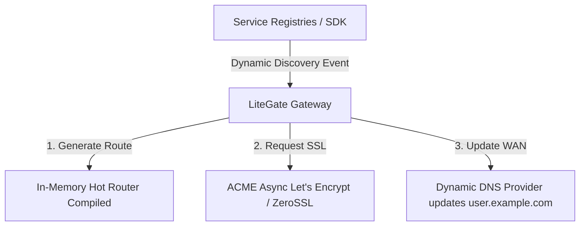

# Magic Ingress (Zero-Configuration Routing)

**Magic Ingress** is the flagship dynamic ingress capability of LiteGate operating in **Litemesh** mode. It achieves "Service-Defined Routing" automation, freeing developers from manually authoring gateway configurations, Ingress controllers, or reload orchestrations.

---

## 1. Core Architecture Design

Traditional Ingress workflows for microservices are notoriously complex and slow:
1. Deploy application workload (e.g. Pod).
2. Configure networking service layers.
3. Write/deploy Ingress controller YAML routing blocks.
4. Wait for external ACME challenges to issue SSL certificates.
5. Manually associate DNS records with the gateway's IP.

**With Magic Ingress, you only need one single step**:
* Tag your microservice instance with the destination domain. LiteGate's control plane dynamically monitors service catalog discoveries and automates all remaining tasks (routing maps compilation, certificate requests, and DNS syncs) in real-time.

---

## 2. Prerequisite: Connect a Discovery Source

Magic Ingress works automatically — there is no separate on/off flag. You only need a discovery source connected in `config.yaml` (Litemesh, Consul, or Docker):

```yaml
litemesh:
  enabled: true
```

Once a discovery source is connected, any service registered with the magic tags below becomes reachable through the gateway with no per-service route configuration.

---

## 3. Registering with Magic Tags

Add the following metadata keys directly to your microservice configuration (whether registering via direct SDK integration or Litemesh Sidecar controllers):

| Metadata Tag Key | Example Value | Description |
| :--- | :--- | :--- |
| `litegate.http.host/path/path_prefix/strip_path` | `myapi.com`, `/api`, `true` | Single-Router shortcut targeting the registered service. |
| `litegate.http.routers.<name>.*` | Router properties | Use the complete resource model for multiple Routers, IDS, or explicit Middlewares. |
| `litegate.http.services.<name>.*` | Service properties | Define discovery, selectors, and load balancing. |

> See the [Service Tag Reference](../03-configuration/tag-reference.md) for every tag.

### Go SDK Registration Example:
```go
import "github.com/jamesleeon/LiteGate/sdk"

service := &sdk.ServiceInstance{
    Name: "user-service",
    Tags: []string{
        "litegate.http.routers.users.match.hosts=user.example.com",
        "litegate.http.routers.users.match.path_prefix=/v1/users",
    },
}
client.Register(service)
```

---

## 4. The Magic Ingress Automation Pipeline

Once a tagged service registers with the discovery plane, LiteGate executes the following real-time workflow:



1. **Hot Route Compilation**: LiteGate intercepts the discovery event and compiles a matching L7 virtual host router directly inside the in-memory route map. `user.example.com` becomes accessible within milliseconds.
2. **Automated SSL/TLS Provisioning**: LiteGate asynchronously triggers ACME HTTP-01 challenges to generate secure, production Let's Encrypt or ZeroSSL certificates for the target domain.
3. **Automated DDNS Sync**: If an outbound DNS provider updater is active, LiteGate updates Cloudflare, Aliyun, or route registers, binding the new microservice domain to the active gateway cluster IP.

---

## Further Reading
- [Magic Ingress Deep Architecture Blueprint](../../magic_ingress_architecture.md)
- [Activating Litemesh Zero-Trust Integration](../07-discovery/litemesh.md)
- [Automated TLS Certificate Pipelines](../06-certificates/auto-cert.md)
