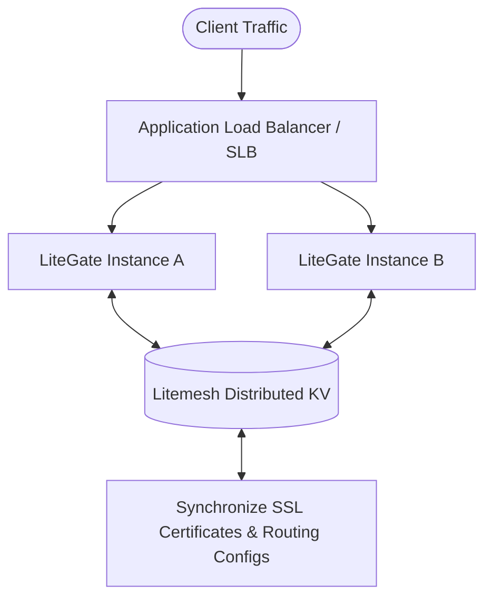

# Production Deployment Best Practices

While LiteGate's default configurations prioritize ease of use out-of-the-box, high-concurrency, high-availability, and enterprise production environments require additional tuning and security hardening.

---

## 1. Performance Tuning

### OS-Level Kernel Adjustments (Linux)
To handle tens of thousands of concurrent connections at the edge layer, you must adjust the operating system's maximum file descriptor limits:

```bash
# Check and increase file descriptor limits temporarily or write to /etc/security/limits.conf
ulimit -n 65535
```

---

## 2. High-Availability (HA) Topologies

> [!IMPORTANT]
> **Single Point of Failure (SPOF) Rule**: Never run a single standalone gateway instance in high-load production environments.

### Recommended Topology: Active-Active Multi-Node Clustering (Litemesh)



1. Deploy at least **2 or more LiteGate instances** across different availability zones.
2. Enable Litemesh integration. This ensures that SSL/TLS certificates and routing configurations are synchronized across the cluster in real-time.
3. Place a highly resilient carrier-grade Application Load Balancer (ALB / SLB) or hardware balancer in front of the LiteGate cluster to distribute ingress HTTP/HTTPS (port 80/443) traffic.

---

## 3. Security Hardening

### Administrative Protection
Change the default Dashboard administrative password to a strong Bcrypt password. Set up `ip_restriction` filters to restrict dashboard access to internal corporate VPNs or specific subnets.

### TLS Protocol Hardening
- Enforce full-site HTTPS redirects globally.
- Enable HTTP Strict Transport Security (HSTS) flags.
- Disable deprecated and vulnerable cipher suites and legacy protocols (such as SSL 3.0, TLS 1.0, and TLS 1.1). Force a minimum protocol version of TLS 1.2 or TLS 1.3.

---

## 4. Monitoring & Backup Routines

- **Telemetry**: Integrate Prometheus with the metrics scraper port (`:9091/metrics`).
- **Cold Backups**: Regularly backup your site configuration directory `sites/` and certificate private keys `certs/` (if local file storage is active) to offline locations.
- **Failures**: Set up automated SRE alerts for high CPU utilization, memory thresholds, high HTTP 5xx error rates, or database reachability issues.

---

## Further Reading
- [How to Activate Cluster Certificate Sharing](../06-certificates/auto-cert.md)
