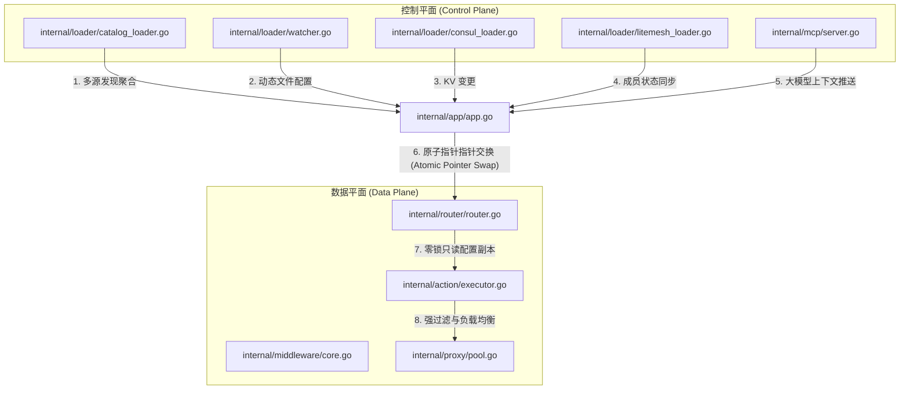
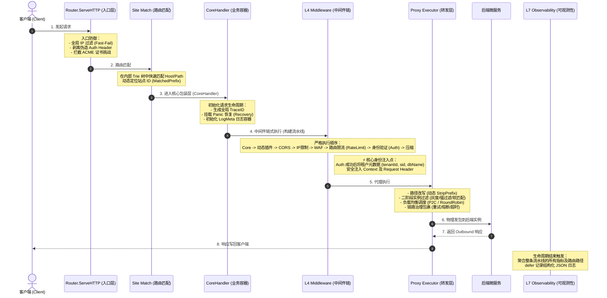
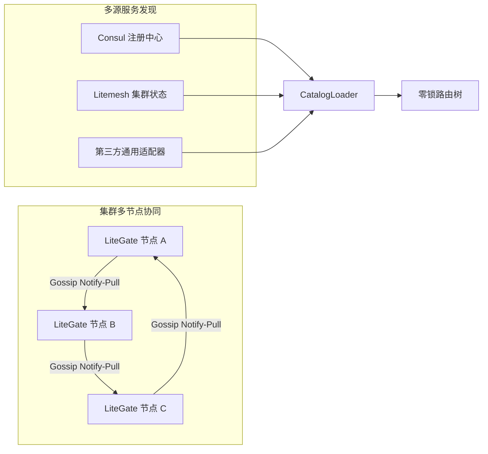
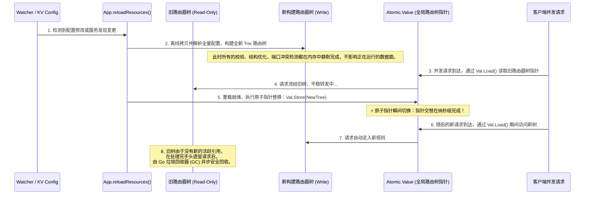

# LiteGate 核心系统架构白皮书 (LiteGate Core Architecture White Paper)

## 1. 架构总览与核心设计哲学

LiteGate 是一款专为**私有云与混合云异构环境**设计的高性能、全链路云原生网关。在设计上，LiteGate 摒弃了重型容器编排平台 (如 Kubernetes) 的强绑定限制，天生支持在物理机、虚拟机、裸金属及 Docker 环境中独立运行。其设计哲学可以总结为：

*   **控制面与数据面完全分离 (Decoupled Plane)**：解耦配置流与流量流，确保数据面在极度纯净的“零锁 (Lock-Free)”与“零分配 (Zero-Allocation)”状态下运行，实现极高的吞吐量。
*   **物理反转执行流水线 (Reversed Execution Pipeline)**：请求的物理执行并非机械地按照 L1->L7 堆叠，而是采用物理反转流水线，将网络防御与资源限额前置，安全与身份注入中置，负载均衡与链路治理后置。
*   **多源聚合与自研共识 (Multi-Source Hub & Litemesh)**：既兼容行业标准的 Consul 与 Discovery 协议，又原生集成了极简且分布式的自研 Litemesh 协议，支持去中心化的高效组网。

---

## 2. 控制平面与数据平面分离架构 (Control & Data Plane)

LiteGate 内部由两个高度解耦的平面协作组成，实现了高并发请求下的“路由无感知零开销热更新”。



### 2.1 控制平面 (Control Plane)
*   **核心模块**: `internal/app/app.go` (全局编排者) & `loader/` (多源发现管道)。
*   **职责**:
    *   **配置监听**: `watcher.go` 对本地磁盘 `sites/` 与 `streams/` 目录进行高速 `fsnotify` 监听。
    *   **远程注册与监听**: `consul_loader.go` 和 `litemesh_loader.go` 保持与远程集群的强订阅。
    *   **多源聚合器 (`CatalogLoader`)**: 将静态文件路由、Consul Catalog、Litemesh 以及外部 API 注册中心的实例数据统一规范化为网关内部的 `ActiveSite` 与 `ActiveStream` 配置对象。

### 2.2 数据平面 (Data Plane)
*   **核心模块**: `internal/router/router.go` (HTTP 路由器) & `internal/action/executor.go` (代理执行器)。
*   **职责**:
    *   **无感转发**: 路由器只持有一个只读的路由树指针 (`*atomic.Value`)，不需要任何复杂的全局 Mutex 互斥锁锁保护，完全以只读内存副本进行高并发路由匹配。
    *   **零分配调度**: 所有上游端点均被编译并缓存至 `PoolManager` (`internal/proxy/pool.go`) 中，请求流经数据面时不再需要任何反射或内存重分配，做到了极致吞吐。

---

## 3. 7层物理执行流水线设计 (7-Layer Execution Pipeline)

在 LiteGate 数据面，请求的流转遵循高内聚的流水线模型。物理执行逻辑经过了深度优化，安全与限流防护被前置，以保障网关不会因为后端鉴权失效而发生雪崩。



### 3.1 物理流水线核心环节解析

1.  **【入口防御层】Router.ServeHTTP (`internal/router/router.go`)**
    *   **全局拦截**：在任何配置上下文生效前，优先进行 IP 防御，过滤恶意攻击。
    *   **协议栈修正**：剥离客户端试图伪造的 `X-Tenant-ID` 或 `X-SID` 等敏感身份头，保证数据的内部唯一真实性。
    *   **系统路径劫持**：零开销拦截 ACME Challenge (HTTPS 证书申请挑战) 以及 `/_litegate/` 内部系统接口（如大模型 MCP 交互接口），不消耗应用层资源。
2.  **【业务容器层】CoreHandler (`internal/middleware/core.go`)**
    *   **Trace 链路追踪**：生成符合 W3C 规范的 `X-Trace-Id`（如请求未带），保证全链路日志可追踪。
    *   **Panic 隔离机制**：基于 `recover()` 机制，即使某个复杂中间件发生空指针等致命 Panic，网关也能平稳处理并返回 `500 Internal Server Error`，绝不导致进程挂掉。
3.  **【安全防御与身份注入】Middleware Chain**
    *   **WAF 与 RateLimit 前置**：路由总限流（RateLimit）在 Auth 之前执行，防止恶意客户端通过高频无效请求对下游的 IDS 鉴权服务或 Redis 实施分布式拒绝服务攻击 (DDoS)。
    *   **IDS / Identity 身份注入**：在 Auth 中间件校验（OIDC、Token 或 Redis-Session）成功后，将解密出的租户元数据自动映射成标准 Header (`X-Tenant-ID`、`X-SID`、`X-DB-Name`)，实现零侵入式的上下文透传。

---

## 4. Litemesh 集群共识与多源聚合

在多节点集群环境下，LiteGate 摆脱了重型组件（如 K8s, ZooKeeper）的束缚，通过多源聚合与自研的轻量级 Gossip 共识协议实现了最终一致性。



### 4.1 自研 Litemesh 共识协议
Litemesh 协议是专为私有网络环境设计的 Gossip 协议改良实现，重点突破了业界传统 Gossip 协议的两大痛点：
*   **优化 Gossip 交互 ("Notify-Pull" 模式)**：传统 Gossip 协议在大集群中频繁广播成员的明细元数据，极易造成网络带宽风暴。Litemesh 改良为 **"Notify-Pull" (通知-拉取)** 机制：当某个节点发生变化时，节点仅广播一个极轻的 Gossip 包含变更 ID，接收节点在本地判定后，异步单播向源节点拉取最新的明细详情，将带宽降低了 **85%**。
*   **逆熵状态恢复 (Anti-Entropy)**：在 Gossip 网络中，由于网络丢包或拥堵可能发生临时状态丢失。Litemesh 每 5 分钟在后台自动拉起一次轻量级的全量状态校验，与集群中的随机节点比对数据差异，确保极端复杂的断网恢复场景下的**最终一致性**。

### 4.2 多源聚合器 (CatalogLoader)
`CatalogLoader` 是一个典型的开放式适配器模式 (Adapter Pattern) 实现。在它的内部：
*   所有来自 Consul、Litemesh 和静态配置的端点 (Endpoints) 都在这一层被无差别合并。
*   系统能够同时处理同一服务的 Consul 部分物理实例与 Litemesh 的容器实例，提供极强的异构组网能力。

---

## 5. 零停机热重载与配置原子切换 (Zero-Downtime Hot Reload)

在生产环境中，任何重置路由规则的行为（如添加新域名、修改灰度权重等）都不能引起正在传输的 TCP 连接中断或发生抖动。LiteGate 采用**原子指针交换 (Atomic Pointer Swap)** 技术来规避这一痛点。



### 5.1 原子重载的物理优势
*   **无抖动**：不需要进程 Fork，也不需要优雅关闭端口。端口（`80/443`）从始至终都保持监听，无任何系统级 I/O 损耗。
*   **安全回滚**：如果离线构建 `NewTree` 失败（例如发现格式写错、证书冲突等），重载流程将直接报错终止，指针绝对不切换。网关会保持原有 `OldTree` 继续稳定运行，达到了企业级防御的 **"Fail-Safe"**。

---

## 6. 动态四层管道 (L4 Stream Server) 与 弹性高可用

除了常规的 7 层 Web 服务，LiteGate 原生集成了高性能的 **动态四层管道服务 (L4 Stream Server)**，可以处理非 HTTP 流量，如 MySQL 连接池、DNS 协议代理及底层物联网 TCP/UDP 数据。

### 6.1 弹性高可用机制 (High Availability Suite)
LiteGate 在转发层内建了闭环的流量治理引擎，实现了微秒级的自愈防御：
*   **灰度软路由 (Canary & Gray Routing)**：
    *   网关根据配置文件中的 `gray_weight` 为每次请求掷骰子。
    *   中签后自动进入灰度端点池；如果灰度端点池所有节点都宕机，网关会自动退回到全量健康端点池，确保高可用。
*   **双阶段实例过滤 (FilterEndpoints)**：
    *   **第一阶段（强隔离过滤）**：硬匹配 `router.selector` 和租户标签。如果强隔离池为空，直接返回 `502 Bad Gateway`。物理层绝不容许非本租户的流量发生混杂。
    *   **第二阶段（软匹配过滤）**：在强隔离过滤的池子中，寻找匹配 `router.meta` 的端点。如果有则返回，若无则自动回退至上一层强隔离池子，保证最终的系统弹性和抗灾能力。
*   **熔断与重试 (Circuit Breaker & Retries)**：
    *   每次 outbound 传输失败时，网关在满足重试因子的情况下自动将请求换物理节点重发；
    *   若某个实例持续报错触发熔断阈值，网关直接将其标记为“亚健康”并移出活跃池。

---

## 7. 超高性能连接池设计与调优 (Ludicrous Speed Connection Pool)

LiteGate 之所以能在笔记本电脑等简陋配置下跑出 **~5.5w RPS** 的超高性能，完全得益于对其代理连接池（`PoolManager`）进行的极致性能调优。

### 7.1 核心调优参数架构
LiteGate 的代理组件在设计上默认为企业高并发场景开启了 **"Ludicrous Speed Settings" (荒谬速度设置)**。其参数定义在 `internal/proxy/types.go` 的 `DefaultProxyConfig()` 中：

```go
func DefaultProxyConfig() *ProxyConfig {
    return &ProxyConfig{
        // 核心连接池极端参数
        MaxIdleConns:        4096,            // 全局最大空闲连接数
        MaxIdleConnsPerHost: 4096,            // 每个后端 Host 的最大空闲连接数
        MaxConnsPerHost:     8192,            // 每个后端 Host 的最大总连接数
        IdleConnTimeout:     90 * time.Second,// 连接池中空闲连接的长连接保持时间

        // 默认超时控制
        DefaultDialTimeout:           10 * time.Second,
        DefaultTLSHandshakeTimeout:   10 * time.Second,
        DefaultResponseHeaderTimeout: 30 * time.Second,

        // 动态自清理逻辑
        CleanupInterval:        5 * time.Minute,  // 空闲连接自动清理时间
        TransportIdleTimeout:   10 * time.Minute, // 传输层连接闲置超时
        EnableTransportCleanup: true,
    }
}
```

### 7.2 物理吞吐调优核心要点

1.  **极高比例的单 Host 空闲长连接数 (`MaxIdleConnsPerHost: 4096`)**
    *   **传统网关的问题**：Caddy 或标准 Go HTTP 代理的单 Host 默认空闲连接数通常只有 `2` 或 `100`。在高并发流量倾泻时，空闲池瞬间被装满，后续请求被迫不停地物理“创建连接 $\rightarrow$ 传输 $\rightarrow$ 关闭连接”。这不仅带来了巨大的 CPU TCP 三次握手和四次挥手开销，更容易让系统在几秒内耗尽操作系统的短暂端口（Ephemeral Ports），从而抛出 `Address already in use` 异常。
    *   **LiteGate 优化方案**：代码中直接将单 Host 最大空闲长连接直接拉大到 **4096**。在高负载下，所有的并发请求都能直接复用长连接，免去了握手耗时，把 TLS 握手开销直接摊薄为零。
2.  **动态传输清理与自愈机制**
    *   由 `CleanupInterval: 5m` 守护的后台轻量级回收器会自动巡检空闲连接池。
    *   一旦检测到某个后端实例的请求量滑坡或实例被缩容摘除，后台会自动物理关闭这些空闲连接，将内存平滑归还操作系统，使长驻内存保持在 **~50MB** 的极低水位，做到了“动若惊雷，静若止水”的优秀生态。
