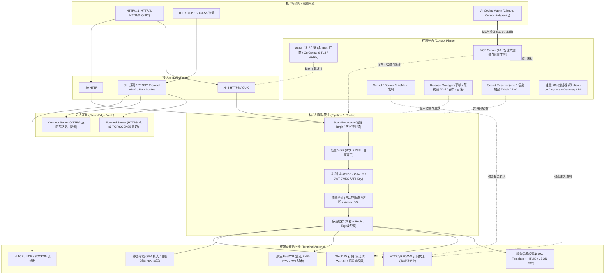

# LiteGate 深度介绍：下一代全能型云原生边缘网关

> **版本**：v1.0+ / 架构演进版  
> **语言**：Go 1.27+  
> **源码基准**：基于当前核心工程代码全量分析与提炼

---

## 目录
1. [定位与设计哲学](#1-定位与设计哲学)
2. [核心架构与关键能力一览](#2-核心架构与关键能力一览)
3. [核心技术亮点（基于源码深度剖析）](#3-核心技术亮点基于源码深度剖析)
   - [3.1 轻量级 Kubernetes 控制面：零 client-go 依赖](#31-轻量级-kubernetes-控制面零-client-go-依赖)
   - [3.2 云边互联与内网穿透：Connect 与 Forward 隧道](#32-云边互联与内网穿透connect-与-forward-隧道)
   - [3.3 AI-Native 智能体基建：内置 Model Context Protocol (MCP)](#33-ai-native-智能体基建内置-model-context-protocol-mcp)
   - [3.4 GitOps 级配置发布控制面（Release Control）](#34-gitops-级配置发布控制面release-control)
   - [3.5 强大的终端动作（Action）与一体化运行时](#35-强大的终端动作action与一体化运行时)
   - [3.6 全链路安全防护与信封加密（Sealed Secret）](#36-全链路安全防护与信封加密sealed-secret)
   - [3.7 双阶配置体系：.lite.yaml 极简风与企业级 YAML](#37-双阶配置体系liteyaml-极简风与企业级-yaml)
4. [横向对比：LiteGate vs 主流网关与反向代理](#4-横向对比litegate-vs-主流网关与反向代理)
   - [4.1 综合能力对比矩阵](#41-综合能力对比矩阵)
   - [4.2 对标 Nginx / OpenResty](#42-对标-nginx--openresty)
   - [4.3 对标 Traefik](#43-对标-traefik)
   - [4.4 对标 Caddy](#44-对标-caddy)
   - [4.5 对标 Envoy / Istio](#45-对标-envoy--istio)
   - [4.6 对标 frp / Cloudflare Tunnel](#46-对标-frp--cloudflare-tunnel)
5. [LiteGate 的核心优点与局限性](#5-litegate-的核心优点与局限性)
   - [5.1 核心优势（Pros）](#51-核心优势pros)
   - [5.2 潜在缺点与适用边界（Cons）](#52-潜在缺点与适用边界cons)
6. [典型应用场景与落地建议](#6-典型应用场景与落地建议)
7. [快速上手指南](#7-快速上手指南)

---

## 1. 定位与设计哲学

在现代分布式系统、微服务架构以及 AI 智能体（Agent）蓬勃发展的背景下，接入层与边缘网关的技术栈正面临新的痛点：
- **工具链割裂**：传统方案通常需要拼装 **Nginx**（反代/静态服）、**Certbot**（ACME 证书更新）、**frp/Cloudflared**（内网穿透）、**Traefik/Ingress-Nginx**（容器与微服务发现）以及各类第三方 WAF / 限流插件。
- **依赖庞大臃肿**：引入 Kubernetes 生态通常意味着拉入体积数十兆甚至上百兆的 `k8s.io/client-go`，带来频繁的安全 CVE 漏洞补丁困扰与缓慢的编译速度。
- **运维与变更风险**：传统网关配置重载（Reload）容易导致长连接/WebSocket/HTTP2 流异常中断，缺乏针对配置变更的“草稿-校验-Diff-回滚”闭环。
- **AI 智能体交互缺失**：大语言模型（LLM）与自动化运维 Agent 难以直接对黑盒网关进行安全可控的观测与调优。

**LiteGate（轻门）** 的诞生正是为了打破这种割裂。它是一个**基于纯 Go 语言编写、单二进制交付、零 CGO 依赖、原生融合云边协同与 AI 协议（MCP）的全能型现代化边缘网关**。

LiteGate 的核心设计哲学可以概括为：
1. **All-in-One 单二进制交付**：将 API 网关、L4/L7 反代、静态托管、FastCGI、WebDAV、模板 SSR、自动化证书与内网穿透融为一体，杜绝组件拼装。
2. **连接一切的云边拓扑**：无论服务身处公网 VPS、K8s 集群，还是无公网 IP 的私网内网机房，均能通过内置隧道无缝纳入统一数据平面。
3. **安全透明、可控可溯**：内置信封加密凭证、配置灰度发布闭环、蜜罐防扫描与自适应流量治理。
4. **面向智能体原生（AI-Native）**：内置深度的 Model Context Protocol (MCP) 接口，让 AI Agent 可以“看得懂、测得准、改得对”。

---

## 2. 核心架构与关键能力一览

LiteGate 的内部架构由分层清晰、松耦合的模块组成，整体分为**网络接入层（Transport/EntryPoints）**、**路由与治理管线（Routing & Pipeline）**、**终端动作执行器（Action Executors）**、**云边互联数据面（Connect & Forward）**以及**控制平面（Discovery, CertManager, Release, MCP）**。



---

## 3. 核心技术亮点（基于源码深度剖析）

### 3.1 轻量级 Kubernetes 控制面：零 client-go 依赖

在绝大多数支持 Kubernetes 的开源网关中，引入 `k8s.io/client-go` 会导致依赖树爆炸式增长（数万行依赖代码、二三十兆可执行文件体积增量），并且极易受上游各类次要 CVE 漏洞波及。

**代码实现亮点**（参见 `internal/provider/k8s/client.go`）：
- LiteGate 完全**摒弃了臃肿的 `client-go` 依赖**，基于 Go 标准库 `net/http` 原生实现了一个极其紧凑的高性能 K8s REST 客户端。
- **自动环境探测**：自动识别 Pod 内部 Projected ServiceAccount Token、CA 证书文件，并支持 In-Cluster Token 热轮换；
- **全能力支持**：
  - 支持标准 Kubernetes **Ingress Controller** 规范；
  - 完整实现 Kubernetes **Gateway API v1** 规范（包括 `GatewayClass`, `Gateway`, `HTTPRoute`, `GRPCRoute`, `TCPRoute`, `UDPRoute`, `TLSRoute`, `ReferenceGrant`）；
  - 内置基于 K8s 原生 `coordination.k8s.io/v1` Lease 的多副本高可用 **Leader Election（选主）** 机制；
  - 采用流式 HTTP Chunked / SSE Watch 监听 `EndpointSlice` 和资源变更，无缝写入网关内部负载均衡器。

### 3.2 云边互联与内网穿透：Connect 与 Forward 隧道

传统运维中，若要访问无公网 IP 节点上的服务（如内网数据库、家庭 NAS、边缘工控机），必须单独搭建 frp、ngrok、Cloudflare Tunnel 或庞大的 WireGuard VPN。

LiteGate 通过两大核心能力彻底重塑了云边组网：

#### 1. LiteGate Connect（架构级反向多路复用隧道）
- **实现原理**（参见 `internal/connect/`）：
  - 边缘（Home/Edge）节点主动向云端（Cloud）发起单向出站 HTTPS 请求，通过 `HTTP/1.1 101 Switching Protocols` 与专有协议 Upgrade（`litegate-connect.v1`）升级为反向 HTTP/2 传输通道。
  - **SNI 智能穿透**：云端仅做 L4 SNI 识别或 L7 反代分流，流量通过既有 HTTP/2 会话直接复用到内网节点，由内网节点本地终结 TLS 或执行业务逻辑。
  - **全双活高可用**：支持多云节点（N Cloud）× 多内网节点（M Edge）网状双活接入，具备自动健康巡检、租约心跳与毫秒级故障漂移。

#### 2. LiteGate Forward（极简安全端口转发与 SOCKS5）
- **实现原理**（参见 `internal/forward/` 与 `pkg/litegate/forward_cmd.go`）：
  - 采用 Forward v3 协议（`litegate-forward.v3`），单次握手鉴权后，每一个本地客户端连接均复用为 HTTP/2 CONNECT Stream；
  - 命令行只需一条指令：`litegate forward --remote https://gateway.com --token secrets/rds.token --target 127.0.0.1:3306`，即可将云端 RDS 或内网数据库安全映射到本地端口；
  - 内置严格的 SOCKS5 访问控制策略引擎（CIDR 白名单/黑名单校验），避免私有网络被非法利用。

### 3.3 AI-Native 智能体基建：内置 Model Context Protocol (MCP)

LiteGate 是行业内首批**原生内置完整 Model Context Protocol (MCP) Server** 的云原生网关（参见 `internal/mcp/`）。

网关不仅是流量入口，更是 AI 编程助手与自动化 DevOps Agent 的“智能感知与控制中枢”：
- **双模通信**：支持 Claude Code / Cursor 等 CLI 工具所用的 `stdio` 管道模式，以及远程部署场景所用的 `HTTP/SSE` 模式；
- **40+ 深度工具集**：
  - **状态与诊断**：`get_gateway_status`（运行时 GC/Goroutine 堆栈分析）、`get_recent_errors`、`get_recent_requests`、`list_active_tunnels`；
  - **路由沙盒与模拟**：`lookup_route`（在不发真实请求的前提下，模拟计算任意 Domain/Path/Header 的命中路由与重写规则）；
  - **安全与证书管理**：`list_certificates_status`、`request_certificate`、`inspect_on_demand_tls`；
  - **动态配置编排**：`get_site_config`、`validate_site_config`、`preview_config_change`（输出 YAML 语义 Diff）、`save_site_config`、`rollback_last_change`；
  - **发布与流控制**：`list_releases`、`validate_draft`、`publish_release`、`rollback_release`。

### 3.4 GitOps 级配置发布控制面（Release Control）

网关误配置往往是导致大规模生产故障的第一元凶。LiteGate 在内部构建了完整的发布控制面（参见 `internal/release/`）：
- **版本快照（Snapshot）**：每一次配置变更均作为一个不可变快照记录（计算 SHA-256 校验和）；
- **发布状态机**：严格遵循 `Draft（草稿）` → `Validated（干跑验证）` → `Publishing（发布中）` → `Active（生效）` / `RolledBack（已回滚）`；
- **结构化 Diff 与预检**：在正式发布前，可调用 Diff 引擎输出变更明细，并触发校验器验证端口冲突、路径重叠与语法安全；
- **一键原子回滚**：当生产出现异常时，可通过 CLI 或 MCP 工具秒级回滚到任意历史版本。

### 3.5 强大的终端动作（Action）与一体化运行时

在 LiteGate 的路由模型中，一个路由匹配后不仅能做 `proxy`，还能执行极其丰富的内置业务动作（参见 `internal/action/`）：

1. **反向代理（Proxy）**：
   - 支持 HTTP/1.1、HTTP/2、HTTP/3（QUIC）、gRPC 及 WebSocket 自动双向透传；
   - 优化的连接池管理（`pool.go`），支持基于负载与健康状况的动态复用；
   - 高级负载均衡策略：Round Robin、Weighted RR、Least Connection、IP Hash、Cookie 粘性会话、Power-of-Two-Choices (p2c)。
2. **原生 FastCGI 引擎**：
   - 内置完整的 FastCGI 客户端协议栈，可直接与本地或远程 PHP-FPM 通信，配置 `fastcgi_root` 与 `fastcgi_split_path` 即可运行 WordPress / Laravel，无需外置 Nginx！
3. **现代 WebDAV 存储服务**：
   - 拥有自研的 WebDAV 协议引擎，内置轻量直观的现代 Web UI 文件浏览器；
   - 深度集成 SSO / Basic Auth 认证与只读/读写（`ro`/`rw`）权限控制，支持直接安全下载。
4. **服务端模板渲染引擎（Template + HTMX）**：
   - 内置 Go Template 解析引擎，原生内嵌 `htmx.min.js` 与 `marked.js`；
   - 支持通过 `fetch_json` 并发异步拉取微服务或远程 API 数据并注入模板，支持基于请求 Nonce 的动态 Content-Security-Policy（CSP）防护与 KV 动态模板存储。
5. **高性能静态托管（Serve）**：
   - 针对单页应用（SPA）的历史路由回退支持（`spa: true`）；
   - 支持预压缩与动态压缩（Brotli、Gzip、Zstd），支持从内存/磁盘分片缓存加速。

### 3.6 全链路安全防护与信封加密（Sealed Secret）

- **蜜罐防御与防扫描（Scan Protection）**：
  - 内置 Tarpit（焦油坑）机制，对恶意爬虫和扫描器进行慢速响应阻塞，耗尽攻击者并发资源；
  - 自动拦截直接 IP 访问（`block_direct_ip`），对 404 暴力探测实施动态封禁。
- **信封加密（Sealed Secret）**：
  - 针对配置中常见的 API Token、私钥、数据库密码，LiteGate 提供了 `litegate secret keygen` 和 `litegate secret encrypt` 工具；
  - 配置文件中直接写入密文 `enc://<ciphertext>`，网关启动时通过主机本地私钥解密，防止 Git 提交泄漏明文凭证；
  - 同时支持 `env://`、`file://`、`vault://`、`secret+http://` 等多种外部 Secret 解析器。
- **Wasm IDS / 流量治理**：
  - 基于 **Wazero**（纯 Go 实现的 WebAssembly 运行时，无任何 CGO 依赖），支持动态热加载 `.wasm` 编写的 IDS 流量审查与鉴权插件。

### 3.7 双阶配置体系：.lite.yaml 极简风与企业级 YAML

LiteGate 兼顾了极客与大型企业的不同心智需求：
- **极简模式（`.lite.yaml`）**：针对个人开发者与轻量站点，提供媲美 Caddyfile 的极度直观语法：
  ```yaml
  app.example.com:
    proxy: 127.0.0.1:8080
    https: true

  static.example.com:
    root: /var/www/dist
    spa: true
  ```
  CLI 提供了 `litegate -export-lite` 命令，可直接将简洁语法编译导出为标准底层配置。
- **企业级全功能模式（`sites/*.yaml`）**：提供类似 Traefik 的强大 DSL（`rule: Host(...) && PathPrefix(...)`），支持复杂的路由优先级、多中间件编排、上游重试、健康探测与微服务元数据匹配。

---

## 4. 横向对比：LiteGate vs 主流网关与反向代理

为了客观评估 LiteGate 在当今基础设施技术栈中的地位，我们将其与工业界 5 款标杆性工具进行多维度对比分析。

### 4.1 综合能力对比矩阵

| 评估维度 | LiteGate | Nginx / OpenResty | Traefik | Caddy | Envoy |
| :--- | :--- | :--- | :--- | :--- | :--- |
| **基础语言与运行时** | **纯 Go** (单二进制 / 零 CGO) | **C 语言** (多进程 Worker) | **Go 语言** (Goroutine) | **Go 语言** (模块化) | **C++** (单进程多线程事件循环) |
| **内存与部署开销** | **极低** (~30MB 常驻内存) | **极低** (~10-20MB) | **中等** (~80-150MB) | **低至中等** (~50-100MB) | **中至高** (~100-300MB) |
| **配置热重载能力** | **无损纯内存热更** (不中断连接) | Reload 重启 Worker (长连接易受损) | 动态监听，平滑生效 | 动态 JSON API / 平滑更新 | xDS 动态下发生效 |
| **Kubernetes 原生支持** | **自研零依赖 Ingress & Gateway API v1** | Ingress-Nginx (庞大/维护停滞) | 官方 Controller (依赖大) | 社区插件 (维护滞后) | 需搭配 Contour/Istio 等控制面 |
| **动态服务发现源** | K8s, Docker, Consul, LiteMesh, 自定义 HTTP | 需依赖 Consul-template / Lua 轮询 | K8s, Docker, Swarm, Consul, Nomad 等 | 插件支持较少 | 依赖 xDS 服务发现 |
| **自动 TLS 证书** | **ACME (HTTP/ALPN/DNS) + 按需 TLS + DDNS** | 需外部工具 (Certbot / acme.sh) | 支持 ACME (高可用存储需企业版) | **业界标杆** (自动 HTTPS / 内部 CA) | 需外部控制面下发 Secret |
| **内网穿透 / 云边互通** | **内置 Connect (H2 隧道) & Forward (TCP/SOCKS5)** | 无 (需搭配 frp / ngrok) | 无 | 无 | 无 (需复杂多集群 Mesh 组网) |
| **AI 智能体原生 (MCP)** | **内置 MCP Server (40+ 工具集)** | 无 | 无 | 无 | 无 |
| **一体化业务能力** | **FastCGI, WebDAV+UI, Template+HTMX, SOCKS5** | FastCGI, WebDAV(模块) | 仅反代与静态托管 | FastCGI, 模板引擎 | 纯代理层 (无业务渲染) |
| **配置版本与回滚** | **内置发布控制面 (草稿/Diff/回滚)** | 无 (需依靠外部 GitOps) | 无 | 无 | 依赖外部管理面版本控制 |
| **安全与凭据管理** | **`enc://` 信封加密 + 蜜罐防扫描 + WAF** | 需商业版 Nginx Plus 或三方 Lua | 中间件扩展 | 插件扩展 | 过滤器生态强大，但配置复杂 |

---

### 4.2 对标 Nginx / OpenResty

- **Nginx 的优势**：
  - 经历了二十多年的极端生产验证，代码经过极限优化，C 语言的多进程事件驱动模型在超高吞吐、纯静态或裸反代场景下拥有业界顶级的 CPU 利用率和最低的极限延迟；
  - 拥有无可匹敌的第三方模块生态与全球技术资料库。
- **LiteGate 相比 Nginx 的优势**：
  - **真正的零停机动态热更**：Nginx 执行 `reload` 时需要分叉创建新 Worker 并等待老 Worker 优雅退出，遇到长周期 WebSocket / HTTP2 流时可能造成连接断开或内存膨胀；LiteGate 采用纯内存级原子切换，完全不重置网络连接；
  - **一体化证书生命周期**：Nginx 需要依赖系统的 Cron + Certbot 脚本定期签发证书并触发 Reload；LiteGate 原生实现 ACME，支持阿里云/腾讯云等多家 DNS 提供商自动验证，并独家支持面向 SaaS 场景的 **On-Demand TLS（客户端初次握手时实时申请证书）**；
  - **运维心智更安全直观**：摆脱了 Nginx 容易误用的 `proxy_pass` URI 结尾斜杠隐式规则、`if` 指令的语义陷阱，支持配置草稿 Diff 与一键回滚。

---

### 4.3 对标 Traefik

- **Traefik 的优势**：
  - 广泛应用于 Docker 与微服务集群，标签（Label）自动化服务发现成熟；
  - 拥有完善的官方 Web 仪表盘和活跃的全球开源社区。
- **LiteGate 相比 Traefik 的优势**：
  - **数据平面能力更加丰富**：Traefik 专注于网络代理；而 LiteGate 内置了 **FastCGI**（直接连 PHP-FPM）、**WebDAV 存储及管理面板**、**Go 模板 + HTMX 页面渲染**以及 **SOCKS5 代理**，一台 LiteGate 即可顶替“Traefik + Nginx + Cloudreve + FRP”四套软件；
  - **轻量级 Kubernetes 架构**：Traefik 强依赖庞大的 `client-go`，容器镜像体积与内存占用偏大；LiteGate 自主实现了零依赖精简 K8s 控制器，启动更快，内存开销减少 60% 以上；
  - **内置内网穿透（Connect/Forward）**：Traefik 无法直接将局域网内的无公网主机纳入统一路由池，而 LiteGate 提供了开箱即用的多路复用隧道；
  - **全功能免费的证书集群共享**：Traefik 在多副本部署时，ACME 证书的高可用同步存储需要购买商业版 Traefik Enterprise；LiteGate 支持通过 Consul 或 LiteMesh 免费实现证书与配置的集群级同步。

---

### 4.4 对标 Caddy

- **Caddy 的优势**：
  - 普及了“自动化 HTTPS”的概念，Caddyfile 语法优雅简洁；
  - 拥有成熟完善的第三方模块扩展生态。
- **LiteGate 相比 Caddy 的优势**：
  - **原生微服务发现与多环境集成**：Caddy 本质上偏向单机 Web 服务器，其容器与微服务动态发现主要依赖第三方社区插件（维护频率参差不齐）；LiteGate 原生将 Kubernetes（Ingress & Gateway API）、Docker、Consul、LiteMesh 的动态服务发现固化在核心引擎中；
  - **双语法模式**：LiteGate 既具备类似 Caddy 极简风格的 `.lite.yaml`，又具备面向企业级复杂流量治理的完整规则语法；
  - **AI 智能体协同**：Caddy 目前无深度集成的 MCP 智能体交互层，而 LiteGate 原生提供了完备的智能体感知和运维工具库。

---

### 4.5 对标 Envoy / Istio

- **Envoy 的优势**：
  - 专为大型服务网格设计的超高性能代理，具备极其深度的统计观测能力与 xDS 动态控制面规范，在大厂数千微服务的大规模网格环境下无可替代。
- **LiteGate 相比 Envoy 的优势**：
  - **学习曲线平缓，配置极简**：Envoy 的配置模型极其复杂繁琐，必须依赖 Istio、Contour 等沉重的控制平面；LiteGate 单文件即可开箱运行，无论是指针化 YAML 还是命令行参数都直观明了；
  - **轻量边缘友好**：Envoy 不具备内置的 ACME 证书管理、Web 界面、FastCGI 与静态文件服务端渲染，无法单独胜任综合性边缘站点的构建，而 LiteGate 是面向边缘全场景的“瑞士军刀”。

---

### 4.6 对标 frp / Cloudflare Tunnel

- **frp / Cloudflared 的优势**：
  - 专门针对内网穿透与安全隧道设计，客户端轻量，社区使用普及度高。
- **LiteGate 相比的优势**：
  - **数据平面统一性**：使用 frp 时，穿透到 VPS 的流量往往还需要再经过一层 Nginx 做证书卸载与域名反代；而在 LiteGate 中，**Connect 与 Forward 隧道直接终结在网关内部**，统一享受网关的路由重写、WAF、自适应限流、监控日志和链路追踪，拓扑架构大幅简化。

---

## 5. LiteGate 的核心优点与局限性

任何优秀的软件都是权衡（Trade-off）的产物。通过深入代码走读，我们对 LiteGate 的优势与不足进行客观评估：

### 5.1 核心优势（Pros）

1. **“瑞士军刀”式的高集成度（All-in-One）**：
   - 彻底消除了边缘部署中的“工具链蔓延”。单二进制文件直接兼顾静态站托管、API 反向代理、FastCGI 脚本、WebDAV 盘、TCP/UDP 流转发与内网穿透。
2. **卓越的现代安全基线**：
   - 内置 `enc://` 凭证信封加密、直接 IP 阻断、针对探测扫描器的 Tarpit 蜜罐、WAF 规则防御，从入口层杜绝大部分常见网络扫描与密码明文泄漏风险。
3. **先进的云边组网能力**：
   - Connect 与 Forward 协议充分利用了 HTTP/2 多路复用和 WebSocket/Upgrade 机制，让处于内网的私有服务无需公网 IP 即可安全对外发布，并能保证极低握手延迟与高稳定性。
4. **面向未来 AI 时代的智能体底座（MCP-Ready）**：
   - 业内首个内置全面 MCP 诊断与配置工具箱的网关，为后续 AI 驱动的自动化运维、自愈系统提供了现成的标准接口。
5. **轻量与易交付性**：
   - 纯 Go 编写，静态编译，无 libc 版本依赖风险，单进程内存常驻低至数十兆，无论是 512MB 内存的小型 VPS 还是高端 Kubernetes 节点均能轻松运行。

---

### 5.2 潜在缺点与适用边界（Cons）

1. **极限吞吐量相比 C/C++ 方案仍有上限**：
   - 在数万甚至十万级高并发长连接的极端极端压测下，受限于 Go 语言 Runtime 的垃圾回收（GC）机制及系统调用开销，CPU 峰值利用效率与最极致延迟相比针对特定硬件极限优化的 Nginx 或 Envoy 仍存在客观物理差距。
2. **生态与社区插件库规模较小**：
   - 作为一个新兴网关，尽管 LiteGate 提供了 `litegate build` 编译期插件扩展规范与基于 Wazero 的 Wasm IDS 运行时，但其第三方现成插件生态和社群规模无法与 Nginx / Caddy 庞大的积淀相比。
3. **功能高度聚合带来的心智模型成本**：
   - 由于 LiteGate 将路由匹配、治理管道（Governance）、终端动作（Action）、L4 Stream 以及隧道（Connect）统一集成，初学者在接触其 L1-L7 标签系统或复杂 YAML 时，需要一定时间理清“匹配顺序、拦截点与动作执行”的概念层级。
4. **多节点无依赖自组网尚依赖外部 KV**：
   - 在多台 LiteGate 组成的分布式集群中，动态证书共享与路由状态同步仍需要挂载外部的 Consul 或 LiteMesh 服务，目前尚未内置基于 Raft 的纯自洽去中心化共识存储。

---

## 6. 典型应用场景与落地建议

| 应用场景 | 传统典型方案 | LiteGate 推荐落地方案 | 带来的收益 |
| :--- | :--- | :--- | :--- |
| **中小型 VPS 个人/极客全栈托管** | Nginx + Certbot + PHP-FPM + Cloudreve | 仅需运行单个 **LiteGate** 二进制 | 内存占用减少 70%，消除组件崩坏排查，几行 `.lite.yaml` 搞定全部站点 |
| **混合云与私网服务安全穿透** | Nginx (云) + frp (云/边) + WireGuard | 云端部署 LiteGate，内网部署 LiteGate Connect / Forward | 消除中间层网络转发，统一证书终结，享受网关全部限流与 WAF 防护 |
| **轻量 Kubernetes 边缘集群** | Ingress-Nginx + Cert-Manager | LiteGate Ingress & Gateway API 模式 | 摆脱 `client-go` 庞大体积与 CVE 风险，镜像轻盈，冷启动提速 |
| **企业内部统一认证入口** | Kong / APISIX + 外部 Auth 插件 | LiteGate OIDC + JWT + API Key 管道 | 原生支持主流 IdP（Google, Keycloak, Casdoor），自动注入 Token 身份 Header |
| **AI 驱动的自动化 DevOps 运维** | 脚本黑盒抓日志 + SSH 改配置 + 重载 | 开启 LiteGate MCP 服务 (stdio / SSE) | AI Agent 可调用 40+ 工具自动定位 502/404 原因、做干跑语法校验并安全回滚 |

---

## 7. 快速上手指南

### 7.1 单命令即刻体验：Hello 模式
无需任何配置文件，一条命令启动一个临时的内存体验站点：
```bash
./litegate -hello
# 打开浏览器访问 http://localhost:8080 即可看到 LiteGate 的运行界面
```

### 7.2 生产环境初始化
```bash
# 1. 自动生成标准目录（sites, streams, certs, logs, secrets 等）与示例配置
./litegate -init

# 2. 生成各种典型业务站点的 YAML 配置模板供参考
./litegate -example

# 3. 语法干跑测试（校验全局与站点配置）
./litegate -t

# 4. 启动网关
./litegate -config config.yaml
```

### 7.3 极速配置：`.lite.yaml` 极简示例
在 `sites/` 目录下创建 `my-services.lite.yaml`：
```yaml
# 1. 反向代理到内网服务，并开启自动 HTTPS
api.example.com:
  proxy: 127.0.0.1:9000
  https: true

# 2. 静态 SPA 单页应用托管
app.example.com:
  root: /var/www/my-spa-dist
  spa: true
  https: true

# 3. 局域网 WebDAV 私有网盘
pan.example.com:
  webdav: /data/share
  https: true
```

### 7.4 接入 AI Agent 协同（MCP 模式）
在 Claude Desktop、Cursor 或命令行 Agent 配置文件中添加：
```json
{
  "mcpServers": {
    "litegate": {
      "command": "/usr/local/bin/litegate",
      "args": ["mcp", "--config", "/etc/litegate/config.yaml"]
    }
  }
}
```
配置完成后，AI 即可直接调用网关的 40+ 工具执行健康自检、路由排错与配置演进。

### 7.5 一键生成 Linux systemd 生产服务
```bash
# 自动探测当前路径与权限，生成完备的 systemd 服务单元
./litegate systemd --print | sudo tee /etc/systemd/system/litegate.service
sudo systemctl daemon-reload
sudo systemctl enable --now litegate
```

---

## 8. 结语

LiteGate 不是对 Nginx 或 Traefik 的简单复刻，而是立足于**云边协同**、**极简运维**与 **AI 智能体时代**的一次全新重构。它将传统网关割裂的各类外围工具收敛在优雅的纯 Go 体系内，以最小的资源代价提供了坚实、安全、开箱即用的边缘接入体验。
