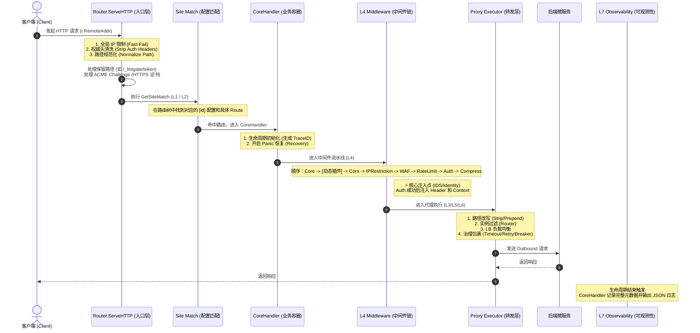

# LiteGate 7 层架构物理执行流水线

在 LiteGate 的设计中，虽然概念上遵循 L1 到 L7 的逻辑分层，但在网关核心处理请求时，**物理执行的顺序是经过深度优化和“反转”的**。

## 物理执行流水线 (Mermaid)

以下是请求从进入网关到抵达业务后端的真实物理执行流：

## 物理执行层级解析

### 1. 【入口防御层】Router.ServeHTTP (Pre-processing)
*   **代码位置**: `internal/router/router.go`
*   **行为**: 
    *   **全局拦截**: 优先处理 clientIP 解析和全局 IP 限制。
    *   **协议栈修正**: 剥离伪造身份头、规范化 URL 路径、处理 ACME 挑战。
    *   **保留路径**: 预处理 `/_litegate/` 系统路径，若命中则在此处直接返回，不进入业务 CoreHandler。

*   **行为**: 根据 Host 和 Path 确定请求所属的 `[id]`。若未命中任何 Site/Route，网关将在此处返回 404。
    *   **上下文注入**: 在确定路由后，网关会将匹配到的 **`MatchedPrefix`**（或精确路径）注入到 `Action Context` 中，供后续执行层使用。

### 3. 【业务容器层】CoreHandler (TraceID & Lifecycle)
*   **代码位置**: `internal/middleware/core.go`
*   **行为**: 只有在命中具体路由后，请求才会被包装进 `CoreHandler`。
    *   **TraceID 生成**: 在此时生成 `X-Trace-Id`（若客户端未传），并注入 Context 和 Response Header。
    *   **可观测性准备**: 初始化 `logMeta` 容器。

### 4. 【L4】 安全防御与身份注入 (Middleware Chain)
*   **代码位置**: `internal/router/router.go` (`BuildRouteHandler`)
*   **执行顺序**: `Core` -> `[动态插件]` -> `CORS` -> `IPRestriction` -> `WAF` -> `RateLimit` -> `Auth` -> `Compress`。
*   **说明**: 
    *   **性能保护与资源限额**: 
        *   **IPRestriction/WAF**: 在最外层拦截恶意 IP 和攻击报文。
        *   **RateLimit (路由总限流)**：在认证之前执行。它限的是该路由的**总吞吐量 (Total QPS)**，旨在后端服务崩溃前进行过载保护，同时也保护了下游的 IDS 鉴权服务不被无效请求压垮。
    *   **身份注入 (Auth)**: OIDC/IDSSession/RemoteAuth 验证成功后，将租户元数据注入 Header 和 Context。注：若需实现基于租户的精细化限流，通常需要额外的插件在 Auth 之后执行。

### 5. 【代理执行层】Proxy Executor (Routing & Rewriting)
*   **代码位置**: `internal/action/proxy.go` (`prepareOutboundRequest`)
*   **行为**: 
    *   **路径改写 (Rewriting)**: 在真正准备转发前执行 `StripPrefix` 和 `PrependPrefix`。其中 `StripPrefix: "true"` 会读取 Context 中携带的 **`MatchedPrefix`** 进行动态剥离。
    *   **灰度抽签 (Gray Routing)**: 基于 `litegate.[id].router.gray_weight` (L3) 进行每请求的随机抽签（掷骰子）。若中签，则从实例池中二次过滤出标记为 `upstream.gray` (L6) 的节点。若灰度节点池为空，则自动回退至全量节点池。
    *   **实例筛选 (Routing)**: 调用 `FilterEndpoints` 执行两阶段筛选：
        1.  **强过滤 (Hard)**: 应用 `router.selector` 和标签。若无匹配则返回空池 (502)，确保物理隔离。
        2.  **软匹配 (Soft)**: 从强过滤结果中寻找匹配 `router.meta` 的实例。
        3.  **自动回退 (Fallback)**: 若 Meta 有匹配则返回 Meta 实例；若 Meta 无匹配，则自动回退并返回所有强过滤实例，确保高可用。
    *   **治理转发 (Governance)**: 应用 LB 策略（RoundRobin/IpHash/Weighted/P2C）选出节点，并应用 L5 的超时、重试、熔断策略。

### 6. 【L7】 全链路观测 (Observability)
*   **代码位置**: `internal/middleware/core.go` (defer 阶段)
*   **行为**: 请求完成后，CoreHandler 聚合整个流水线的执行细节（包括路由 ID、选择的后端物理地址、鉴权结果等），输出标准化 JSON 日志。
