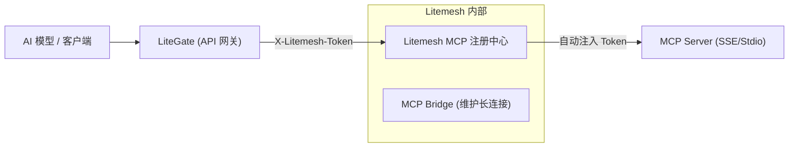

# LiteGate 集成 Litemesh MCP 指南 (新架构)

本文档说明 LiteGate 如何集成 Litemesh 的 MCP（Model Context Protocol）能力。

> [!IMPORTANT]
> **架构升级说明**: Litemesh 的 MCP 子系统已于 2026 年完成重构，正式脱离了通用的“服务注册表”。
> 如果你的 LiteGate 此前是通过 `tag=mcp-bridge` 发现服务的，请务必参考末尾的[迁移指南](#迁移指南)进行代码适配。

---

## 1. 新架构预览



**核心变化**:

| 特性 | 旧架构 (Legacy) | 新架构 (Modern) |
| :--- | :--- | :--- |
| **存储方式** | KV Store 散点存储 | 独立 `mcp.dat` 持久化文件 |
| **发现接口** | `/v1/discovery?tag=mcp-bridge` | `/v1/mcp/discovery` (专用接口) |
| **数据模型** | `ServiceInstance` (通用服务) | `MCPServerConfig` (专用配置) |
| **状态追踪** | passing / critical | connected / disconnected |

---

## 2. MCP Server 注册与注销

MCP Server 现在通过专用的控制台或 API 进行生命周期管理，不再依赖服务自注册。

### 注册示例 (JSON API):
```bash
curl -X PUT http://litemesh:8080/v1/mcp/register \
  -H "X-Lito-Token: <your-token>" \
  -d '{
    "name": "weather-service",
    "type": "sse",
    "endpoint": "http://internal-mcp:8090/sse",
    "headers": { "Authorization": "Bearer key-xxx" }
  }'
```

---

## 3. LiteGate 侧的集成实现

### 3.1 动态工具发现 (Discovery)
LiteGate 启动或接收到变更事件后，应调用专用接口同步工具集。

- **URL**: `GET /v1/mcp/discovery`
- **鉴权**: 必须携带 `X-Lito-Token`，因为响应中包含后端的敏感认证头。

### 3.2 代理调用 (Bridge Call)
推荐通过 Litemesh Bridge 进行中转调用。
- **优势**: LiteGate 无需感知各 MCP 后端的原始 Token，由 Litemesh 自动注入。
- **接口**: `POST /v1/mcp/call/{server_name}`

---

## 4. 实时状态监听 (SSE)

由于 MCP 是长连接协议，LiteGate 必须实时感知连接状态。

1.  **订阅事件**: 监听 Litemesh 的 `/v1/events`。
2.  **处理事件**: 当收到 `mcp-status:server-name` 消息时，表示该服务的连接状态发生了切换（连上或断开）。
3.  **响应动作**: LiteGate 刷新本地 MCP 缓存，并按需通知连接的 AI 客户端工具集已变更。

---

## 5. Go SDK 集成示例

```go
import litemesh "github.com/james/litemesh/sdk"

client := litemesh.NewClient("http://litemesh:8080", "token-xxx")

// 1. 获取所有活跃的 MCP 服务器
mcpServers, err := client.GetActiveMCPServers()

// 2. 调用具体的工具
res, err := client.MCPCall("weather-server", "get_current_weather", map[string]any{
    "city": "Shanghai",
})
```

---

## 6. 迁移指南 (旧架构 -> 新架构)

> [!WARNING]
> **字段映射变更**:
> - `instance.Status.State == "passing"` ➡️ `config.Status == "connected"`
> - `instance.Meta["mcp_type"]` ➡️ `config.Type`
> - `SSE Event: mcp:name` ➡️ `SSE Event: mcp-status:name`

**核心改动点**:
1.  **接口更换**: 将所有对 `/v1/discovery` 的 MCP 相关查询替换为 `/v1/mcp/discovery`。
2.  **解析逻辑**: 从解析 `ServiceInstance` 改为解析 `MCPServerConfig` 结构体。
3.  **鉴权更新**: 确保发现请求携带了正确的 Litemesh 内部令牌。
