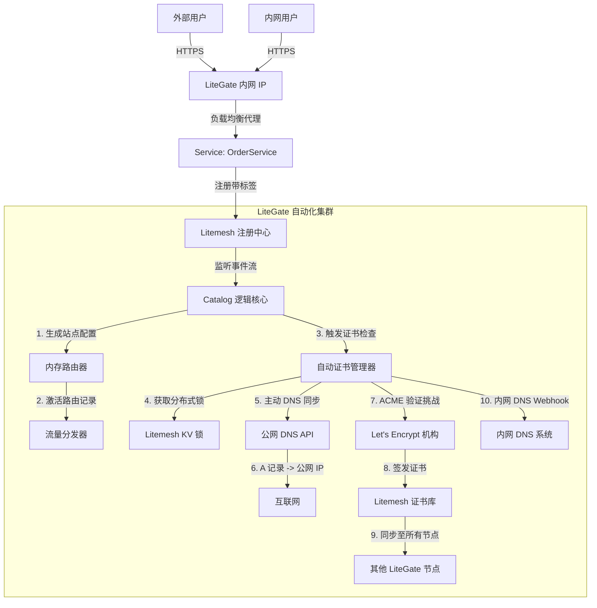

# Magic Ingress 架构解析：服务网格的零配置集成

**Magic Ingress** 允许您将服务暴露给世界，而无需编写哪怕一行 YAML 配置。您只需给服务打上标签，剩下的全部交给 LiteGate 自动处理。

---

## 🚀 核心愿景："Tag & Forget"（打标即上线）

在传统架构中，上线一个服务通常涉及繁琐的手工步骤：
1.  部署服务端。
2.  配置 Nginx/Gateway 路由规则。
3.  购买/申请域名。
4.  配置公网 DNS A 记录。
5.  申请 SSL 证书并配置。
6.  配置内网 DNS 以供内部访问。

而在 **Magic Ingress** 架构下，您只需做一步：
1.  **部署带标签的服务实例**：例如 `litegate.http.host=order.example.com`

**LiteGate 将在毫秒级内全自动完成上述所有剩余步骤。**

---

## 🏗️ 架构概览

当 Litemesh（或 Consul/Docker）检测到新服务时，以下自动化流水线会被立即触发：

---

## 🔧 工作流详细解析

### 1. 服务注册（唯一的人工步骤）
在使用 Litemesh SDK 启动服务（或通过 Sidecar 注册）时，添加以下元数据标签：

| 标签 Key | 示例值 | 说明 |
| :--- | :--- | :--- |
| `litegate.http.host` | `order.example.com` | 快捷模式：把该域名转发到本服务。 |
| `litegate.http.routers.<name>.match.*` / `.rule` | ``Host(`order.example.com`) && PathPrefix(`/api/v1`)`` | 命名 Router 的 Host 与路径匹配。 |
| `litegate.http.services.<name>.*` | `timeout=30s` | 本服务的超时、重试、负载均衡等策略。 |

Router 默认挂到 `web` 与 `websecure`，转发到注册服务本身。

> 完整标签清单见[服务标签参考](user/03-configuration/tag-reference.md)。

### 2. Magic Ingress 发现机制
LiteGate 的 **Catalog Loader** 实时监听 Litemesh 注册中心。它会瞬间检测到新服务并执行：
- 解析 EntryPoint / Router / Service 资源标签，或封闭的单 Router 快捷标签 `litegate.http.host/path/path_prefix/strip_path`。
- 在内存中即时生成一个虚拟的 `SiteConfig` 对象。
- 更新 **Router**，使其立即开始接管该域名的流量。

### 3. 后备流程：自动化安全与解析
一旦路由激活，LiteGate 的后台控制器立即接管剩余工作：

*   **公网连通性 (DDNS)**：
    - 自动探测网关当前的公网出口 IP。
    - 调用您配置的 DNS 服务商 API（如阿里云、Cloudflare），将域名解析指向**网关公网 IP**。
    
*   **证书自动化 (AutoCert)**：
    - 检查 Litemesh KV：“我们已经有该域名的有效证书吗？”
    - 如果没有：通过 Litemesh 获取集群分布式锁，从 Let's Encrypt 申请标准 SSL 证书。
    - 申请成功后保存到集群 KV，**所有在线节点**瞬间同步并加载新证书。

*   **内网连通性 (Split-Horizon DNS)**：
    - `dns_update` 将域名和网关内网 IP 写入 LiteMesh KV。
    - LiteDNS 监听 KV，将域名直接解析到**网关内网 IP**。
    - **结果**：内网用户通过局域网直接访问，且由于持有合法证书，浏览器显示安全锁。

---

## 🎉 最终成果

*   **零配置维护**：无需手动编写 `nginx.conf` 或 `gateway.yaml`。
*   **零运维 (Zero Ops)**：无需手动配置解析、无需购买/上传证书、无需处理续期。
*   **一致性体验**：内网和外网用户使用完全相同的域名和 HTTPS 环境，开发与生产逻辑高度对齐。

这套架构让 LiteGate 从一个简单的反向代理，升级为**“自动驾驶”级别的边缘网关**。
