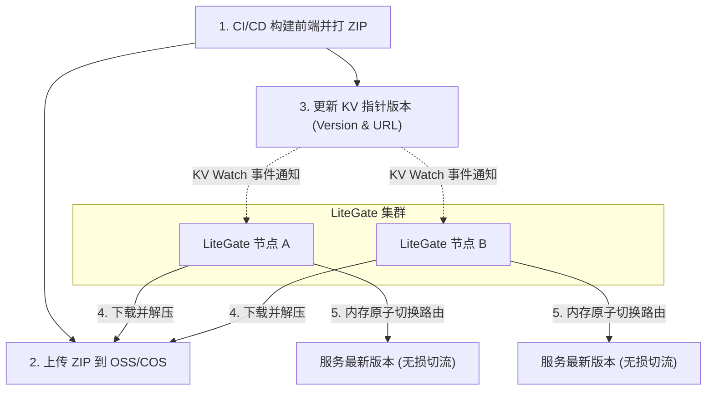

# LiteGate 前端 ZIP 托管与 Serve KV 自动化同步模式

本文档介绍 LiteGate 的 **Serve KV** 功能。这是一种全新的、极简的前端静态资源分发和多节点同步模式。

---

## 1. 痛点与设计背景

在以往的多节点或 VPS 网站部署中，前端静态资源的升级通常面临以下繁琐痛点：
* 需要编写复杂的 rsync 脚本，逐台向网关节点分发静态目录；
* 升级与回滚操作较重，容易因某台节点的网络或权限问题导致版本不一致；
* 需要单独挂载共享存储或通过复杂的 CI/CD pipeline 配合。

**Serve KV** 改变了这一切。它将前端发布动作收敛为一次极其简单的声明式指针更新：
1. **打包上传**：前端构建完成后，打成 ZIP 压缩包上传到 OSS/COS 或任意对象存储；
2. **提交版本**：向 Litemesh KV、Consul KV 或 HTTP API 写入一个包含新版本 URL 和 SHA256 校验的 JSON 键值对；
3. **节点跟进**：所有 LiteGate 节点监听到 KV 变化后，自动在后台下载 ZIP、验证 SHA256、解压到本地版本文件夹、**原子性地**热切内存中的服务路径，并根据策略自动清理历史冗余版本。



---

## 2. 站点配置指南

在 LiteGate 站点的 YAML 配置文件中，原先的 `serve` 类型路由现在可以通过增加 `kv_` 前缀相关字段进入 **KV 自动托管模式**。

### 2.1 完整模式配置样例 (Full Mode)

在 `sites/yourdomain.yaml` 中配置：

```yaml
domain: example.com
routes:
  - match:
      path_prefix: /
    action:
      type: serve
      root: /var/www/my-app           # 本地用于存放版本文件的基础目录
      spa: true                        # 开启单页应用 (SPA) 路由支持
      
      # --- KV Mode 核心字段 ---
      kv_mode: true                    # 开启 KV 同步模式
      kv_provider: litemesh            # 支持: litemesh, consul, http
      kv_key: litegate/config/front/main # 监听的 KV 键名或 HTTP URL
      keep_versions: 3                 # 本地最多保留的历史版本数量 (默认 3)
```

### 2.2 字段说明

| 字段 | 类型 | 是否必填 | 默认值 | 作用 |
| :--- | :--- | :--- | :--- | :--- |
| `kv_mode` | bool | 是 | `false` | 设为 `true` 开启此自动同步功能。 |
| `kv_provider` | string | 是 | - | 指定版本源驱动，支持：`litemesh` (推荐)、`consul`、`http`。 |
| `kv_key` | string | 是 | - | 版本数据键名。如果 provider 是 `http`，此处填写完整的 GET API 地址。 |
| `keep_versions` | int | 否 | `3` | 指定各节点本地目录保留的历史版本数，多余的旧版本目录会在成功切换后被自动清理。 |

---

## 3. KV Payload 规范与发布步骤

LiteGate 监听的 KV 值（Payload）必须是一个标准的 **JSON 结构体**。

### 3.1 JSON 规范

```json
{
  "version": "12",
  "url": "https://oss.example.com/front/main-12.zip",
  "sha256": "2cf24dba5fb0a30e26e83b2ac5b9e29e1b161e5c1fa7425e73043362938b9824"
}
```

* **`version`**：必须为**可解析为 64 位整数的数字字符串**（例如 `"12"`）。LiteGate 依靠其数值大小判断是否为更新的版本，禁止版本倒退或回滚（除非物理目录已被删除），这提供了强大的脑裂和防错保障。
* **`url`**：ZIP 压缩包的公网或内网可达的下载链接。
* **`sha256`**：（可选）ZIP 文件的 SHA256 校验和。若提供，LiteGate 会在下载后进行严格计算比对，校验失败将拒绝部署，避免分发损坏的文件。

### 3.2 极简发布三步走

1. **打包**：`zip -r main-12.zip dist/` 并上传到存储服务，得到链接：`https://oss.example.com/front/main-12.zip`。
2. **计算 SHA256**：`sha256sum main-12.zip`，得到：`2cf24dba5fb0a30e26e83b2ac5b9e29e1b161e5c1fa7425e73043362938b9824`。
3. **写入 KV**：
   * **Litemesh KV 用户**：
     ```bash
     curl -X PUT http://127.0.0.1:8787/v1/kv/litegate/config/front/main \
       -d '{"version": "12", "url": "https://oss.example.com/front/main-12.zip", "sha256": "2cf24dba5fb0a30e26e83b2ac5b9e29e1b161e5c1fa7425e73043362938b9824"}'
     ```
   * **Consul KV 用户**：
     ```bash
     consul kv put litegate/config/front/main '{"version": "12", "url": "https://oss.example.com/front/main-12.zip", "sha256": "2cf24dba5fb0a30e26e83b2ac5b9e29e1b161e5c1fa7425e73043362938b9824"}'
     ```

---

## 4. 关键架构技术与安全机制

### 4.1 超尾优雅延迟防护 (503 Warming Up 拦截)

当新节点加入、冷启动或刚添加新站点配置时，本地的物理版本目录通常处于“未准备就绪（仍在下载或解压）”的状态。
如果此时有大量的外部用户请求涌入，传统网关可能会因为找不到文件而直接抛出大量 404，或者造成进程死锁。

LiteGate 为此实现了一套**超尾延迟防护机制**：
1. 请求到达时，若发现本地没有就绪的版本路径，LiteGate 会将请求挂起并进行优雅的极短时间轮询等待（最多 `200ms`）。
2. 如果在 200ms 内后台下载并解压成功，请求会无损、平滑地继续服务最新前端。
3. 若超时仍未准备好，为了不积压网关协程池，LiteGate 会根据请求的 HTTP Accept 头部和文件后缀，分流返回适配的 **503 Service Unavailable** 结构：
   * **浏览器/HTML 访问**：展示带有现代感毛玻璃磨砂（Glassmorphism）和加载动画的 Premium **Warming Up 提示页**。
   * **API / JSON 访问**：返回标准 JSON：`{"status": 503, "message": "Site warming up, please retry in 3 seconds"}`。
   * **JS / CSS 静态依赖**：返回干净的 `/* LiteGate: Site warming up, please retry in 3 seconds */`，杜绝 HTML 乱码数据污染前端的依赖链。

### 4.2 ZIP 遍历攻击防御 (Zip Slip Prevention)

由于下载的 ZIP 文件来自外部网络，在解压过程中容易受到 **Zip Slip 目录穿越攻击**（即压缩包内包含 `../../etc/passwd` 等恶意文件名）。
LiteGate 的解压器在提取每一个文件前，都会对合成的绝对路径进行严格前缀判定：
```go
if !strings.HasPrefix(fpath, filepath.Clean(dest)+string(os.PathSeparator)) {
    return fmt.Errorf("illegal file path in zip: %s", f.Name)
}
```
凡是非目标解压目录下的路径，一律予以拒绝并报错拦截，确保服务器的底层安全。

### 4.3 自动化磁盘收敛与清理

LiteGate 会将版本文件夹存放在您指定的 `root` 参数追加 `_versions` 后缀的目录下（例如 `root: /var/www/my-app` 时，版本总控目录为 `/var/www/my-app_versions/`）。

每次升级成功后，LiteGate 会在后台启动清理协程：
* 将该目录下的所有版本文件夹转换为数值进行降序排序；
* 仅保留最近的 `keep_versions`（例如 3 个）版本目录；
* **防删除安全盾 (Safety Shield)**：清理过程中会主动扫描并记录所有 Watcher 当前内存中活跃引用的实际物理文件夹，即便这些活跃文件夹属于“更旧的版本”（比如发生版本降级），也绝对不会被物理删除，从而实现零抖动的温和回滚与平滑切流。
