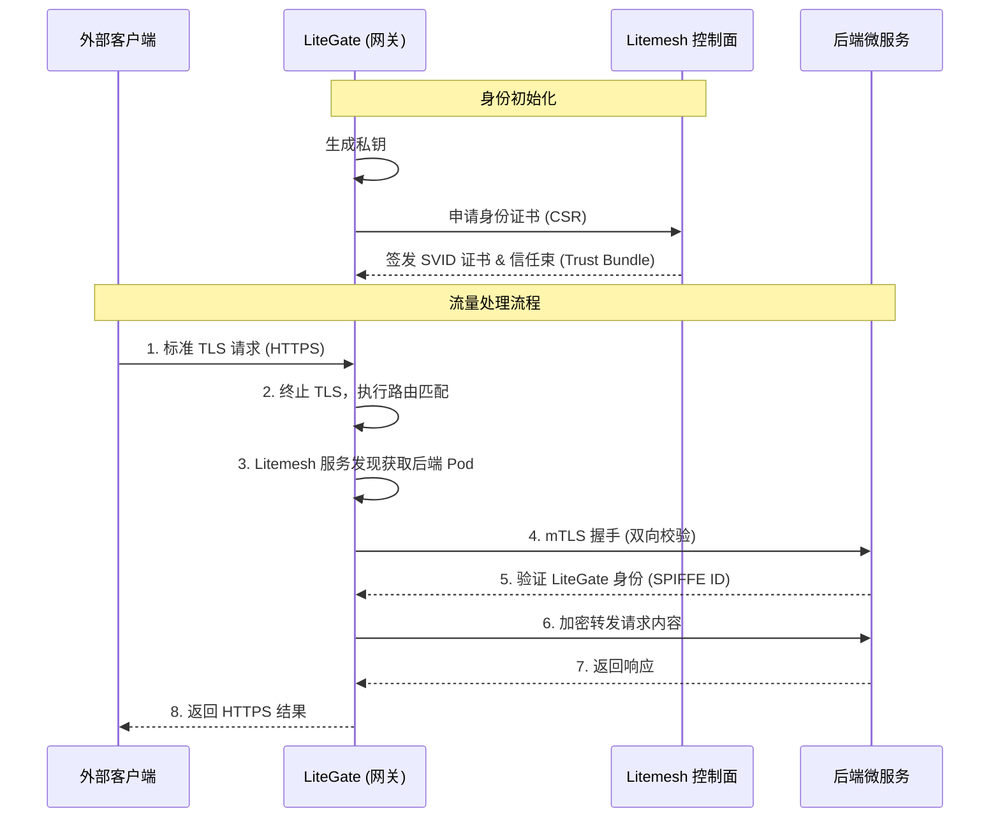

# LiteGate TLS 与 mTLS 架构文档

本文档说明 LiteGate 如何处理从外部客户端到内部微服务的全链路安全通信。

---

## 架构概览

LiteGate 采用双层安全隔离模型：
1.  **外部层 (TLS)**：公网客户端通过标准 HTTPS 访问 LiteGate 入口。
2.  **内部层 (mTLS)**：LiteGate 与后端微服务之间通过 Litemesh 实现双向 TLS (mTLS) 身份验证。



---

## 1. 外部层：客户端 -> LiteGate (标准 TLS)

LiteGate 作为南北向流量的终结点，负责处理外部加密。

-   **证书管理**：
    -   **静态**：通过配置文件指定 `.pem` 和 `.key`。
    -   **动态 (AutoCert)**：利用内置 ACME 机制从 Let's Encrypt 自动获取/续期。
-   **协议支持**：TLS 1.2 / 1.3，支持 HSTS 强制加固。
-   **性能**：针对高并发 TLS 握手进行了优化。

---

## 2. 内部层：LiteGate -> 后端 (Litemesh mTLS)

这是 LiteGate 实现“零信任”安全的核心。开启后，LiteGate 变为网格中的一个受信任节点。

### 核心机制

1.  **动态身份 (SVID)**：LiteGate 不再使用固定的证书文件，而是每隔一段时间向 Litemesh 申请一份具备时效性的 SPIFFE ID 证书。
2.  **双向验证**：
    -   LiteGate 验证后端服务是否属于合法的集群。
    -   后端服务验证 LiteGate 证书中的 SPIFFE ID 是否具备访问权限。
3.  **全自动轮转**：证书在过期前 1/3 时间会自动通过内存更新，无感知切换，保证业务长连接不断连。

### 身份定义 (SPIFFE)
LiteGate 的身份通常被定义为：
`spiffe://litemesh.local/ns/system/sa/litegate`

---

## 3. 配置示例

在 `litegate.yaml` 中全局启用内部 mTLS 加密：

```yaml
# 外部入口证书
tls:
  certs_dir: "./certs"

# Litemesh 服务网格集成
litemesh:
  enabled: true
  address: "http://litemesh-agent:8787"
  mtls: true # 🔥 开启内部全链路加密
  spiffe_id: "spiffe://litemesh.local/ns/gateway/sa/litegate"
```

---

## 📌 优势总结

1.  **物理身份隔离**：即便黑客攻破了网络边界，也无法伪造合法证书与后端微服务通讯。
2.  **证书零管理**：内部证书的生成、签发、分发、轮转全部流程自动化。
3.  **细粒度权限控制**：后端可以基于证书中的 SPIFFE ID 明确指出“只允许来自 LiteGate 的流量”。
