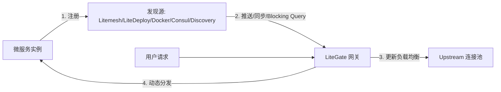

# 服务发现集成原理

LiteGate 的核心竞争力之一是其强大的 **动态服务发现 (Service Discovery)** 能力。它允许网关实时感知后端实例的上下线，无需手动修改 upstream 列表。

---

## 1. 为什么需要服务发现？

在云原生或微服务环境下，后端实例（如 Docker 容器、K8s Pod）的 IP 地址是动态变化的。
- **动态性**: 扩缩容、滚动更新会导致后端 IP 频繁变动。
- **健康状态**: 实例可能随时宕机。
- **零管理**: 开发者只需启动服务并注册，网关应自动发现并开始导流。

---

## 2. 支持的集成来源

LiteGate 当前后端发现源是 5 种：`litemesh`、`litedeploy`、`docker`、`consul`、`discovery`。这些来源都会被归一成同一类服务实例，再交给同一套 `litegate.*` 标签系统处理。

| 来源 | 机制 | 说明 |
| :--- | :--- | :--- |
| `litemesh` | SSE 推送 | 适合 Litemesh 服务网格、mTLS 和 Magic Ingress |
| `litedeploy` | SSE 推送 | 适合由 LiteDeploy 管理发布和实例元数据的服务 |
| `docker` | Docker event stream | 适合 Docker / Swarm，通过容器 labels 接入 |
| `consul` | Catalog 同步 | 适合已有 Consul Catalog 和健康检查体系 |
| `discovery` | Blocking query | 连接 `camodns_discovery` 这类外部聚合层 |

`discovery` 在配置中写作 `provider: discovery`，运行时由 external discovery client 消费，常见接口是 `/v1/catalog/services` 和 `/v1/health/service/:service_name`。

---

## 3. 工作流程：从注册到上线



### 详细步骤
1.  **服务注册**: 后端服务启动时，通过 SDK 或 Sidecar 将自己的 IP、端口、服务名及元数据 (Meta) 注册到中心。
2.  **监听变化**: LiteGate 的发现 Agent 实时监控中心的变化。
3.  **计算候选集**: 当检测到某服务 `Passing` 后，Agent 重新计算合法的 Upstream 列表。
4.  **无损更新**: 路由表在内存中原子替换，正在处理的请求不受影响。

---

## 4. 路由与发现的绑定

LiteGate 支持两种路由与发现的绑定方式：**静态声明绑定** 和 **动态自动合并 (Magic Ingress)**。

### 方式 A：静态声明绑定
如果你有固定的站点 YAML 配置文件，你只需在站点路由中声明 `service_name`，即可将该路由绑定到服务发现：

```yaml
action:
  type: proxy
  upstream_type: consul  # litemesh / litedeploy / docker / consul / external
  service_name: order-api # 声明服务名
```

---

### 方式 B：动态自动合并路由 (Magic Ingress) 🌟
**这是最推荐的生产实践。** 开发者无需手动在 LiteGate 中新建或修改任何静态 YAML 配置文件。

当后端服务实例注册时，可在 Metadata / Tags 中声明命名资源：

```properties
litegate.http.routers.orders.match.hosts=site.example.com
litegate.http.routers.orders.match.path_prefix=/order/api
litegate.http.services.orders.timeout=30s
```

Router 默认挂到 `web` 与 `websecure`，转发到注册服务本身。只需要一个域名时用快捷模式 `litegate.http.host=site.example.com` 即可；两种写法不能混用。写法详见[服务标签使用指南](../03-configuration/tag-dsl.md)。

**真正做到：服务上线即注册，注册即路由，全流程无需修改网关任何 YAML 配置文件。**

---

## 延伸阅读
- [配置 Consul 发现](../07-discovery/consul.md)
- [Litemesh 集成指南](../07-discovery/litemesh.md)
- [服务发现源总览](../07-discovery/overview.md)
- [基于元数据的灰度发布 (RouteSelector)](./sites-and-routes.md)
