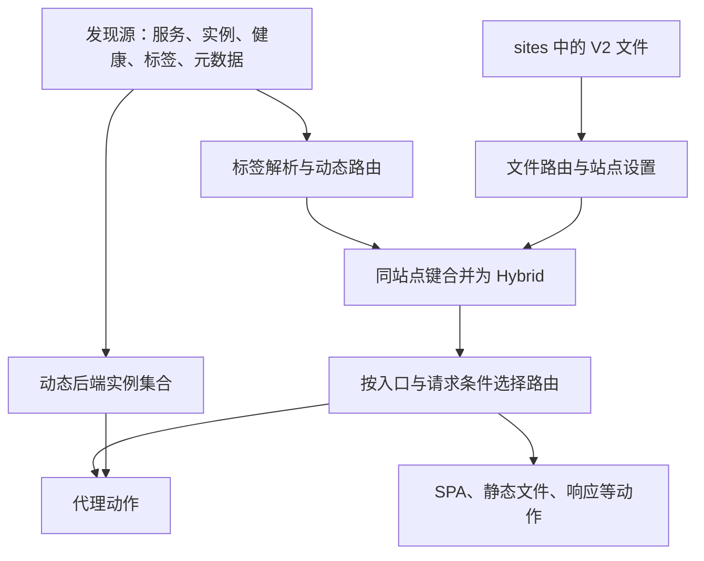

# 站点 YAML V2：结构与基本概念

本文从一份最短的配置开始，介绍 V2 的文件结构、站点地址、路由匹配、动作、配置复用和校验。先理解每一层负责什么，再查具体字段，会更容易写出正确的配置。

新建站点使用 `sites/*.yaml` 和顶层 `site:`。下面是一份完整的站点配置：

```yaml
site: :9090
~/goapi: 127.0.0.1:8080
spa: ./www
```

它在 9090 端口接受任意 Host；`/goapi` 路径段及其子路径交给后端，匹配时忽略 ASCII 大小写；其余路径由 `./www` 中的单页应用处理。代理默认保留请求路径。

## 阅读导航

1. [文件与整体结构](#1-文件与整体结构)
2. [YAML 写法、缩进与引号](#2-yaml-写法缩进与引号)
3. [全局配置与站点配置](#3-全局配置与站点配置)
4. [站点地址、HTTPS 与 ECH](#4-站点地址https-与-ech)（含 4.3 站点顶层属性全览、4.4 客户端握手加密 ECH）
5. [路径路由与匹配器](#5-路径路由与匹配器)（含 5.4 match 完整匹配属性）
6. [动作与简写](#6-动作与简写)（含 proxy / serve / php 等各动作属性清单）
7. [路由选择与执行顺序](#7-路由选择与执行顺序)
8. [配置作用域与继承](#8-配置作用域与继承)（含 8.3 CORS / 鉴权 / 限流 / 缓存等路由治理属性全览）
9. [占位符与动态值](#9-占位符与动态值)
10. [片段与共享定义](#10-片段与共享定义)（含 10.3 片段支持治理字段清单）
11. [中间件、Service 与 Transport](#11-中间件service-与-transport)（含资源定义完整属性）
12. [注释、环境变量与路径](#12-注释环境变量与路径)
13. [校验、热加载与常见错误](#13-校验热加载与常见错误)
14. [服务发现源、标签与 V2 的整合](#14-服务发现源标签与-v2-的整合)

## 1. 文件与整体结构

### 1.1 一个文档描述一个站点

默认目录组织如下，实际目录以全局配置为准：

```text
config.yaml                全局配置
sites/
  app.yaml                 应用站点
  api.yaml                 API 站点
  _shared.yaml             共享匹配器与片段
www/
  index.html               前端构建产物
```

V2 通过 `site:` 识别格式，`version: 2` 可以省略。文件名用于组织文件，站点地址由文件里的 `site` 决定。

### 1.2 先看各层的位置

```yaml
site: app.example.com
https: false

# 站点范围的响应头
response_headers:
  X-Frame-Options: DENY

# 命名资源：只定义，不会自动产生路由
services:
  orders:
    to: localhost:8080
    timeout: 5s

# 路径路由：匹配条件写在键名里
/api:
  service: orders
  strip_prefix: true

# 显式路由：用于精确路径、方法等条件
routes:
  - name: health
    match: {path: /health}
    respond: ok

# 站点级动作：作为兜底路由
spa: ./www
```

| 位置 | 负责什么 | 示例 |
|---|---|---|
| `site`、`https`、`port`、`entrypoints` | 站点地址和入口设置 | `site: :9090` |
| `/api`、`~/api` | 按路径前缀定义路由 | `/api: localhost:8080` |
| `routes` 中的 `match` | 描述复杂匹配条件 | `match: {path: /health}` |
| 路由里的动作 | 生成响应或转发请求 | `proxy`、`respond`、`serve` |
| 路由里的治理字段 | 处理命中该路由的请求 | `cors`、`strip_prefix` |
| `services`、`transports`、`middlewares` | 定义可引用的资源 | `service: orders` |
| `matchers`、`snippets` | 复用匹配条件和配置 | `match: '@api'`、`import: common` |

### 1.3 多站点

多个站点可以分别放在不同文件，也可以使用 `---` 分隔为同一文件中的多个 YAML 文档：

```yaml
site: app.example.com
spa: ./www
---
site: api.example.com
proxy: localhost:8080
```

多个地址使用完全相同的配置时，可以在 `site` 中用逗号分隔：

```yaml
site: example.com, www.example.com
respond: hello
```

这会为每个地址展开一份站点配置。同一文件中的多个文档应使用同一种格式；不要混放 V2 和旧格式。不同站点也不会自动继承对方的配置。

## 2. YAML 写法、缩进与引号

### 2.1 缩进决定层级

使用空格缩进，建议每层两个空格：

```yaml
site: example.com
/api:
  proxy: localhost:8080
  strip_prefix: true
spa: ./www
```

`proxy` 和 `strip_prefix` 属于 `/api`；`spa` 与 `/api` 同级，是站点的兜底动作。若把 `spa` 缩进到 `/api` 下，就会在同一路由中声明两个动作，校验会拒绝。

### 2.2 字符串、对象和列表

同一个代理动作可以从短写法逐步展开：

```yaml
site: example.com
/api: localhost:8080
```

```yaml
site: example.com
/api:
  proxy: localhost:8080
```

```yaml
site: example.com
/api:
  proxy:
    to: [localhost:8080, localhost:8081]
    timeout: 5s
    retry: 2
```

前两份等价；第三份增加了多个后端、超时和重试。对象也能写成一行，例如 `proxy: {to: localhost:8080, timeout: 5s}`。较复杂的配置建议展开，以便添加注释。

### 2.3 哪些值需要加引号

| 值 | 推荐写法 | 原因 |
|---|---|---|
| 以 `*` 开头的地址 | `site: '*.example.com'` | `*` 在 YAML 中有别名含义 |
| 以 `@` 开头的引用 | `match: '@api'` | 避免 YAML 特殊字符解析 |
| 单独的占位符 | `X-Path: '{path}'` | 避免被识别为对象 |
| Windows 路径 | `spa: 'D:\web\dist'` | 单引号保留反斜杠 |
| 字符串形式的布尔词 | `respond: 'true'` | 未加引号的 `true` 是布尔值 |
| 包含冒号加空格的文本 | `respond: 'result: ok'` | 避免被识别为键值结构 |

`site: :9090` 和 `proxy: localhost:8080` 可以直接写，因为冒号后没有空格。

### 2.4 多行文本

```yaml
site: example.com
respond:
  content_type: text/plain
  body: |
    Welcome to LiteGate.
    This is a multi-line response.
```

`|` 保留换行，`>` 折叠普通换行。重复键、YAML 锚点/别名、合并键和 `null` 在 V2 中不受支持；省略不需要的字段即可。

## 3. 全局配置与站点配置

全局配置 `config.yaml` 描述网关运行方式，例如监听入口、站点目录、日志、服务发现和证书管理。站点文件描述某个站点如何处理 HTTP 请求。

站点根部的字段不一定是“全局字段”。例如 `spa: ./www` 是这个站点的兜底动作，不会影响其他站点。

| 需求 | 配置位置 |
|---|---|
| 配置网关入口、服务发现源 | `config.yaml` |
| 接入一个域名或独立站点端口 | 站点文件中的 `site` |
| API 转发和前端分流 | 路径键或 `routes` |
| 复用后端连接、重试和负载均衡配置 | 站点中的 `services` |
| 跨站点复用匹配条件和治理配置 | `sites/_shared.yaml` |

全局字段的完整说明见 [全局配置](global-config.md)。

## 4. 站点地址、HTTPS 与 ECH

### 4.1 地址对照

| `site` 值 | 含义 |
|---|---|
| `example.com` | 按 HTTP Host 匹配域名，使用既有入口 |
| `example.com:9090` | 在指定端口上匹配该域名 |
| `:9090` | 在指定端口接受任意 Host |
| `'*:9090'` | 与 `:9090` 等价 |
| `0.0.0.0:9090` | 与 `:9090` 等价 |
| `'[::]:9090'` | 与 `:9090` 等价 |
| `127.0.0.1:9090` | 在指定端口匹配 Host 为该 IP 的请求 |
| `'[::1]:9090'` | IPv6 Host 与端口；有端口时需要方括号 |
| `https://example.com` | 声明 HTTPS 站点意图 |

地址中的 Host 用于选择请求，不能用它指定绑定哪张本机网卡。实际绑定地址由入口设置控制。域名写在配置里也不会自动创建 DNS 记录。

端口范围为 1–65535。地址已经带端口时，不能再同时声明 `port` 或 `entrypoints`。

### 4.2 HTTPS 必须明确配置

V2 的 `https` 默认是 `false`。单独写域名、IP 或 `:443` 不会自动把它变为 `true`。

```yaml
site: example.com
https: true
proxy: localhost:8080
```

也可以写 `site: https://example.com`，此时不能再声明 `https: false`。`http://` 前缀不是当前 V2 支持的地址写法；HTTP 站点使用普通地址和 `https: false`。

HTTPS 正常工作还需要相应入口和可用证书。证书申请、存储等配置见 [证书申请配置指南](../06-certificates/certificate-application-guide.md)。

### 4.3 站点顶层属性全览

除了 `site` 与 `https` 外，站点根层级还支持配置入口、网络限制、全局继承与 TLS 等属性：

| 顶层属性 | 类型 | 默认值 | 作用与深入说明 |
|---|---|---|---|
| `site` | 字符串 | 必需 | 站点监听与匹配地址。支持域名（`example.com`）、端口简写（`:9090`）、带端口域名（`example.com:9090`）、IPv6（`'[::1]:9090'`）、HTTPS 意图（`https://example.com`）或逗号分隔多地址。 |
| `https` | 布尔值 | `false` | 是否开启 HTTP 至 HTTPS 自动重定向。即使绑定 443 端口，V2 也不会默认开启，需显式声明 `https: true`。 |
| `ech` | 布尔值 / 字符串 | `false` | 站点级 ECH（Encrypted ClientHello）握手加密。全局仅配置单组 ECH 时可设为 `true`；多组时必须指定具体的公共域名（如 `ech: ech.example.com`）；`false` 为关闭（默认）。启用要求站点为 HTTPS（443 端口且支持 TLS 1.3），域名将自动纳入对应 DNS 提供商的 HTTPS (Type 65) 记录发布。不可用于通配符、纯 IP 或 L4 透传站点。 |
| `port` | 整数 (1–65535) | 依赖全局配置 | 显式指定独立端口。若 `site` 地址中已包含端口，严禁重复设置 `port`。 |
| `entrypoints` | 字符串列表 | 全局入口 | 关联全局 `config.yaml` 定义的入口监听器名称（如 `[web, websecure]`）。与包含端口的 `site` 互斥。 |
| `max_request_body_size` | 整数 (字节) | `0` (不限) | 客户端请求体大小上限（单位：字节）。超出限制网关直接返回 413 Payload Too Large。例如 `10485760` (10MB)。 |
| `disable_trace_id` | 布尔值 | `false` | 全站禁用请求追踪 ID。开启后网关不再自动生成 `X-Trace-Id` 响应头与跨度日志。 |
| `ip_restriction` | 对象 | 无 | 站点级客户端 IP 访问限制。包含 `allow_ips` 与 `deny_ips` 列表（支持单 IP 与 CIDR 网段）。 |
| `request_headers` | 键值映射 | 无 | 站点级请求头继承字典。自动附加到站内所有代理 (`proxy`) 动作；头名前缀 `-`（如 `-Authorization`）表示移除该请求头。支持占位符。 |
| `response_headers` | 键值映射 | 无 | 站点级响应头继承字典。自动附加到站内所有路由与动作的最外层；头名前缀 `-` 表示移除该响应头。 |
| `upstream_client` | 字符串 | 跟随全局 | 站点级上游 HTTP 客户端策略。可选 `fast`（超高性能同步 HTTP/1.1 客户端）或 `standard`（标准 Go HTTP 客户端）。 |
| `use` | 字符串 / 列表 | 无 | 站点级绑定的命名中间件。在编译时自动拼接到站内每条路由的中间件流水线前面。 |
| `error_pages` | 对象列表 | 无 | 站点级自定义 HTTP 错误页面映射。格式为 `[{status: [404], template: /var/www/404.html}]`。 |
| `tls` | 对象 | 无 | 站点独立 TLS 证书与策略覆盖（包含 `cert_file`, `key_file`, `client_auth` 等）。 |
| `forward` | 对象 | 无 | Layer 4 穿透转发配置（与 HTTP 路由互斥）。 |

**站点顶层配置完整示例：**

```yaml
site: api.example.com
https: true
ech: ech.example.com                # 绑定 ECH 公共组，对外加密 SNI（按需开启）
max_request_body_size: 20971520      # 限制客户端请求体最大 20MB
upstream_client: fast               # 默认使用高性能上游客户端

# 站点级 IP 限制（站内所有路由生效）
ip_restriction:
  allow_ips:
    - 192.168.0.0/16
    - 10.0.0.0/8
  deny_ips:
    - 192.168.1.100

# 站点级请求头（继承给所有 proxy 路由）与响应头（继承给所有动作）
request_headers:
  X-Gateway-Site: api.example.com
response_headers:
  X-Frame-Options: DENY
  X-Content-Type-Options: nosniff

# 站点级自定义错误页
error_pages:
  - status: [404]
    template: /var/www/errors/404.html
  - status: [500, 502, 503, 504]
    template: /var/www/errors/50x.html

# 站点级独立证书覆盖（可选，默认使用 ACME 自动证书或全局证书）
tls:
  enabled: true
  cert_file: /etc/ssl/certs/api.crt
  key_file: /etc/ssl/certs/api.key
  min_version: "1.2"
  client_auth: "none"                # mTLS 双向认证时可设为 require_and_verify

/api: localhost:8080
```

### 4.4 客户端握手加密 ECH (`ech`)

ECH（Encrypted ClientHello）用于加密客户端浏览器到网关的 TLS ClientHello 握手扩展，隐藏真实访问域名（SNI）。公网监听只能看到外层公共域名（如 `ech.example.com`），LiteGate 在边缘完成解密后，仍按内层实际域名（如 `api.example.com`）执行证书匹配与业务路由：

```yaml
site: api.example.com
https: true
ech: ech.example.com
proxy: localhost:8080
```

- **配置方式**：
  - `ech: ech.example.com`：指定绑定的 ECH 公共组域名（多组场景下必需）。网关自动将当前站点域名纳入该公共组及其对应 DNS 提供商的 HTTPS（Type 65）记录发布列表。
  - `ech: true`：仅当全局 `config.yaml` 只配置了一个 ECH 组时允许使用；若配置了多个 ECH 组则会报错提示必须明确指定公共域名。
  - `ech: false`：显式关闭 ECH（缺省值）。
- **生效前提与约束**：
  - 全局 `config.yaml` 必须开启 `ech.enabled: true` 并配置 `groups`（及关联的 DNS 提供商凭据）。
  - 站点必须开启 HTTPS（`https: true` 或 `site: https://...`），监听 443 端口，且 TLS 策略允许 TLS 1.3（默认允许）。
  - 站点域名必须被所选 DNS 提供商的 `domains` 范围覆盖。
  - **不支持的场景**：通配符站点（如 `*.example.com`）、纯 IP 站点（如 `127.0.0.1:9090`、`:9090`）以及 Layer 4 穿透转发站点（`forward:`）。
- **热加载与换组**：
  - 站点级 `ech` 的开启、关闭与换组完全支持热加载，无需重启网关。
  - 换组时网关会先安全撤回在旧 DNS 提供商处发布的 HTTPS 记录，再由新组发布。
  - 完整 DNS 发布、DoH 客户端接入与多节点 KV 密钥同步说明见 [ECH 配置指南](../06-certificates/ech.md)。

## 5. 路径路由与匹配器

### 5.1 路径键是前缀匹配

```yaml
site: example.com
/api: localhost:8080
~/goapi: localhost:8081
spa: ./www
```

| 请求路径 | 命中路由 |
|---|---|
| `/api`、`/api/orders` | `/api` |
| `/API/orders` | SPA 兜底 |
| `/goapi`、`/GoApi/Orders` | `~/goapi` |
| `/apix`、`/goapix`、`/other/goapi` | SPA 兜底 |

路径键按路径段边界匹配。`~/` 表示忽略 ASCII 大小写，不是正则表达式。不要同时定义 `/goapi` 和 `~/goapi`。

路径键下不能再写 `match`；需要额外条件时改用 `routes`。

### 5.2 精确路径与组合条件

```yaml
site: example.com
routes:
  - name: health
    match: {path: /health, method: GET}
    respond: ok
  - name: api-write
    match: {prefix: /api, method: [POST, PUT, DELETE]}
    proxy: localhost:8081
/api: localhost:8080
```

`path` 为精确路径，`prefix` 是 `path_prefix` 的别名；`method` 接受字符串或列表。不同种类的条件共同限制请求，上例写操作走 8081，其余 `/api` 请求走 8080。

精确路径不提供可删除的匹配前缀，所以不能搭配 `strip_prefix: true`。此时需要显式指定要删除的字符串，或者改用前缀匹配。

### 5.3 命名匹配器

```yaml
site: example.com
matchers:
  writes:
    prefix: /api
    method: [POST, PUT, DELETE]
routes:
  - match: '@writes'
    proxy: localhost:8081
/api: localhost:8080
```

`matchers` 定义条件，`match: '@writes'` 使用条件。定义本身不会产生路由，也不会改变优先级。名称使用字母或下划线开头，后续可包含数字、下划线和连字符。

写成列表表示各项同时满足，同一个 matcher 因此可以被多条路由复用，每条路由追加自己的条件；定义里也可以这样组合：

```yaml
site: example.com
matchers:
  api: {prefix: /api}
  api-write: ['@api', {method: [POST, PUT, DELETE]}]
routes:
  - match: '@api-write'
    proxy: localhost:8081
  - match: ['@api', {header: {X-Canary: "1"}}]
    proxy: localhost:8082
/api: localhost:8080
```

`rule` 以 AND 连接，`header`/`query` 合并；其他字段只能由一项提供，值冲突时报错，不会静默覆盖。

正则及更复杂的表达式通过 `match.rule` 配置；路径列表、通配路径和详细条件请查 [站点配置参考](site-config.md)。不要把路径键 `/api/*` 当作 `/api` 前缀简写。

### 5.4 路由与匹配属性清单 (match 完整参数与元属性)

在 `routes:` 列表中，每个路由项包含元属性与匹配条件：

| 路由元属性 | 类型 | 默认值 | 说明 |
|---|---|---|---|
| `name` | 字符串 | 无 (自动编号) | 路由唯一名称标识符。用于日志审计、指标观测和调试追踪。同一站点内必须唯一。 |
| `priority` | 整数 | `0` | 显式路由匹配优先级。数值越大越优先评估。同等具体程度下，高优先级路由排在前面。 |
| `match` | 字符串 / 对象 / 列表 | 必需 | 匹配条件。标量字符串为路径前缀或 `@name`；对象形式支持下列组合条件；列表表示各项同时满足。 |

`match` 条件对象的属性列表：

| `match` 属性 | 类型 | 示例 | 作用与匹配机制 |
|---|---|---|---|
| `prefix` / `path_prefix` | 字符串 | `prefix: /api` | 路径前缀匹配。必须以 `/` 开头，按路径段边界严格匹配（`/api` 匹配 `/api` 与 `/api/users`，不匹配 `/apix`）。 |
| `path` | 字符串 / 列表 | `path: /health`<br>`path: ["/v1/*", "/v2/*"]` | 精确路径匹配（以 `/` 开头），或带 `*` 通配符的路径列表（系统自动编译为高效正则 `PathRegexp` 表达式）。路径必须以 `/` 或 `*` 开头。 |
| `method` | 字符串 / 列表 | `method: GET`<br>`method: [POST, PUT, DELETE]` | 请求 HTTP 方法匹配，忽略大小写。支持单值或字符串列表。 |
| `header` | 键值映射 | `header: {X-Role: admin}`<br>`header: {Accept: [application/json, text/plain]}` | HTTP 请求头匹配。支持精确匹配，值支持字符串或匹配候选列表。 |
| `query` | 键值映射 | `query: {version: v2, debug: "true"}` | URL Query 查询参数匹配。请求中必须包含对应参数且值匹配。 |
| `rule` | 字符串 | `rule: "Method('GET') && PathPrefix('/api')"` | 高级规则 DSL 表达式（Traefik 兼容风格）。可单独使用，也可与上述条件并存（自动执行逻辑与 `&&`）。 |

**简写匹配与命名匹配说明：**
- **路径前缀标量简写**：`match: /api` 等价于 `match: {prefix: /api}`。
- **命名匹配器引用**：`match: '@writes'` 引用站点 `matchers.writes` 中预先定义的匹配条件。
- **大小写不敏感路径键**：站点层路径键 `~/goapi:` 自动开启大小写不敏感的前缀匹配（忽略 ASCII 大小写）。

**路由匹配综合示例：**

```yaml
site: example.com
matchers:
  admin_only:
    prefix: /admin
    header: {X-Role: admin}
routes:
  # 精确路径 + 方法匹配 + 自定义优先级
  - name: health_check
    priority: 100
    match:
      path: /healthz
      method: [GET, HEAD]
    respond: "healthy\n"

  # 通配路径列表 + 写操作方法过滤
  - name: api_v1_writes
    priority: 10
    match:
      path: ["/api/v1/*", "/api/v2/*"]
      method: [POST, PUT, DELETE]
    proxy: localhost:8081

  # 引用命名匹配器
  - name: admin_console
    match: '@admin_only'
    proxy: localhost:8082

/api: localhost:8080
spa: ./dist
```

## 6. 动作与简写

每条路由只能有一个终结动作。治理字段可以配合动作，但不能同时配置 `proxy` 和 `spa` 等两个动作。

| 动作类型 | 简写形式 | 展开或深入配置方式 | 说明 |
|---|---|---|---|
| `proxy` | `proxy: localhost:8080` | `proxy: {to: [...], timeout: 5s, lb: least_conn}` | 反向代理到上游地址或发现服务 |
| `service` | `service: orders` | `proxy: {service: orders}` | 快捷引用在 `services:` 中定义的命名后端 |
| `serve` | `serve: ./public` | `serve: {root: ./public, index: index.html}` | 提供本地静态文件，`file_server` 是同义写法 |
| `spa` | `spa: ./dist` | `serve: {root: ./dist, spa: true}` | 单页应用，未命中文件时回退到 `index.html` |
| `php` | - | `php: {root: /var/www, upstream: unix:///run/php-fpm.sock}` | PHP-FPM 网站，内置目录首页与回退 |
| `respond` | `respond: ok` | `respond: {status: 200, body: ok, content_type: text/plain}` | 直接返回固定状态码与响应正文 |
| `redirect` | `redirect: /new` | `redirect: {location: /new, status: 301}` | URL 重定向，简写默认 302 |
| `webdav` | `webdav: ./share` | `webdav: {root: ./share, read_only: false}` | 提供 WebDAV 网络存储与文件管理 |
| `template` | - | `template: {template: index.html, fetch_json: [...]}` | 动态模板引擎，支持数据预取与 HTMX |

路径字符串简写固定表示代理地址。例如 `/api: orders` 会被识别为代理到主机名为 `orders` 的机器，不能代替 `service: orders`；`/static: ./public` 也不能代替静态文件动作。

### 6.1 反向代理属性 (`proxy`)

`proxy` 对象用于反向代理到静态地址池、服务发现或引用 Service：

| 属性 | 类型 | 简写形式 | 默认值 | 作用与深入说明 |
|---|---|---|---|---|
| `to` / `servers` | 字符串 / 列表 | `to: localhost:8080` | 无 | 静态后端物理地址列表（`host:port`）。多个地址用逗号或列表指定，自动形成负载均衡池。`to` 与 `servers` 互为别名（不可同时出现）。 |
| `service` | 字符串 | `service: orders` | 无 | 引用在 `services:` 中预先定义的命名后端资源。引用 Service 时，路由层不能重复覆盖其后端连接属性。 |
| `discovery` | 字符串 / 对象 | `discovery: orders` | 无 | 动态服务发现后端。标量字符串为注册服务名；对象形式支持 `name` 及硬/软标签选择器 `selector: {match: {...}, meta: {...}}`。与静态地址互斥。 |
| `timeout` | 字符串 / 整数 | `timeout: 5s` | 全局默认 (30s) | 后端响应超时。支持带时间单位字符串（如 `5s`, `500ms`, `2m`）或整秒数字。 |
| `retry` | 整数 / 对象 | `retry: 2` 或 `retry: {attempts: 2}` | `0` (不重试) | 请求后端失败时向其他可用实例重试的最大次数。 |
| `lb` / `loadbalancer` | 字符串 / 对象 | `lb: least_conn` | `round_robin` | 负载均衡算法策略。可选：`round_robin` (轮询), `least_conn` (最少连接), `ip_hash` (IP 哈希), `p2c_least_conn` (P2C 最少连接)。对象形式支持 `{strategy, server: {port, scheme}, serverstransport}`。 |
| `health` / `healthcheck` | 字符串 / 对象 | `health: /health` | 无 | 后端主动存活健康检查探针。标量为检测路径；对象形式支持 `path: /health` 及探测周期 `interval: 10s`。 |
| `circuitbreaker` | 对象 | `circuitbreaker: {...}` | 无 | 后端熔断器保护机制。包含 `enabled` (bool), `timeout` (熔断开启时长秒), `maxrequests` (半开状态放行请求数), `tripthreshold` (连续触发熔断的失败次数)。 |
| `resolver` | 字符串 | `resolver: internal-dns` | 全局 DNS | 引用全局配置中定义的上游 DNS 解析器名称。 |

**内联 Proxy 完整配置示例：**

```yaml
site: example.com
/api:
  proxy:
    to:
      - 10.0.1.10:8080
      - 10.0.1.11:8080
    timeout: 3s
    retry: 2
    lb: least_conn
    health:
      path: /healthz
      interval: 5s
    circuitbreaker:
      enabled: true
      timeout: 30
      tripthreshold: 5
  strip_prefix: true
```

### 6.2 静态文件与单页应用 (`serve` / `file_server` / `spa`)

`serve`（同义词 `file_server`）用于对外提供本地静态文件，`spa` 专门提供单页应用回退：

| 属性 | 类型 | 简写形式 | 默认值 | 作用与说明 |
|---|---|---|---|---|
| `root` | 字符串 | `serve: ./public`<br>`spa: ./dist` | 必需 | 静态文件资源根目录路径。建议使用绝对路径或基于网关工作目录的明确相对路径。 |
| `index` | 字符串 | - | `index.html` | 目录访问时的默认首页文件名。 |
| `file` | 字符串 | - | 无 | 直接提供指定的单一文件（如用于根路由提供下载或站点图标）。 |
| `spa` | 布尔值 | `spa: ./dist` 自动为 true | `false` | 是否开启单页应用 (SPA) 路由回退。找不到对应静态文件时自动回退至 `index.html`，保障前端 History 路由。 |
| `browse` / `allow_browse` | 布尔值 | - | `false` | 是否允许列出目录下的文件列表（适用于下载站或共享目录）。 |
| `show_hidden` | 布尔值 | - | `false` | 是否允许访问以 `.` 开头的隐藏文件。默认拒绝访问。 |
| `cache_control` | 字符串 | - | 无 | 注入静态响应的 `Cache-Control` 头（如 `public, max-age=31536000, immutable`）。 |
| `try_files` | 字符串列表 | - | 无 | 自定义文件探测顺序候选列表（如 `["{path}", "{path}.html", "/index.html"]`）。 |
| `not_found_file` | 字符串 | - | 无 | 找不到文件时的自定义 404 HTML 文件相对路径。 |
| `render_markdown` | 布尔值 | - | `false` | 是否将目录中的 `.md` Markdown 文件就地渲染为 HTML 返回。 |

**静态文件与 SPA 示例：**

```yaml
site: example.com
# 静态资源目录（带缓存控制）
/static:
  serve:
    root: /var/www/assets
    cache_control: "public, max-age=604800"

# 站点兜底单页应用
spa:
  root: /var/www/dist
  not_found_file: 404.html
```

### 6.3 PHP 网站 (`php`)

`php` 自动协调 FastCGI、静态资源查找与前端控制器路由，无需手工配置复杂的重写规则：

| 属性 | 类型 | 默认值 | 作用与安全说明 |
|---|---|---|---|
| `root` | 字符串 | 必需 | PHP 网站的物理代码根目录（例如 `/var/www/wordpress`）。 |
| `upstream` | 字符串 / 列表 | 必需 | PHP-FPM 监听地址。支持 Unix socket（`unix:///run/php/php8.3-fpm.sock`）或 TCP 地址（`127.0.0.1:9000` 或 `fastcgi://127.0.0.1:9000`）。 |
| `deny_scripts` | 字符串列表 | 无 | 禁止执行 PHP 脚本的根相对目录（如 `[/wp-content/uploads]`），拦截并返回 403，防范恶意上传脚本执行。 |
| `index` | 字符串 | `index.php` | 默认 PHP 首页文件，必须以 `.php` 结尾。 |
| `try_files` | 字符串列表 | 见说明 | 静态文件与 PHP 脚本回退候选列表。默认 `["{path}", "{path}/index.php", "{path}/index.html", "/index.php"]`。 |
| `timeout` | 整数 (秒) | `30` | FastCGI 处理超时时间（秒）。 |
| `keep_conn` | 布尔值 | `false` | 是否开启 FastCGI 长连接复用。高并发生产站点推荐开启。 |
| `max_idle_conns` | 整数 | `16` | 最大空闲 FastCGI 连接数。 |
| `idle_timeout` | 整数 (秒) | `60` | 空闲连接保持时长（秒）。 |
| `params` | 键值映射 | 无 | 附加传递给 PHP-FPM 的自定义 FastCGI 环境变量（如 `{APP_ENV: production}`）。 |

**WordPress / Laravel 生产级配置：**

```yaml
site: example.com
https: true
compress: true
php:
  root: /var/www/wordpress
  upstream: unix:///run/php/php8.3-fpm.sock
  deny_scripts: [/wp-content/uploads]
  keep_conn: true
  max_idle_conns: 16
  idle_timeout: 60
```

### 6.4 直接响应与重定向 (`respond` / `redirect`)

JSON 对象可以直接作为 `respond` 的值，自动展开为状态码 `200`、`content_type: application/json` 和序列化后的 `body`，不用额外加引号或转义：

```yaml
/check:
  respond: {"code":1,"message":"dbserver is running"}
```

对象支持嵌套、数组、布尔值和空值。如果顶层含有 `status`、`body`、`content_type` 或 `location`，按原有响应配置解析；JSON 业务字段使用这些名称时，请用显式 `body` 字符串写法。


- **`respond` 属性**：
  | 属性 | 类型 | 简写形式 | 默认值 | 说明 |
  |---|---|---|---|---|
  | `status` | 整数 | - | `200` | HTTP 响应状态码，如 200, 403, 503。 |
  | `body` | 字符串 | `respond: "OK"` | 无 | 响应正文文本。支持使用 YAML `\|` 语法书写多行文本或 JSON 内容。 |
  | `content_type` | 字符串 | - | `text/plain` | 响应 Content-Type，如 `application/json`, `text/html; charset=utf-8`。 |

- **`redirect` 属性**：
  | 属性 | 类型 | 简写形式 | 默认值 | 说明 |
  |---|---|---|---|---|
  | `location` | 字符串 | `redirect: /new-path` | 必需 | 重定向目标 URL 或路径。支持 `{uri}`、`{path}` 等请求占位符。 |
  | `status` | 整数 | - | `302` | 重定向状态码。可选 301 (永久重定向), 302 (临时重定向), 307 (保持动词临时重定向), 308 (保持动词永久重定向)。 |

```yaml
site: example.com
# 维护页或健康检查响应
/health:
  respond:
    status: 200
    body: '{"status":"UP"}'
    content_type: application/json

# 路径永久重定向
/old-docs:
  redirect:
    location: https://docs.example.com{path}
    status: 301
```

### 6.5 WebDAV 与动态模板 (`webdav` / `template`)

- **`webdav` 属性**：`root`（存储根目录，必需）、`read_only`（是否只读布尔值，默认 false）、`direct_download`（是否开启直链下载）、`allow_browse`（是否允许 Web 目录索引展示）。
- **`template` 属性**：`template`（模板文件路径）、`template_root`（模板根目录）、`template_fragment`（HTMX 局部渲染块名）、`template_csp`（Content-Security-Policy 策略）、`template_debug`（调试模式）、`fetch_json`（预取 JSON 数据配置列表，每项包含 `key`, `url`, `ttl`, `timeout`, `forward_headers` 等）。

### 6.6 路径匹配不会自动改写代理路径

```yaml
site: :9090
~/goapi:
  proxy: localhost:8080
  strip_prefix: true
spa: ./www
```

请求 `/GoApi/Orders` 转发为 `/Orders`，剩余部分保留大小写。不加 `strip_prefix` 时，后端收到 `/GoApi/Orders`。

静态文件动作有自己的文件路径映射规则：挂载在 `/static` 下的 `file_server: ./public` 默认去掉挂载前缀，`/static/app.js` 对应 `./public/app.js`。不要把这个行为套用到代理或 PHP 上。

### 6.7 高级动作出口

需要原动作模型中的高级能力或插件动作时，可以使用通用 `action`：

```yaml
site: example.com
/api:
  action:
    type: proxy
    upstream: [localhost:8080]
    host: backend.internal
```

通用 `action` 必须显式声明 `type`，不能再并列写 `proxy` 等动作。优先使用常规 V2 写法；高级字段按相应动作参考填写。

## 7. 路由选择与执行顺序

先选中站点，再在站点内选择路由，最后执行该路由的治理和动作。

```yaml
site: example.com
/orders: localhost:8080
/orders/export: localhost:8081
respond: unknown route
```

`/orders/export/report` 选择更具体的 `/orders/export`。更具体的路径不需要排在文件前面。站点根部的动作作为兜底处理。

复杂匹配还会考虑显式 `priority` 和匹配条件的具体程度；不要依靠把宽泛路由挪到前面来改变选择。同等条件需要关注声明顺序，但完全重复的路由可能直接被校验拒绝。详细规则见 [路由优先级](../02-concepts/routing-priority.md)。

**路由匹配和动作执行是两件事。** 命中 API 代理后，后端的 404 不会让请求再去执行 SPA 兜底。`strip_prefix` 改的是转发路径，也不会重新选择路由。

治理字段在 YAML 中的先后顺序不是运行时中间件顺序。流水线按阶段和优先级执行，见 [Middleware Pipeline](../05-middleware/pipeline.md)。

## 8. 配置作用域与继承

### 8.1 站点级继承

```yaml
site: example.com
request_headers:
  X-Gateway: LiteGate
response_headers:
  X-Frame-Options: DENY
/api:
  proxy: localhost:8080
  response_headers:
    X-Service: api
spa: ./www
```

站点 `request_headers` 用于代理请求；站点 `response_headers` 用于全部动作。路由的同名头覆盖站点值。站点 `use` 可为各路由绑定公共中间件。

### 8.2 根路由治理与站点继承不同

只有一个根动作时，可以直接给它配置治理字段：

```yaml
site: example.com
compress: true
spa: ./www
```

有子路由时，根动作的治理需要放到显式 `/` 路由中：

```yaml
site: example.com
/api: localhost:8080
/:
  compress: true
  spa: ./www
```

这里的压缩只绑定到 `/` 路由。要为所有路由绑定公共能力，使用站点 `use`，不要把根部的 `auth`、`cors`、`rate_limit` 理解为自动继承字段。

### 8.3 路由治理策略属性全览 (CORS、鉴权、限流、缓存、改写等)

在 V2 中，每条路由（包括路径键 `/api:` 以及 `routes:` 列表项）不仅可以声明终结动作，还可以直接就地声明流量治理策略。这些治理字段由统一中间件流水线按阶段高效执行。

#### 8.3.1 跨域资源共享 (`cors`)

| 属性 | 类型 | 默认值 | 作用与说明 |
|---|---|---|---|
| `allowed_origins` | 字符串列表 | 必需 | 允许访问的 Origin 列表。如 `["*"]`（全通配）或 `["https://app.example.com", "https://admin.example.com"]`。 |
| `allowed_methods` | 字符串列表 | 必需 | 允许的 HTTP 方法列表。如 `[GET, POST, PUT, DELETE, OPTIONS]`。 |
| `allowed_headers` | 字符串列表 | 必需 | 允许客户端请求携带的自定义请求头。如 `["*"]` 或 `[Authorization, Content-Type, X-Requested-With]`。 |
| `exposed_headers` | 字符串列表 | 无 | 允许浏览器端 JavaScript 访问的安全响应头列表，如 `[X-Total-Count, X-Trace-Id]`。 |
| `allow_credentials` | 布尔值 | `false` | 是否允许请求携带凭证（Cookie/Token）。若设为 `true`，`allowed_origins` 严禁配置为通配符 `*`。 |
| `max_age` | 整数 (秒) | `0` | OPTIONS 预检请求在客户端浏览器的最大缓存时长（单位：秒）。例如 `86400` (24小时)。 |
| `enabled` | 布尔值 | `true` | 显式启用或关闭开关。声明了 `cors:` 时可省略。 |

```yaml
cors:
  allowed_origins: ["https://web.example.com"]
  allowed_methods: [GET, POST, PUT, DELETE, OPTIONS]
  allowed_headers: ["Authorization", "Content-Type", "X-Trace-Id"]
  exposed_headers: ["X-Total-Count"]
  allow_credentials: true
  max_age: 7200
```

#### 8.3.2 认证鉴权 (`auth`)

支持 Basic Auth（用户名/密码）、JWT（令牌校验）与 SSO（统一会话登录）：

| 属性 | 适用类型 | 类型 | 默认值 | 作用与说明 |
|---|---|---|---|---|
| `type` | 全部 | 字符串 | 必需 | 认证机制类型。可选值：`basic`、`jwt`、`sso`。 |
| `realm` | basic | 字符串 | `"Restricted"` | HTTP Basic 认证提示域。 |
| `users` | basic | 键值映射 | 无 | 用户名到 SHA-256 密码哈希的映射字典。格式为 `{username: sha256_hash}`（明文密码不会被保存）。 |
| `permissions` | basic | 键值映射 | 无 | 用户细粒度权限映射。键为用户名，值为 `"rw"` (读写) 或 `"ro"` (只读)。 |
| `jwks_url` | jwt | 字符串 | 无 | 远程 JWKS 公钥端点 URL（网关自动拉取公钥并验证签名）。 |
| `issuer` | jwt | 字符串 | 无 | 期望匹配的 JWT `iss` 签发者字段（校验不匹配则拒绝）。 |
| `audience` | jwt | 字符串列表 | 无 | 期望匹配的 JWT `aud` 受众标识列表。 |
| `secret` | sso | 字符串 | 无 | SSO 会话 Cookie 签名与加密密钥。 |
| `template` | sso | 字符串 | 无 | 自定义 SSO 登录页面的 HTML 模板文件路径。 |
| `session_ttl` | sso | 整数 (秒) | `86400` | SSO 登录成功后会话 Cookie 的有效期（秒）。 |
| `cookie_samesite` | sso | 字符串 | `lax` | SSO Cookie 的 SameSite 模式：`lax`、`strict`、`none`。 |
| `cookie_secure` | sso | 布尔值 | `true` | 是否限定 Cookie 仅在 HTTPS 传输。 |

```yaml
# Basic Auth 示例
auth:
  type: basic
  realm: "Admin Area"
  users:
    admin: "8c6976e5b5410415bde908bd4dee15dfb167a9c873fc4bb8a81f6f2ab448a918"  # sha256("admin")
  permissions:
    admin: rw

# JWT 示例
auth:
  type: jwt
  jwks_url: "https://auth.example.com/.well-known/jwks.json"
  issuer: "https://auth.example.com"
  audience: ["api.example.com"]
```

#### 8.3.3 速率与连接限制 (`rate_limit` / `limit_conn`)

防止上游被突发脉冲压垮，保障可用性：

| 属性 | 类型 | 默认值 | 作用与说明 |
|---|---|---|---|
| `rate_limit` | 浮点数 / 整数 / 对象 | 无 | 允许的最高请求速率 QPS。简写支持单数字（如 `rate_limit: 100`）；对象支持 `{rate: 100, key: '{client_ip}'}`。 |
| `rate_limit_policy` | 字符串 | `static` | 限流算法。`static` 为固定速率令牌桶；`adaptive` 为根据后端实例健康状况自适应调节。 |
| `rate_limit_key` | 字符串 | `{client_ip}` | 限流区分维度键。默认按客户端 IP，也支持按请求头（如 `{header.X-API-Key}`）或租户区分。 |
| `limit_conn` | 整数 | 无 | 最大并发连接数限制（如 `limit_conn: 20`）。单 key 超过最大并发直接返回 429。 |
| `limit_conn_key` | 字符串 | `{client_ip}` | 并发限制的区分维度键。 |

```yaml
# 每秒最多 50 次请求，按请求头中的 API Key 区分
rate_limit:
  rate: 50
  key: "{header.X-API-Key}"
rate_limit_policy: static

# 单客户端 IP 最大限制 10 个并发连接
limit_conn: 10
limit_conn_key: "{client_ip}"
```

#### 8.3.4 响应缓存 (`cache`)

对后端代理响应执行高性能网关级缓存（仅对 `proxy` 动作生效）：

| 属性 | 类型 | 默认值 | 作用与说明 |
|---|---|---|---|
| `cache` | 布尔值 / 对象 | 无 | 缓存开关。标量 `cache: true` 使用默认 60s；对象形式自定义缓存策略。 |
| `enabled` | 布尔值 | `true` | 显式启用/关闭缓存。 |
| `ttl` | 字符串 / 整数 | 必需 | 缓存保留时长。支持整秒带单位字符串（如 `30s`, `10m`, `1h`）或整数秒数。必须为正数整秒。 |
| `key` | 字符串 | 默认键 | 自定义缓存键生成表达式，如 `"{method}:{host}:{uri}"`。 |

```yaml
/api/products:
  proxy: localhost:8080
  cache:
    enabled: true
    ttl: 5m
    key: "{host}:{uri}"
```

#### 8.3.5 路径修剪与拼接 (`strip_prefix` / `prepend_prefix`)

控制转发到后端上游时的 URL 路径变换：

| 属性 | 类型 | 适用场景 | 作用与说明 |
|---|---|---|---|
| `strip_prefix` | 布尔值 / 字符串 | 路径键或前缀匹配 | `true` 自动剥离当前路由匹配到的前缀段（要求当前路由必须是前缀匹配）；字符串显式指定要移除的前缀（如 `/api`）。精确匹配不能直接搭配 `true`。 |
| `prepend_prefix` | 字符串 | 代理动作 | 向上游转发前，在 URL 路径头部拼接指定的前缀字符串。例如将外部请求 `/users` 转换为后端期望的 `/api/v1/users`。 |

```yaml
# 请求 /goapi/orders -> 转发为 /orders
/goapi:
  proxy: localhost:8080
  strip_prefix: true

# 请求 /search -> 转发为 /internal/v2/search
/search:
  proxy: localhost:8080
  prepend_prefix: /internal/v2
```

#### 8.3.6 URL 路径与查询参数重写 (`rewrite`)

精细化改写请求路径和 URL Query 参数：

| 属性 | 类型 | 作用与语法 |
|---|---|---|
| `path` | 对象 | 路径正则重写。包含 `pattern: "^/old/(.*)$"`（正则表达式）与 `target: "/new/$1"`（替换目标）。兼容顶层 `pattern` 与 `target` 别名。 |
| `query` | 对象 | 查询参数重写操作集合。支持以下子操作：<br>• `set: {key: val}`：强制设置或覆盖参数值<br>• `add: {key: val}`：仅当参数不存在时追加<br>• `rename: {oldKey: newKey}`：重命名已有参数名<br>• `remove: [p1, p2]`：剔除指定的敏感或冗余查询参数 |

```yaml
rewrite:
  path:
    pattern: "^/v1/user/(.*)$"
    target: "/v2/profile/$1"
  query:
    set:
      client: "litegate"
    rename:
      old_token: "token"
    remove:
      - "internal_debug"
```

#### 8.3.7 响应压缩 (`compress`)

`compress: true`：开启后网关根据客户端请求的 `Accept-Encoding` 头自动进行高效压缩（支持 gzip、brotli、zstd）。

#### 8.3.8 路由级 IP 黑白名单 (`ip_restriction`)

覆盖站点级限制，专门对特定路由进行严格 IP 控制：

```yaml
/admin:
  proxy: localhost:8080
  ip_restriction:
    allow_ips:
      - 10.0.0.0/8
      - 192.168.1.50
    deny_ips:
      - 10.0.1.99
```

#### 8.3.9 应用防火墙 (`waf`)

| 属性 | 类型 | 默认值 | 作用与说明 |
|---|---|---|---|
| `enabled` | 布尔值 | `true` | 是否启用 WAF 规则检测引擎。 |
| `block_mode` | 布尔值 | `true` | 是否阻断。`true` 命中恶意规则直接返回 403 阻断；`false` 仅旁路告警并记录指标，不中断请求。 |
| `sensitivity` | 字符串 | `medium` | 规则敏感度等级。可选：`low`（极低误报）、`medium`（平衡等级）、`high`（严格模式）。 |

#### 8.3.10 IDS Provider 与 OIDC 外部认证 (`ids` / `remote_auth`)

`ids` 仍然有效，但当前含义是 **IDS Provider 插件的请求决策入口**。“大一统控制引擎”是旧称，不表示内核内置 MD5 验签、Redis 会话或登录选路。

| 配置 | 当前职责 | `provider` 引用什么 |
|---|---|---|
| `ids` | 路由匹配后、动作执行前调用插件，决定放行、直接响应、可信 Header 注入、按主体限流和发现实例筛选 | 通过 `RegisterIDSProvider` 注册的插件名称 |
| `remote_auth` | OIDC / OAuth2 登录、回调和 Claims 注入 | 全局 `auth_providers` 中的名称 |

两者是独立配置，不是别名。MD5、Token 查询、Redis 会话等业务规则由 IDS 插件实现；网关负责调用、超时、并发上限、熔断和应用决策。IDS 只能筛选路由已选定 Service 的实例，不能替换 Service。

例如，仅让 `open.example.com/api` 及子路径经过 MD5 插件：

```yaml
site: open.example.com
https: true
/api:
  proxy: 127.0.0.1:8080
  ids:
    provider: openapi-md5
    fail_policy: deny
    options:
      secret_env_prefix: OPENAPI_SECRET_
      max_clock_skew: 5m
      max_body_size: 1MiB
```

**`openapi-md5` 已在默认入口内置注册，使用更新后编译的 LiteGate 即可。** 后端地址为示例；options 由该插件解释，不是所有 IDS 插件的通用参数。配置与协议见 [OpenAPI MD5 IDS 插件](../../openapi-md5-ids-plugin.md)。

请求流程：匹配站点 → 匹配 `/api` 路由 → Provider `Evaluate` → 放行后执行 proxy，或直接返回拒绝响应。默认保留 `/api` 前缀。其他路由不会自动继承这里的 IDS；Hybrid 中的动态路由也不会获得文件 `/api` 的 IDS 配置。

`ids` 支持 `provider`、`fail_policy`、`selector_merge_policy`、`runtime`、`options`、`header_projection`。插件明确拒绝不会被 `fail_policy: allow` 放行。字段与开发契约见 [IDS Provider 插件开发与配置](../../ids-provider-plugin-guide.md)。不要继续使用旧示例中的 `ids.enabled`、`ids.url`、`ids.sign_method`、`ids.static_secret` 或 `ids.lookup`；它们不属于当前 `IDSConfig`。

`remote_auth` 支持 `enabled`、`provider`、`callback_path`、`enforce`、`inject_claims`、`default_redirect_back`、`fail_policy`。类型中保留的 `sign_method` 字段不意味着提供 MD5 IDS 插件。

#### 8.3.11 流量镜像 (`mirror`)

异步将生产环境接收到的请求实时复制一份并发送给影子后端（用于灰度回归、压测、安全审计），不影响主流程响应：

```yaml
mirror:
  service_name: payment-shadow       # 目标服务名
  service_port: 8080                 # 目标端口
  namespace: default
  percent: 20                        # 采样百分比 (1-100)，此处为 20%
```

#### 8.3.12 可观测性与生命周期钩子

| 属性 | 类型 | 说明 |
|---|---|---|
| `upstream_client` | 字符串 | 路由级上游客户端覆盖。可选 `fast`（超高性能同步 HTTP/1.1 客户端）或 `standard`（标准 Go 客户端）。 |
| `log_level` | 字符串 | 路由专属日志级别。可选 `debug`, `info`, `warn`, `error`。 |
| `tracing` | 布尔值 | 是否对该路由开启 OpenTelemetry 分布式链路跟踪（采集 Span 数据）。 |
| `flush_interval` | 整数 (秒) | 流式响应刷新周期（单位：秒）。`-1` 表示无缓冲立即 Flush 推送，适用于 SSE、大文件上传下载或实时数据流。 |
| `on_success` | 对象 | 代理成功 (2xx) 后的网关清理操作。属性包括：<br>• `invalidate_cache: [tag1, tag2]`：主动使匹配标签的缓存失效<br>• `htmx_trigger: [refreshEvent]`：注入 HTMX 响应触发器<br>• `discard_body: bool`：丢弃后端返回的正文（仅保留响应头） |
| `on_error` | 对象 | 后端发生故障时的兜底降级响应。包含 `status: 503`、`body: "Service Degradation"`、`content_type: text/plain`。 |

#### 8.3.13 头部治理与引用绑定

| 属性 | 类型 | 作用与说明 |
|---|---|---|
| `request_headers` | 键值映射 | 向上游转发的请求头字典。仅对代理动作生效。键前缀加 `-`（如 `-Cookie`）表示移除该请求头。支持占位符。 |
| `response_headers` | 键值映射 | 返回给客户端的响应头字典。对所有动作生效。键前缀加 `-` 表示移除该响应头。 |
| `use` | 字符串 / 列表 | 引用在站点 `middlewares:` 中预定义的中间件（如 `use: [cors-policy, zip]`）。 |
| `import` | 字符串 / 列表 | 引用在站点 `snippets:` 中预定义的配置片段（如 `import: [api-governance]`）。 |

`@` 表示按名引用。只有字段同时接受字面值时才必须写（`match: '@name'` 对比 `match: /api`）；`import`、`use` 只接受名称，`import: base` 与 `import: '@base'` 等价。

**路由治理综合配置实战：**

```yaml
site: api.example.com
/v1/orders:
  proxy: localhost:8080
  # 路径修剪与改写
  strip_prefix: true
  rewrite:
    query:
      remove: [debug, mock]

  # 跨域策略
  cors:
    allowed_origins: ["https://app.example.com"]
    allowed_methods: [GET, POST, OPTIONS]
    allowed_headers: ["*"]
    allow_credentials: true

  # 速率与并发防护
  rate_limit:
    rate: 100
    key: "{header.X-User-Id}"
  limit_conn: 15

  # 响应缓存
  cache:
    enabled: true
    ttl: 30s
    key: "{path}:{query.page}"

  # 头部治理
  request_headers:
    X-Gateway: LiteGate
    -X-Internal-Token: ""            # 向上游剔除私有 Token
  response_headers:
    X-Content-Type-Options: nosniff

  # 故障降级兜底
  on_error:
    status: 503
    body: '{"error":"Orders service temporarily unavailable"}'
    content_type: application/json
```

## 9. 占位符与动态值

某些字段支持按请求替换占位符：

```yaml
site: www.example.com
redirect:
  location: https://example.com{uri}
  status: 301
```

| 占位符 | 含义 | 示例用途 |
|---|---|---|
| `{uri}` | 路径与查询参数 | 跨域跳转保留请求地址 |
| `{path}` | 请求路径 | 路径相关的动态值 |
| `{host}` | 请求主机 | 生成与请求域名相关的值 |
| `{header.X-Tenant}` | 指定请求头的值 | 向后端传递请求上下文 |

占位符由支持它的功能在请求处理中替换，不是 YAML 对整个文件进行变量插值。不能假设 `site`、文件目录或所有后端字段都支持任意占位符。

模板动作使用的 `{{ ... }}` 是另一套模板语法，见 [Template](../04-actions/template.md)。

## 10. 片段与共享定义

### 10.1 snippets 与 import

```yaml
site: example.com
snippets:
  api-common:
    response_headers:
      X-API-Version: v1
    strip_prefix: true
/users:
  import: api-common
  proxy: localhost:8080
/orders:
  import: api-common
  proxy: localhost:8081
```

片段在编译配置时展开，用于复用治理字段。`import` 接受一个名称或名称列表；可引用其他片段，但循环和未知引用会报错。

片段不能定义站点地址、匹配条件、路由、终结动作或 Service 等资源。它也没有参数，不用于导入任意文件。

合并规则：普通治理字段重复时报错，不进行对象深层合并；请求头和响应头按头名合并，本地值优先；同级导入片段的同名头冲突时报错；`use` 按引用顺序合并并去重。

**用片段还是命名中间件？** 片段在编译时复制进每条路由，每条路由各有一份实例和运行时状态；`use: name` 引用同一个命名中间件定义。对 `rate_limit`、`limit_conn` 这一点有实际差别：片段（或内联）里的限流按路由各自计数，命名中间件则由站点内所有引用它的路由共用一份计数。

| 需求 | 用法 |
|---|---|
| 同一策略、每条路由各自的额度（每个接口 100 req/s） | 片段里写 `rate_limit` |
| 多条路由共用一个额度（整个站点 100 req/s） | 命名 `rate_limit` 中间件，`use` 引用 |
| 把响应头、CORS、鉴权等字段打包复用 | 片段 |

### 10.2 跨站点共享

公共匹配器和片段可以放在 `sites/_shared.yaml`：

```yaml
matchers:
  api:
    prefix: /api
snippets:
  security:
    response_headers:
      X-Frame-Options: DENY
```

站点文件按名称引用：

```yaml
site: example.com
routes:
  - match: '@api'
    import: security
    proxy: localhost:8080
spa: ./www
```

共享文件用于定义公共配置，不是一个可访问的站点。共享配置的展开也不意味着不同站点自动共享限流计数等运行时状态。名称冲突、引用和作用域规则见 [站点配置参考](site-config.md)。

### 10.3 片段内支持的治理字段清单

片段设计宗旨是**提取公共路由治理策略**，其属性与路由治理字段完全对齐。

**片段内允许定义的属性：**
- **全部路由级治理字段**：`cors`、`auth`、`rate_limit`、`rate_limit_policy`、`rate_limit_key`、`limit_conn`、`limit_conn_key`、`cache`、`strip_prefix`、`prepend_prefix`、`rewrite`、`compress`、`ip_restriction`、`waf`、`remote_auth`、`ids`、`mirror`、`upstream_client`、`log_level`、`tracing`、`on_success`、`on_error`、`flush_interval`。
- **请求与响应头**：`request_headers`、`response_headers`。
- **引用关系**：`use`（可引用命名中间件）、`import`（片段可嵌套导入其他片段，严禁循环引用）。

**片段内严禁定义的属性：**
- **站点地址与入口**：`site`、`https`、`port`、`entrypoints` 等。
- **路由拓扑与匹配**：`routes` 列表、路径键（如 `/api:`）、`match` 条件。
- **终结动作**：`proxy`、`serve`、`spa`、`respond`、`redirect`、`php` 等（终结动作必须由具体路由决定）。
- **资源声明**：`services`、`transports`、`middlewares`、`matchers`（命名资源必须在站点或共享文件的顶层声明）。

## 11. 中间件、Service 与 Transport

这些资源解决不同问题：

| 概念 | 问题 | 引用方式 |
|---|---|---|
| Matcher | 哪些请求命中？ | `match: '@name'` |
| Snippet | 哪些配置可以复用？ | `import: name` |
| Middleware | 请求或响应要经过什么处理？ | `use: name` 或名称列表 |
| Service | 如何选择、连接和治理后端？ | `service: name` |
| Transport | 上游连接使用什么传输设置？ | `loadbalancer.serverstransport` |

### 11.1 命名中间件 (`middlewares`)

默认构建的 Forward Auth 插件支持站点和路由内联简写：`forward_auth: http://127.0.0.1:9091/api/authz/forward-auth`。完整对象支持 `address`、`uri`、`copy_headers` 等参数；它被编译成同一中间件，不需要额外命名和 `use`。站点级配置继承到各路由，路由级配置完整替换继承值。参见 [Authelia / Forward Auth 接入文章](../05-middleware/forward-auth.md)。

在 `middlewares:` 字典下定义可复用的中间件资源。定义本身不会产生运行时开销，只有在站点或路由中通过 `use:` 引用时才会被挂载执行。

| 属性 | 类型 | 必需 | 说明 |
|---|---|---|---|
| `type` | 字符串 | 是 | 中间件类型。支持内置类型：`compress`、`headers`、`ip_restriction`、`rate_limit`、`limit_conn`、`cors`、`waf`、`basic_auth`、`jwt`、`circuit_breaker`、`remote_auth`、`rewrite`、`trace` 等。 |
| `config` | 键值映射 | 否 | 该中间件的特定配置参数字典。例如 headers 类型的 `response.X-Custom: value`。 |

```yaml
site: example.com
middlewares:
  # 响应压缩中间件
  zip:
    type: compress

  # 统一安全响应头中间件
  secure-headers:
    type: headers
    config:
      response.X-Content-Type-Options: nosniff
      response.X-Frame-Options: SAMEORIGIN

use: [zip, secure-headers]
/api: localhost:8080
spa: ./www
```

### 11.2 命名后端 (`services`)

`services:` 字典用于集中定义后端服务拓扑、服务发现、连接超时、重试、负载均衡及存活检查。路由通过 `service: name` 按名引用，实现路由与后端的职责解耦。

| 属性 | 类型 | 简写形式 | 默认值 | 作用与说明 |
|---|---|---|---|---|
| `to` / `servers` | 字符串列表 | - | 无 | 静态后端上游地址列表（如 `["10.0.1.10:8080", "10.0.1.11:8080"]`）。与 `discovery` 互斥。`to` 与 `servers` 为同义词。 |
| `discovery` | 字符串 / 对象 | `discovery: orders` | 无 | 动态服务发现。标量为服务名；对象支持 `name: orders` 以及 `selector: {match: {...}, meta: {...}}` 实例标签选择器。 |
| `timeout` | 字符串 | - | 全局默认 (30s) | 后端响应超时时间。支持带单位字符串，如 `5s`, `500ms`, `2m`。 |
| `retry` | 整数 / 对象 | `retry: 2` | `0` (不重试) | 请求失败时重试其他实例的次数。对象形式为 `retry: {attempts: 2}`。 |
| `lb` / `loadbalancer` | 字符串 / 对象 | `lb: least_conn` | `round_robin` | 负载均衡算法与传输绑定。可选：`round_robin`, `least_conn`, `ip_hash`, `p2c_least_conn`。对象形式：`{strategy: least_conn, serverstransport: backend-tls}`。 |
| `health` / `healthcheck` | 字符串 / 对象 | `health: /health` | 无 | 主动存活检测探针。标量为健康检查路径；对象形式支持 `{path: /health, interval: 10s}`。 |
| `circuitbreaker` | 对象 | - | 无 | 熔断保护。包含 `enabled` (bool), `timeout` (熔断开启时长秒), `maxrequests` (半开状态放行数), `tripthreshold` (连续失败触发数)。 |
| `resolver` | 字符串 | - | 全局 DNS | 引用全局配置中定义的上游 DNS 解析器视图名称。 |

**命名 Service 完整定义与引用示例：**

```yaml
site: example.com
transports:
  backend-tls:
    tls:
      enabled: true

services:
  # 静态集群服务（带健康检查、最少连接与熔断）
  user-backend:
    to:
      - 10.0.1.20:8080
      - 10.0.1.21:8080
    timeout: 3s
    retry: 2
    lb: least_conn
    health:
      path: /healthz
      interval: 10s
    circuitbreaker:
      enabled: true
      timeout: 60
      tripthreshold: 5

  # 动态服务发现服务（带实例选择器）
  order-backend:
    discovery:
      name: orders
      selector:
        match: {env: production}
        meta: {version: v2}
    timeout: 5s
    loadbalancer:
      strategy: round_robin
      serverstransport: backend-tls

# 路由按名引用
/api/users:
  service: user-backend
  strip_prefix: true

/api/orders:
  service: order-backend
  strip_prefix: true
```

### 11.3 传输配置 (`transports`)

在 `transports:` 字典下定义网关与后端上游通信时的传输通道特性（例如后端 TLS 加密或双向 mTLS 认证）。后端通过 `loadbalancer.serverstransport` 按名称引用：

| 属性 | 类型 | 必需 | 说明 |
|---|---|---|---|
| `tls.enabled` | 布尔值 | 是 | 是否在此上游传输通道中启用 TLS 加密。 |
| `tls.insecureskipverify` | 布尔值 | 否 | 是否跳过后端 TLS 证书与主机名验证（测试环境或自签名后端可用）。默认 false。 |
| `tls.clientcertificate` | 字符串 | 否 | 客户端身份名称，目前仅支持 `litemesh`，使用 LiteMesh 身份向上游执行 mTLS 认证；不支持证书文件路径。使用时不得启用 `insecureskipverify`。 |

```yaml
site: example.com
transports:
  # 用于连接后端微服务的安全 TLS 通道
  backend-tls:
    tls:
      enabled: true
      insecureskipverify: false
      clientcertificate: litemesh

services:
  secure-orders:
    to: https://internal.order-service.local:8443
    loadbalancer:
      strategy: least_conn
      serverstransport: backend-tls

/orders:
  service: secure-orders
```

上述 mTLS 示例需要网关已配置可用的 LiteMesh 身份。仅需单向 TLS 时，省略 `clientcertificate`。

## 12. 注释、环境变量与路径

### 12.1 注释

`#` 开始 YAML 注释，可独立一行，也可放在值后：

```yaml
site: :9090                 # 开发入口
~/goapi: localhost:8080     # 后端保留 /goapi 前缀
spa: ./www                 # 前端构建目录
```

若文本本身含有 ` #`，用引号包住。注释用于记录部署前提和配置目的，不参与路由选择。

### 12.2 环境变量与密钥引用

启动参数中的 `LITEGATE_CONFIG` 用于指定全局配置文件。部分凭据字段通过密钥解析器支持 `env://NAME`、`${NAME}` 等引用；OIDC 的特定字段还支持 `env:NAME`。

这些是相应字段的能力，不应把环境变量语法当成所有 V2 字段的通用替换机制。需要动态生成站点地址或后端地址时，先生成完整 YAML，再进行校验。密钥引用方式见 [CredKeeper](../06-certificates/credkeeper.md)，OIDC 字段见 [OIDC](../05-middleware/oidc.md)。

### 12.3 相对路径

`./www` 等相对路径应结合启动工作目录和具体功能的路径处理规则确认。不要仅因站点文件放在 `sites/` 中，就假定目录一定相对于该文件。部署时固定工作目录，或使用明确的绝对路径；容器中的路径要指向容器可见目录。

## 13. 校验、热加载与常见错误

### 13.1 保存前校验

```shell
litegate -t -config config.yaml
```

该命令通过统一 Loader 检查配置；既检查 YAML，也检查字段、引用和业务约束。仅 YAML 语法正确不代表站点配置有效。

站点目录的变更支持热加载。无效的新配置不能替换已加载的有效站点；保存后应查看加载日志，确认更新成功。

### 13.2 错误对照

| 现象或写法 | 原因与调整方式 |
|---|---|
| `site: *:9090` | 给 `*` 开头的字符串加引号，或改成 `site: :9090` |
| 地址带端口又写 `port` / `entrypoints` | 选择一种入口声明方式 |
| `/api` 下同时有 `proxy` 和 `spa` | 每条路由只保留一个动作；SPA 放到站点根部兜底 |
| `/api` 下再写 `match` | 改成 `routes` 列表里的匹配条件 |
| `/goapi` 与 `~/goapi` 同时存在 | 按大小写需求保留其中一个 |
| 精确 `path` 搭配 `strip_prefix: true` | 使用前缀匹配，或明确填写要删除的前缀字符串 |
| `proxy: orders` 被当作后端地址 | 定义 `services.orders`，使用 `service: orders` |
| 有子路由，根部直接写 `auth` / `cors` | 放到显式 `/` 路由；全站处理用站点 `use` |
| `import` 后治理字段重复 | 删除冲突字段；片段不是任意对象覆盖机制 |
| 未定义的中间件、片段或 Service | 先定义对应资源，再引用名称 |
| 后端返回 404，却没有进入 SPA | 已选中代理路由，不会继续执行另一个动作 |
| `ech: true` 报错未指定公共域名 | 全局配置了多个 ECH 组时必须明确指定公共域名（如 `ech: ech.example.com`） |
| `ech` 在通配符或 IP 站点上报错 | ECH 仅支持具体的单域名 HTTPS 站点，不可用于通配符、纯 IP 或 L4 透传站点 |
| `ech` 站点提示未覆盖 | 站点域名未包含在该 ECH 组关联的 DNS 提供商 `domains` 列表中 |

更多可复制配置见 [常用场景案例](../cookbook/README.md)，具体字段见 [站点配置参考](site-config.md)，常见报错见 [错误对照](../cookbook/04-pitfalls.md)。

## 14. 服务发现源、标签与 V2 的整合

### 14.1 三个概念先分清

| 概念 | 提供什么 | 例子 |
|---|---|---|
| 服务发现源 | 服务名、实例地址、健康状态、标签和元数据 | Litemesh、Docker、Consul |
| 服务标签 | 将注册服务发布为路由，并声明后端和治理策略 | `litegate.http.routers.orders.*` |
| V2 站点文件 | 人工维护的路由、前端页面、站点设置和资源 | `sites/app.yaml` |

发现到一个实例，不等于它一定产生公开路由。路由可以由标签生成，也可以在 V2 中手写；实例地址仍由发现源更新。标签里的 Router 名称、本地 `services` 名称、注册中心服务名也不是同一个名字空间。



### 14.2 发现源在哪里配置

发现源在全局 `config.yaml` 中配置。当前实现包含以下接入方式，也支持通过发现 Provider 插件扩展：

| Catalog `provider` | 来源 | 常见标签载体 |
|---|---|---|
| `litemesh` | Litemesh Agent | 服务 Tags / Metadata |
| `litedeploy` | LiteDeploy Agent | 发布服务的标签与元数据 |
| `docker` | Docker Daemon / Swarm | 容器或服务 Labels |
| `consul` | Consul Catalog / Agent | 服务 Tags / Meta |
| `discovery` | 外部发现聚合 Agent | Agent 返回的标签与元数据 |
| `k8s` | Kubernetes 服务与端点 | 接入规则见 Kubernetes 文档 |

`provider: discovery` 对应后端的 external 发现客户端，可以接入 `camodns_discovery` 这类聚合层。Docker、Litemesh 等标签在进入网关后使用统一的资源语义；具体凭据、实例地址选择和更新机制仍由 Provider 决定。

例如使用外部聚合 Agent：

```yaml
# config.yaml 中的配置段
service_discovery:
  catalogs:
    - name: primary
      enabled: true
      provider: discovery
      url: http://127.0.0.1:55500
      namespace: default
```

`catalogs` 可以声明多个源。配置源以后，再根据谁负责路由选择下面的接入方式。具体连接参数见 [服务发现源总览](../07-discovery/overview.md) 和各 Provider 文档；Kubernetes 原生 Ingress / Gateway 接入见 [Kubernetes 使用指南](../../litegate_k8s_usage_guide.md)。

### 14.3 方式一：标签负责路由，V2 负责前端

这是前后端同域部署的常见组合。假设发现源中注册了 `orders` 服务，并附带以下标签：

```properties
litegate.http.routers.orders.match.hosts=app.example.com
litegate.http.routers.orders.match.path_prefix=/api
litegate.http.routers.orders.service=orders-backend
litegate.http.services.orders-backend.timeout=5s
litegate.http.services.orders-backend.retry.attempts=2
```

`orders` 是 Router 名；`orders-backend` 是标签声明的 Service 资源名；实际注册服务叫 `orders`。标签 Service 描述注册这些标签的服务本身，不能通过修改 `discovery.name` 转向另一个注册服务。

在 `sites/app.yaml` 中只维护前端：

```yaml
site: app.example.com
spa: ./www
```

合并后，请求表现如下：

| 请求 | 处理者 |
|---|---|
| `/api`、`/api/orders` | 标签生成的动态 Router，转发到 `orders` 实例 |
| `/dashboard`、`/settings/profile` | 文件中的 SPA 兜底 |
| `/apix` | SPA 兜底，未命中 `/api` 路径段 |

标签未声明 `entrypoints` 时默认使用 `web` 与 `websecure`。示例需要这些入口可用；是否启用 HTTPS 和如何提供证书还需相应配置。此例保留 `/api` 前缀，要删除它请在标签中定义并绑定去前缀中间件。

只有简单的 Host / 路径发布时，也可以采用快捷标签：

```properties
litegate.http.host=app.example.com
litegate.http.path_prefix=/api
litegate.http.strip_path=true
```

快捷模式与命名资源不能在同一服务上混用。需要策略时使用完整命名资源写法，见 [服务标签使用指南](tag-dsl.md)。

### 14.4 方式二：V2 负责路由，发现源只提供后端

如果 API 路径、鉴权和响应头由网关统一维护，可以在 V2 中声明发现后端：

```yaml
site: app.example.com
services:
  orders-backend:
    discovery: orders
    timeout: 5s
    retry: 2
/api:
  service: orders-backend
  strip_prefix: true
spa: ./www
```

这里的本地 `services.orders-backend` 是文件自己的资源，`discovery: orders` 才是注册中心服务名。实例变化时，网关更新后端集合，不需要将实例 IP 写进站点文件。该文件路由无需再由标签声明同样的公开路径。

`service: orders-backend` 不会在标签资源中查找同名 Service，也不会自动读取标签中的 timeout、retry 或 Middleware。文件路由的策略来自这份 V2 配置。

发现源接入仍是前提。`discovery` 简写不指定 Provider；后端按网关已配置的默认发现方式解析，多源运行时使用相应发现客户端。当前 V2 的 `discovery` 对象支持 `name` 和 `selector`，不能在其中随意添加 `provider`、`namespace`。需要显式指定底层发现类型和命名空间时，使用高级动作：

```yaml
site: app.example.com
/api:
  action:
    type: proxy
    service_name: orders
    upstream_type: litemesh
    namespace: default
  strip_prefix: true
spa: ./www
```

这同样需要该发现客户端已配置并可用。它不与本地 `service:` 引用并用。

### 14.5 什么条件下会合并成 Hybrid

合并按**运行时站点键**进行，不按文件名、注册服务名或 Router 名进行：

- 普通站点以域名为键；80、443 按通用域名键处理。
- 独立非标准端口以 `域名:端口` 为键。
- 同一个键同时有文件配置和 Catalog 配置，形成 Hybrid。
- 只有文件配置为 Static；只有发现生成的配置为 Mesh。这里的分类名称并不表示发现源一定是 Litemesh。

例如 `site: app.example.com` 与标签 Host `app.example.com` 可以合并。`site: app.example.com:9090` 与默认发布到 80/443 的标签不是同一个站点键。

`site: :9090` 是 `*:9090` 通配站点键，也不等于 `app.example.com:9090`。具体域名站点和通配站点是不同候选，不能依靠通配 SPA 文件自动补充某个具体域名的动态站点。要让前端与 API 合并，确保 Host 和端口组织一致。

标签需要自建 9090 入口时，还必须满足 `service_discovery.tag_entrypoints.allowed_ports` 的允许规则；也可以按名称引用已配置入口。具体入口规则见 [服务标签使用指南](tag-dsl.md)。

### 14.6 合并的是路由集合，不是给同一路由逐字段打补丁

文件路由和动态路由保留各自的匹配、动作及策略，然后组成一个路由集合。两个来源声明 `/api`，不会变成“文件的鉴权 + 标签的后端”这一条新路由。

| 合并内容 | 当前规则 |
|---|---|
| 路由 | 两边加入同一个集合，重新排序 |
| 同一层级的非根路由 | 先比较 `priority`，再比较匹配类别和路径具体程度；仍相同时文件来源优先 |
| `/` 前缀路由 | 作为兜底；文件与动态的根路由同等条件下，文件优先 |
| Middleware 定义 | 合并名称表；文件与动态同名但配置不同时，保留文件定义并记录冲突 |
| 端口、站点入口、TLS 配置、站点 IP 限制 | Hybrid 中保留文件侧设置 |
| `https` / 禁用 Trace ID | 合并后的布尔值采用两边的逻辑或 |
| 请求体上限、自定义错误页 | 文件有配置时优先，否则采用动态侧值 |
| 标签声明的入口资源 | 保留到合并视图，继续参与监听器管理 |

根前缀 `/` 在请求执行时是兜底，不要尝试仅靠给它提高 `priority` 覆盖所有更具体的 API 路由。复杂条件应明确建成相应的匹配路由。

**文件来源优先只发生在排序条件相同的时候。** 更具体的动态 `/api/orders` 可以排在文件 `/api` 前面；相同具体程度时，较高 `priority` 的动态路由也可以排在文件路由前面。

中间件名称冲突还分两种情况：文件与动态冲突时文件定义优先；不同动态服务在同站点中声明同名但不同配置的中间件时，该动态定义会被判为失效。推荐使用 `orders-limit`、`users-limit` 等明确名称。

### 14.7 文件站点的继承不会自动扩展到动态路由

V2 的站点 `use`、`request_headers`、`response_headers` 在编译时绑定到**这份文件的路由**。动态路由随后才参与 Hybrid 合并，所以它们不会自动获得这些绑定。

例如文件中写 `response_headers: {X-Policy: file}`，可以影响文件 SPA；不能据此推断标签生成的 `/api` 也一定带这个响应头。需要对标签 API 设置治理时，在标签 Router 上声明并绑定相应 Middleware；需要完全由文件统一管理时，采用方式二。

另一方面，真正保存在合并站点上的设置，例如站点 IP 限制、TLS 和请求体上限，会对该站点的请求处理产生作用。区分“编译到文件路由的字段”和“保留在站点上的字段”，比只看 YAML 的缩进位置更准确。

文件片段、命名匹配器和 Service 引用在文件编译时解析，标签资源也在标签解析时校验；不要依靠 Hybrid 合并进行跨来源的未定义引用。

### 14.8 服务消失时，如何避免 API 被 SPA 接管

仅保留 SPA 文件、API 路由完全来自标签时，如果一次有效 Catalog 更新移除了这个 API 路由，原来的 API 路径可能落入 SPA。需要保留 API 边界时，在文件中加低优先级占位路由：

```yaml
site: app.example.com
/api:
  priority: -1
  respond:
    status: 503
    body: API unavailable
spa: ./www
```

配合方式一中默认优先级为 0 的标签 `/api` 路由：

| 状态 | `/api/orders` | `/dashboard` |
|---|---|---|
| 标签路由存在 | 动态 API 后端 | SPA |
| 标签路由被移除 | 文件占位路由返回 503 | SPA |
| 标签路由恢复 | 动态 API 后端 | SPA |

“路由被移除”和“路由存在但没有可用实例”不同。后者已经命中代理，代理失败不会继续尝试 SPA。发现源查询失败也不等于有效的空目录更新：已有实现会在相应失败路径保留上一份有效配置，不应把所有故障都理解为立即删除动态路由。

### 14.9 实例标签与路由标签的边界

同一注册服务的路由和资源标签应在各实例上一致，避免同一个逻辑路由生成不同策略。实例身份则可以不同，例如 `sid`、`version`、区域等元数据。

V2 可以用发现 Selector 选择实例：

```yaml
site: app.example.com
services:
  orders-v2:
    discovery:
      name: orders
      selector:
        match: {sid: tenant-a}
        meta: {version: v2}
/api:
  service: orders-v2
```

`selector.match` 是硬边界；`selector.meta` 是软偏好，在硬匹配集合内优先选择命中的实例，无软匹配时回退到硬匹配集合。标签 Service 使用对应的 `discovery.selector.match.*` 与 `discovery.selector.meta.*` 字段。

### 14.10 选择配置分工

| 目标 | 配置方式 |
|---|---|
| 服务发布时自动开通 API | 标签声明 Router / Service |
| 同域前端由运维维护，API 随服务发布 | V2 SPA + 标签 API，形成 Hybrid |
| API 下线仍要明确返回 503 | Hybrid 中增加低优先级文件占位路由 |
| 路径、鉴权和策略由网关集中管理 | V2 路由 + `services.discovery` |
| 同路径临时人工接管 | 明确比较匹配条件与 `priority`，不要逐字段混合两条路由 |

部署后同时检查发现源连接、标签校验日志、运行时站点分类和最终路由。`litegate -t` 可以校验文件，却不能替代检查未来从注册中心上报的每一份动态标签。
