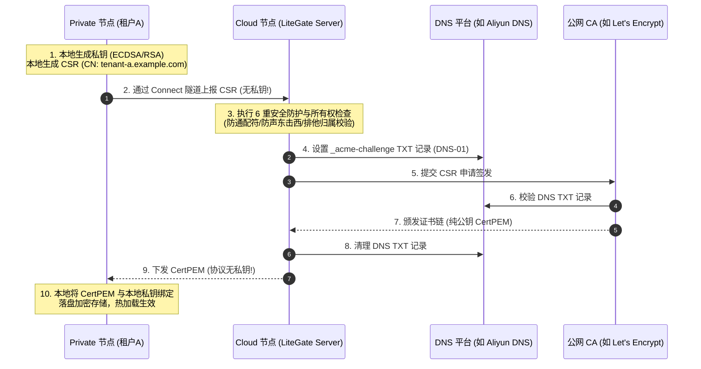

# Connect 证书委托签发与端到端私钥安全管理

LiteGate Connect 支持**零信任委托证书签发模式**：由位于内网/私有云的 Private 节点在本地生成并持有独立私钥，仅将证书签名请求（CSR）通过安全的 Connect 隧道委托给拥有公网 DNS 解析权限的 Cloud 节点，由 Cloud 代办 ACME DNS-01 验证并签发公网可信证书，再将公钥证书回传给 Private 本地加载。

该模式同时实现了：
1. **端到端 TLS 终结（E2EE）**：公网客户端请求到达 Cloud 时，Cloud 仅根据 SNI 做四层密文盲透传（不终止 TLS），最终在 Private 本地完成解密，杜绝云端中间人攻击与数据劫持；
2. **私钥绝对不出网**：Private 节点的 TLS 私钥在本地生成，永不离开内网，也绝不向 Cloud 或网络上传；
3. **DNS 凭据零泄露**：域名所有权凭据（如阿里云、Cloudflare 的 DNS AccessKey/Secret）集中保存在 Cloud，内网各租户节点完全无需接触任何 DNS 密钥；
4. **多租户严格隔离**：严禁签发泛域名证书，且在签发前执行严格的域名所有权与归属绑定校验，租户之间无法越权伪造或解密彼此的流量。

---

## 1. 业务场景与架构拓扑

在典型的混合云与敏感业务数据下行架构（如公有云/聚石塔向私有机房下发电商订单、客户隐私数据）中，整体流量与证书控制模型如下：

```
【公有云 / 聚石塔】
  云端应用 / MQ 消费者
         │
         │ HTTPS 请求 (Host: tenant-a.example.com)
         ▼
  LiteGate Cloud 集群 (公网入口 443)
  ├── 掌控 *.example.com DNS 解析权限 (DNS Provider)
  ├── 运行 Connect Server 控制面
  └── 4 层 SNI 路由器 (不解密 TLS 密文，按 SNI 盲转发)
         │
         │ Connect TLS 数据隧道 (密文传输)
         ▼
【私有云 / 客户机房 / 内网】
  LiteGate Private (Connect Client)
  ├── 独占持有 tenant-a 私钥 (本地生成、本地存储、永不出网)
  ├── 终止 TLS 握手 (解密报文)
  └── 转发明文至客户内部业务系统 (JetStream / 本地 API / 数据库)
```

### 控制面与证书签发时序



---

## 2. 私钥（Key）全生命周期安全管理

在多租户和敏感数据传输场景中，私钥一旦泄露，整个数据链路的机密性将彻底荡然无存。LiteGate 从架构设计和底层代码上对私钥施加了最高级别的物理隔离：

### 2.1 本地生成，绝对不出网
- **生成位置**：私钥由 Private 节点上的 `internal/certmanager` 模块直接调用 Go 标准库密码学接口（默认 ECDSA P-256 或 RSA-2048/4096）生成。
- **协议约束**：Connect 控制面协议结构体 `CSRAckPayload` 中**彻底移除了私钥字段**。Cloud 既没有能力向 Private 下发私钥，Private 也绝不会向 Cloud 上报私钥。
- **内存生命周期**：私钥仅在 Private 进程的 TLS 握手层解密使用。

### 2.2 本地静态落盘加密 (Storage Encryption)
Private 节点取得签发的公钥证书后，会将公钥与本地私钥持久化保存到 `certs_dir`。为了防止私钥在宿主机被未授权拷贝，LiteGate 支持对证书与私钥进行 **AES-GCM-256 静态落盘加密**。

只需在 Private 的 `config.yaml` 中配置 `storage_secret`：
```yaml
auto_cert:
  enabled: true
  storage_secret: "a-secure-32-character-long-secret-key-here!"
  certs_dir: ./certs
```
配置该选项后，写入磁盘的所有私钥文件（`.key`）与证书文件（`.crt`）都会使用该密钥进行高强度认证加密，即使磁盘镜像被窃取也无法还原明文私钥。

### 2.3 密钥与凭据的动态注入 (Zero Hardcoding)
`storage_secret` 以及 Connect 通信所需的 `token` 支持通过 LiteGate 统一机密解析器动态拉取，避免在配置文件中留下任何明文：

| 模式 | 语法示例 | 说明 |
| :--- | :--- | :--- |
| **环境变量** | `env://AUTOCERT_STORAGE_SECRET` | 生产容器化标准注入 |
| **文件挂载** | `file:///run/secrets/storage_key` | K8s Secret 或 Docker Swarm 挂载卷 |
| **远程 HTTPS** | `https://kms.example.com/v1/keys#secret` | 动态集中式 KMS 密钥管理服务 |
| **HashiCorp Vault** | `vault://secret/data/litegate#storage_secret` | 企业级 Vault KV 存储引擎 |

---

## 3. Cloud 端六重安全防护体系

为了防止恶意的或受损的内网节点利用 CSR 委托机制发起越权攻击，Cloud 节点在签发证书前执行严格的**六重安全拦截机制**：

### ① CSR 深度反解与声明一致性校验（防声东击西）
有些攻击者可能在请求中声明域名为 `tenant-a.example.com`（以通过粗粒度的域名检查），但在二进制 CSR 数据中偷偷植入 `*.example.com` 或 `admin.example.com`。
- **防御机制**：Cloud 强制解析 `CSRPEM` 报文，逐一提取 ASN.1 结构中的 `Subject.CommonName` 和 `DNSNames`（SAN）。
- **判定标准**：CSR 内部实际包含的所有域名集合必须与请求声明的 `req.Domains` 集合**完全 100% 对齐**，若有多出、缺少或不一致，立刻物理拒签（`csr_reject`）。

### ② 绝对拦截通配符 / 泛域名（No Wildcards）
- **风险分析**：如果内网租户 A 能签发 `*.example.com` 的证书，租户 A 即可利用该证书和私钥解密租户 B 的通信内容，甚至冒充整个平台。
- **防御机制**：Cloud 对 CSR 提取出的每一个域名进行字符检测，只要发现包含 `*`（通配符），无论 Peer 配置了何种白名单，**一律直接拒签**。Connect 委托模式**仅允许签发精确子域名证书**。

### ③ 保留域名与 Cloud 本地站点统一规则
- **防御机制**：
  1. **保留域名绝对拦截**：Cloud 自身的 Connect 通信入口（如 `connect.example.com`）与配置文件声明的 `reserved_domains` 属于平台基础设施，任何 Peer 绝不允许签发；
  2. **本地站点与覆盖统一**：统一采用 Registry 权威路由判定。未配置 `connect_override` 的 Cloud 本地自建站点（`SNITargetLocal`）绝不外流；已显式配置 `connect_override` 并由当前 Peer 成功接管的站点则合法放行；Cloud 的本地通配站点亦不会误杀租户已精确注册的子域。

### ④ Peer 授权策略边界 (`allowed_cert_domains`)
- **防御机制**：Cloud 为每个 Peer 单独配置了 `allowed_cert_domains`（允许申请证书的域名模式）。
- **隔离规则**：路由授权（`allowed_domains`）与证书签发授权（`allowed_cert_domains`）独立定义，避免将宽泛的路由转发通配符误用为证书签发范围。

### ⑤ 动态精确所有权校验（杜绝通配抢占与 TOCTOU 竞态）
- **风险分析**：若租户 A 注册了 `*.example.com` 的通配 Site，普通的粗粒度匹配可能会让租户 A 判定为所有未分配子域名的“所有者”，进而抢签他人域名；此外，ACME 签发耗时 1~2 分钟，期间域名归属可能发生变更。
- **防御机制**：
  1. **精确注册强制要求**：Cloud 调用 `registry.LookupMatch(domain)`，强制要求 `!match.Wildcard`。**通配注册绝对不能用于证明子域名的所有权**，租户必须**精确注册**了该子域名（`match.Target.ConnectID == connectID`）才获准签发；
  2. **下发前二次校验（防竞态）**：在 CA 签发完成、向客户端下发公钥证书之前，Cloud 会**再次执行精确归属检查**。若签发期间域名已被注销或转移，立刻就地销毁证书，绝不下发。

### ⑥ 防刷与 CA 额度双重防线（冷却窗口 + 全局周预算）
为了防止故障或恶意客户端无限轮换本地私钥狂刷 CSR 导致 Let's Encrypt 额度耗尽（主域每周 50 张新证书），Cloud 设立了严密的配额与断路器：
1. **双 Cloud 集群共享与持久化存储**：配额状态支持接入 **Litemesh KV**（`litegate/connect/csr-quota`）在双 Cloud A/B 节点间全局实时共享，单机或无 Litemesh 时自动通过本地文件持久化；Cloud 重启后历史记录不丢失，存量续期请求绝不会误当新签发；
2. **防线一：单域名周重复限额与防抖（完美支持重装与主备）**：
   - 彻底摒弃硬性的 30 天拦截，采用符合 Let's Encrypt 官方 Duplicate Certificate 规则（官方允许 5 张/周）的弹性防线；
   - **单域名周重复限额**：同一精确域名在 7 天内最多允许签发 **2 次**，既满足了 **Private 机器重装/私钥丢失** 后的快速自愈，也完美支撑了 **主备 HA 独立私钥部署**（主备各 1 次）；
   - **最小防抖冷却**：同一域名连续签发间隔不得小于 **5 分钟**，杜绝死循环客户端秒级刷单；同时提供管理员手动重置接口；
3. **防线二：全局注册主域周预算（Global Weekly Budget）**：
   - 按 `eTLD+1`（如 `example.com`）统计过去 7 天内的新证书总数。默认阈值为 **40 张/周**（保留 10 张作为平台缓冲）；
   - **准入名额预占与回滚**：在请求准入时立即原子预占配额名额，彻底闭合并发竞态窗口；若后续 ACME 签发失败则自动回滚释放名额；若周预算触顶，立即熔断新域名签发，仅放行存量续期请求。

### ⑦ Private 客户端的双重密码学校验
Private 节点收到 Cloud 下发的公钥证书链后，在存盘与热加载前自动执行多维校验：
1. **公私钥配对校验**：调用 `tls.X509KeyPair` 验证证书中的公钥与本地私钥完全匹配；
2. **SAN / CN 域名覆盖**：调用 `leaf.VerifyHostname` 校验公钥证书完全覆盖了当前申请的所有域名；
3. **有效期区间检查**：验证当前系统时间处于证书的 `NotBefore` 与 `NotAfter` 之间，任何损坏、错配或过期的证书会被立即就地丢弃并报警。

---

## 4. 生产部署实战配置

### 4.1 Cloud 端配置 (`config.yaml`)

Cloud 端需要启用公网端口、配置 DNS Provider（用于 DNS-01 验证）、并启动 Connect Server：

```yaml
# ==============================================================================
# LiteGate Cloud 节点配置
# ==============================================================================

# 1. 入口监听
entrypoints:
  web:
    address: ":80"
  websecure:
    address: ":443"

# 2. 自动化证书与 DNS Provider
auto_cert:
  enabled: true
  email: "ops@example.com"
  ca_provider: "letsencrypt"     # 或 custom / zerossl
  use_staging: false            # 首次上线调试可设为 true
  certs_dir: ./certs

  # 配置掌控主域名的 DNS Provider（用于代办 DNS-01 质询）
  dns_providers:
    - name: "aliyun-main"
      type: "aliyun"
      enabled: true
      domains:
        - "*.example.com"
        - "example.com"
      config:
        access_key_id: "env://ALIYUN_DNS_AK"
        access_key_secret: "env://ALIYUN_DNS_SK"
        propagation_wait: "60s"
        skip_propagation_check: "true"

# 3. Connect Server 服务端配置
connect:
  server:
    enabled: true
    hostname: connect.example.com  # Connect 控制面通信域名（自动进入保留域名）
    path: /_litegate/connect/v1
    state_file: ./data/connect-registry.json

    # 全局保留域名（任何 Peer 均不可注册或申请证书）
    reserved_domains:
      - admin.example.com
      - gitea.example.com

    peers:
      # 租户 A 配置
      tenant-a:
        token_file: ./secrets/tenant-a.token
        # 允许通过 Connect 隧道发布路由的范围
        allowed_domains:
          - "tenant-a.example.com"
        # 允许委托 Cloud 签发证书的范围（精确最小权限）
        allowed_cert_domains:
          - "tenant-a.example.com"
        max_sites: 50
        max_connections: 2048
        sessions: 2

      # 租户 B 配置
      tenant-b:
        token_file: ./secrets/tenant-b.token
        allowed_domains:
          - "tenant-b.example.com"
        allowed_cert_domains:
          - "tenant-b.example.com"
        max_sites: 50
        max_connections: 2048
        sessions: 2
```

---

### 4.2 Private / 内网节点配置 (`config.yaml`)

Private 节点不需要配置任何公网 DNS 凭证，只需指定 DNS Provider 为 `connect`，并配置好本地业务 Site：

```yaml
# ==============================================================================
# LiteGate Private / 内网租户 A 节点配置
# ==============================================================================

# 1. 本地入口（用于本地解密 TLS）
entrypoints:
  websecure:
    address: ":8443"  # 本地 HTTPS 监听端口

# 2. 自动化证书配置（关键：启用 connect 委托模式）
auto_cert:
  enabled: true
  storage_secret: "env://PRIVATE_STORAGE_SECRET"  # 本地私钥落盘加密密码
  certs_dir: ./certs
  renew_days: 10                                 # 到期前 10 天触发自动平滑续期

  dns_providers:
    # 将 example.com 域名的证书申请委托给 Cloud
    - name: "cloud-csr-delegate"
      type: "connect"
      enabled: true
      domains:
        - "tenant-a.example.com"

# 3. Connect Client 客户端配置
connect:
  client:
    enabled: true
    name: tenant-a
    remote: https://connect.example.com/_litegate/connect/v1
    token_file: ./secrets/connect.token
    publish_sites: true     # 将本地 Site 自动发布至 Cloud
    publish_streams: false
    sessions: 2
    max_connections: 2048
    exclude_domains:
      - connect.example.com

# 4. 业务 Site 路由配置 (sites/tenant-a.yaml)
sites:
  - name: "tenant-a-service"
    domain: "tenant-a.example.com"
    entrypoints:
      - websecure
    tls:
      enabled: true        # 开启 TLS，LiteGate 将通过 AutoCert 自动加载委托证书
    routes:
      - name: "business-api"
        match:
          path_prefix: "/"
        action:
          type: proxy
          upstream:
            - "http://127.0.0.1:8080" # 本地内部明文业务系统
```

---

## 5. 证书全生命周期演进

### 5.1 首次启动与冷启动就绪（Zero-Drop Cold Start）
1. Private 节点启动，发现本地 `certs/` 目录下尚无 `tenant-a.example.com` 的证书；
2. Private 此时会先向 Cloud 登记该 Site，状态为 `pending_certificate`；
3. Cloud 将该域名记录在 Registry 中标记为未就绪，外部若有请求进入 Cloud，Cloud 会返回安全错误（Fail-Closed），绝不会泄露任何未加密数据；
4. 同时，Private 触发 `obtainCertificateViaConnect`：
   - 本地生成私钥并生成 CSR；
   - 将 CSR 发往 Cloud，Cloud 验证其所有权（此时已是当前 Peer 拥有该域名），代办 DNS-01 签发；
   - 签发完毕下发公钥证书；
5. Private 收到公钥证书后与本地私钥组装，热加载进 TLS 引擎；
6. Private 发送站点状态变更，域名在 Cloud 上变为 `ready`；
7. 整个过程自动完成，约 30~60 秒内全自动打通端到端密文通道。

### 5.2 自动续期（Zero-Downtime Hot Renewal）
- Private 节点内部每日运行巡检定时器。
- 当证书有效剩余天数小于 `renew_days` 时，Private 自动生成新的 CSR 请求并通过隧道向 Cloud 发起续期申请。
- Cloud 再次代办完成签发并下发新证书。
- Private 接收新证书并在内存中原子替换（Atomic Swap），不断开现有已建立的长连接，平滑过渡。

---

## 6. 容量规划与 CA 频控边界

### 6.1 Let's Encrypt 官方配额分析
如果平台统一使用 Let's Encrypt 作为公网免费 CA，需要注意以下关键限额：
- **按主注册域（Registered Domain）计算**：每个主域（例如 `example.com`）**每周最多签发 50 张新证书（Certificates per Registered Domain）**；
- **续期不占用新证书限额**：如果证书包含完全一致的域名集合，且在有效期内续期，属于 Renewal，受单主域每周 300 次限制。

### 6.2 租户规模支撑测算
按 Let's Encrypt 证书 90 天有效、每 60 天轮换一次计算：
$$\text{每周可用新证书额度} = 50 \text{ 张/周}$$
$$60 \text{ 天（约 8.5 周）累计可签发新证书} = 50 \times 8.5 \approx 425 \text{ 张}$$

> **容量结论**：
> 在纯免费的 Let's Encrypt 体系下，独立子域名委托模式可稳定支持 **300 ~ 400 个活跃租户**。

### 6.3 规模超过 400 户时的演进路径

当业务高速增长、租户规模超过 400 户时，LiteGate 提供了两大无缝演进方案：

#### 方案 A：向 Let's Encrypt 官方申请配额提升 (Rate Limit Increase)
Let's Encrypt 官方为大规模 SaaS 和 API 提供免费的配额提升申请通道（通常可直接提升至每周 1000 ~ 5000 张），只需在官方表单中提交平台主域名与业务场景说明即可，架构无需做任何变更。

#### 方案 B：结合内部调用方切换为私有 CA (Private PKI)
如果流量来源均为企业自有服务（例如聚石塔内部部署的专属消费集群），可将 Cloud 上的 `ca_provider` 切换为企业内部私有 CA（如 LiteMesh CA、HashiCorp Vault CA 或 Step-CA）：
```yaml
auto_cert:
  ca_provider: "custom"
  acme_url: "https://ca.internal.example.com/acme/directory"
  acme_ca_cert: "/etc/litegate/certs/internal-root-ca.pem"
```
- **优势**：完全不受公网 CA 配额限制，签发毫秒级响应，支持签发更长有效期；
- **调用端**：仅需在云端调用方容器/系统中信任企业内网根证书即可。

---

## 7. 常见问题与排障指南 (FAQ)

### Q1: 出现 `csr_reject: domain "..." contains wildcard` 错误？
- **原因**：Private 端的 `domains` 配置或 CSR 中包含了通配符 `*.example.com`。
- **解决**：Connect 委托模式为了多租户安全彻底关闭了通配符签发。请将 Private 端的 `domains` 配置为具体的子域名（如 `tenanta.example.com`）。

### Q2: 出现 `csr_reject: domain "..." ownership mismatch with peer` 错误？
- **原因**：发起 CSR 请求的域名，尚未在 Cloud 的 Connect Registry 中被当前 Peer 成功注册，或者当前已被其他 Peer 注册占用。
- **解决**：检查 Private 的 `sites` 配置，确保该域名已在 `entrypoints: [websecure]` 中配置且 `publish_sites: true`。必须先在控制面完成所有权登记，才能获准签发。

### Q3: 出现 `csr_reject: rate limit exceeded for peer` 错误？
- **原因**：该 Peer 在短时间内重复发起了多次 CSR 签发请求，触发了防刷保护（默认单 Peer 并发为 1，每分钟最多 2 次）。
- **解决**：检查 Private 节点的日志，排查是否存在频繁重启或本地证书文件无法写入磁盘导致反复重试的问题。正常情况下等待 1 分钟后会自动解冻。

### Q4: 证书生成后存放在哪里？文件格式是怎样的？
- **位置**：保存在 Private 节点配置的 `auto_cert.certs_dir` 目录下。
- **内容**：
  - `tenant-a.example.com.crt`：CA 颁发的公钥证书链；
  - `tenant-a.example.com.key`：Private 本地生成的私钥（若启用了 `storage_secret`，则为 AES-GCM 密文格式）。
