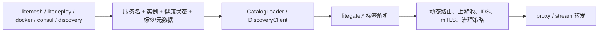

# 服务发现源总览

LiteGate 的后端发现源可以分成 5 种：`litemesh`、`litedeploy`、`docker`、`consul`、`discovery`。它们进入 LiteGate 以后都会变成同一种 `ServiceEndpoint`，再由同一套 `litegate.*` 标签驱动路由、上游池、鉴权、IDS、mTLS 和观测。

这意味着文档里看到的“标签系统”不是某一个 provider 的专有语法。标签可以来自 Docker Labels、Litemesh/LiteDeploy/Consul 的 Tags 或 Meta，也可以来自外部 discovery agent 返回的元数据。LiteGate 只关心最终得到的服务名、实例地址、健康状态、标签和元数据。

## 1. 发现源矩阵

| 发现源 | 配置值 | 连接对象 | 更新方式 | 适合场景 |
| :--- | :--- | :--- | :--- | :--- |
| Litemesh | `provider: litemesh` / `upstream_type: litemesh` | Litemesh Agent | SSE 推送 | 已接入 Litemesh、需要 mTLS、服务状态变化频繁 |
| LiteDeploy | `provider: litedeploy` / `upstream_type: litedeploy` | LiteDeploy Agent 或集群地址 | SSE 推送 | 由 LiteDeploy 管理发布、实例和服务元数据 |
| Docker | `provider: docker` / `upstream_type: docker` | Docker Daemon Socket | Docker event stream | 单机 Docker 或 Swarm，直接用容器 labels 自动接入 |
| Consul | `provider: consul` / `upstream_type: consul` | Consul Agent / Catalog | Catalog 同步 | 已有 Consul 注册中心和健康检查体系 |
| Discovery | `provider: discovery` / `upstream_type: external` | `camodns_discovery` 或兼容 agent | Blocking query | 异构注册中心聚合，如 Docker、K8s、Nacos、Etcd、Litemesh 并存 |

> [!NOTE]
> 配置里的 `provider: discovery` 对应后端运行时的 external discovery client。它不是第 6 种业务发现源，而是 LiteGate 通过 HTTP blocking query 接入 `camodns_discovery` 这类外部发现聚合层的名称。

## 2. 同一套标签怎么流动



常见标签职责如下：

| 标签范围 | 作用 |
| :--- | :--- |
| `litegate.http.host/path/path_prefix/strip_path` | 快捷模式：一个域名转发到本服务 |
| `litegate.http.routers.<name>.*` | 声明 Host/路径规则，并引用 IDS、Middleware 和 Service；默认挂到 web 与 websecure |
| `litegate.entrypoints.<name>.*` | 新开 HTTP 监听，端口须在 `service_discovery.tag_entrypoints.allowed_ports` 中 |
| `litegate.http.services.<name>.*` | 声明发现、Selector、负载均衡、健康检查、重试与熔断 |
| `litegate.http.middlewares.<name>.*` | 声明可复用的请求/响应处理 |
| `mtls`、`mtls_port`、`spiffe_id` | 声明 Litemesh mTLS 后端访问方式 |
| `sid`、`env`、`version` 等元数据 | 用于灰度、租户隔离、IDS 决策后的物理选路 |

## 3. Discovery 与 camodns_discovery

`discovery` 源背后连接的是 `camodns_discovery`。LiteGate 把它当成兼容 Consul Catalog 语义的 HTTP agent 使用，重点消费两类 blocking query 接口：

- `GET /v1/catalog/services`
- `GET /v1/health/service/:service_name`

blocking query 的价值是：LiteGate 不需要不停短轮询所有服务；agent 在服务索引变化前可以挂起请求，变化后再返回新索引和实例列表。这样外部聚合层可以把 Docker、K8s、Nacos、Etcd、Litemesh 等来源统一成 LiteGate 能理解的服务目录。

```yaml
service_discovery:
  catalogs:
    - enabled: true
      provider: discovery
      url: "http://127.0.0.1:55500"
      namespace: "default"
```

如果 `camodns_discovery` 本身也注册在 Litemesh 或 Consul 中，可以用服务名先解析 discovery agent，再由 agent 提供 blocking query：

```yaml
service_discovery:
  catalogs:
    - enabled: true
      provider: discovery
      service_name: "camodns-discovery"
      url: "http://127.0.0.1:8787"
      resolve_via: "litemesh"
      namespace: "default"
```

## 4. 如何选择

| 你现在的环境 | 推荐发现源 |
| :--- | :--- |
| 后端已经接入 Litemesh，并且要用 mTLS | `litemesh` |
| 发布系统由 LiteDeploy 管理 | `litedeploy` |
| 服务主要跑在 Docker / Swarm | `docker` |
| 已有 Consul Catalog 和健康检查 | `consul` |
| 多个注册中心并存，需要先聚合再给 LiteGate | `discovery` + `camodns_discovery` |

## 延伸阅读

- [站点 YAML V2：服务发现源、标签与 V2 的整合](../03-configuration/site-yaml-v2-concepts.md#14-服务发现源标签与-v2-的整合)：路由分工、Hybrid 合并、冲突与下线行为
- [Tag DSL](../03-configuration/tag-dsl.md)
- [Proxy Action](../04-actions/proxy.md)
- [Consul 服务发现](./consul.md)
- [Litemesh 服务发现](./litemesh.md)
- [Litemesh mTLS 接入](./litemesh-mtls.md)
- [Docker Provider 部署指南](../../litegate_docker_provider_deployment_guide.md)
